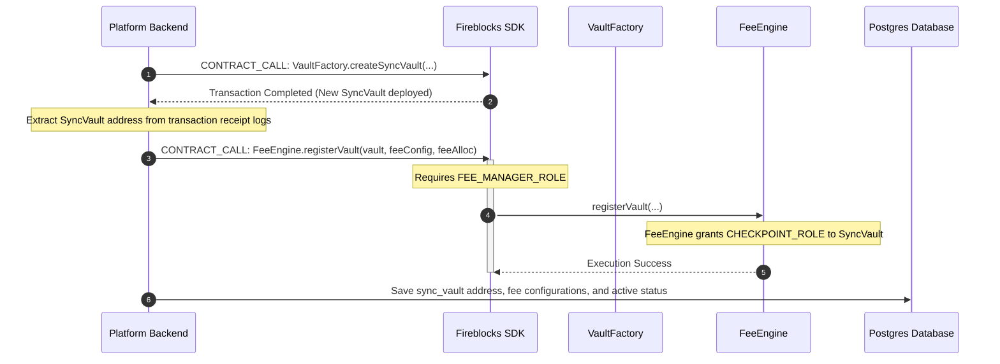
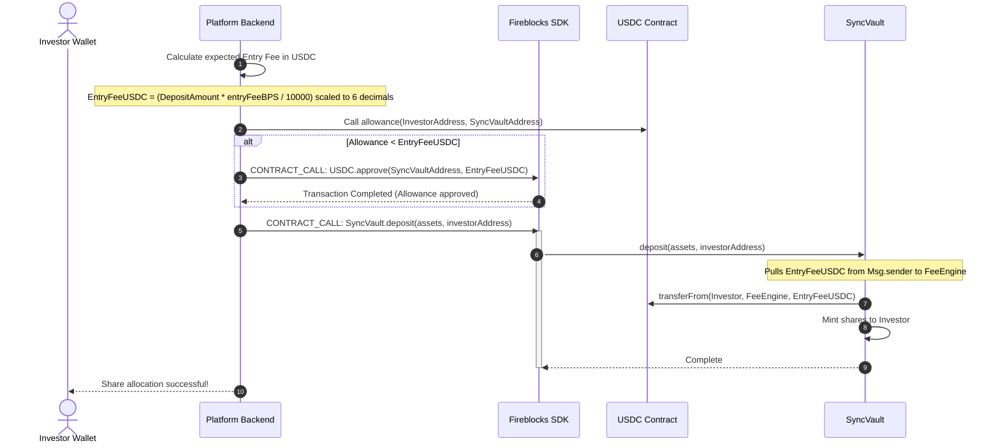

# CRATS Protocol v6: Backend Fee & Oracle Integration Guide

This guide details the backend implementation, database updates, and transaction workflows required to support the new **v6 Stablecoin Fee Engine** (`FeeEngine.sol`) and **NAV Oracle** (`NAVOracle.sol`) layers, integrated with **Fireblocks API/SDK**.

---

## 🏛️ 1. Core Architecture Updates

In the v6 protocol, direct RWA-token fee extraction is replaced with **Atomic USDC/USDT stablecoin fee extraction**. 

*   **Continuous Checkpoints:** The `SyncVault` contract automatically checkpoints itself on the `FeeEngine` during investor actions (`deposit`/`mint`/`withdraw`/`redeem`).
*   **Decoupled Gas Fees:** Because `SyncVault` holds the `CHECKPOINT_ROLE`, the investor pays the gas for fee checkpointing. The backend does not need to run scheduled off-chain checkpoint transactions.
*   **Decimals Alignment:** Real-world assets (typically 18 decimals) are dynamically scaled down to stablecoin decimals (typically 6 decimals for USDC/USDT) using the vault's on-chain decimal scaler.

---

## 🔄 2. Backend Registration Workflow (Asset Listing Phase)

When an authorized issuer lists a new asset and deploys a vault, the backend must register and configure the vault in the `FeeEngine`.

### Step-by-Step Flow



### ABI Parameters for `FeeEngine.registerVault`
```javascript
// Function Signature
function registerVault(
    address vault,
    FeeConfig calldata config,
    FeeAllocation calldata alloc
) external;

// Data Structure definitions
struct FeeConfig {
    uint256 entryFeeBPS;       // e.g. 100 for 1%
    uint256 exitFeeBPS;        // e.g. 50 for 0.5%
    uint256 managementFeeBPS;  // e.g. 150 for 1.5% annual
    uint256 performanceFeeBPS; // e.g. 1500 for 15% carry
    uint256 hurdleRateBPS;     // e.g. 800 for 8% minimum yield
}

struct FeeAllocation {
    uint256 protocolTreasuryBPS; // e.g. 4000 for 40%
    uint256 assetIssuerBPS;     // e.g. 4000 for 40%
    uint256 complianceBPS;      // e.g. 1000 for 10%
    uint256 insuranceBPS;       // e.g. 1000 for 10%
}
```

---

## 💸 3. Primary Market Investment Workflow (USDC Fee Pre-Approval)

Because the `SyncVault` pulls the entry fee in USDC directly from the investor/treasury address, the backend must ensure that the USDC allowance is approved **before** calling `deposit()` or `mint()`.

### Step-by-Step Flow



### Backend Implementation Example (Node.js + Ethers)

```javascript
const { ethers } = require("ethers");
const axios = require("axios"); // For Fireblocks REST API

async function processPrimaryMarketInvestment(investorAddress, vaultAddress, assetAmountHex) {
  const syncVault = new ethers.Contract(vaultAddress, SV_ABI, provider);
  const feeEngineAddress = await syncVault.feeEngine();
  const feeEngine = new ethers.Contract(feeEngineAddress, FE_ABI, provider);
  const usdcAddress = await feeEngine.usdc();
  const usdc = new ethers.Contract(usdcAddress, ERC20_ABI, provider);

  // 1. Calculate Entry Fee
  const config = await feeEngine.vaultConfigs(vaultAddress);
  const entryFeeBPS = config.entryFeeBPS;
  
  const assetAmount = BigInt(assetAmountHex);
  const rawEntryFee = (assetAmount * BigInt(entryFeeBPS)) / 10000n;

  // Scale decimals from Asset (18 decimals) to USDC (6 decimals)
  const assetDecimals = 18;
  const usdcDecimals = 6;
  const entryFeeUSDC = rawEntryFee / BigInt(10 ** (assetDecimals - usdcDecimals));

  if (entryFeeUSDC > 0n) {
    // 2. Check current allowance
    const currentAllowance = await usdc.allowance(investorAddress, vaultAddress);
    if (currentAllowance < entryFeeUSDC) {
      console.log(`Approving SyncVault to spend ${entryFeeUSDC.toString()} USDC...`);
      // Submit approval transaction via Fireblocks
      await submitFireblocksContractCall({
        vaultAccountId: getVaultIdForAddress(investorAddress),
        contractAddress: usdcAddress,
        abi: ERC20_ABI,
        functionName: "approve",
        args: [vaultAddress, entryFeeUSDC.toString()]
      });
    }
  }

  // 3. Execute Deposit
  console.log(`Executing deposit of ${assetAmount.toString()} RWA assets...`);
  const depositTx = await submitFireblocksContractCall({
    vaultAccountId: getVaultIdForAddress(investorAddress),
    contractAddress: vaultAddress,
    abi: SV_ABI,
    functionName: "deposit",
    args: [assetAmount.toString(), investorAddress]
  });

  return depositTx;
}
```

---

## 🏛️ 4. Fee Distribution & Withdrawal Workflow

The backend can trigger fee distributions programmatically or offer a button in the Admin portal.

### Action Prompt: Distribute Vault Fees
1. **Target Identification**: Identify the specific `SyncVault` to distribute fees for.
2. **Execute Call**: Submit a `CONTRACT_CALL` via Fireblocks to the `FeeEngine` contract:
   *   **Function**: `distributeFees(address vault)`
3. **Distribution Path**: This will split all accumulated USDC fees for that vault and transfer them atomically to:
   *   40% to **Protocol Treasury** (Fireblocks address)
   *   40% to **Asset Issuer Wallet**
   *   10% to **Compliance Reserve**
   *   10% to **Insurance Reserve**
