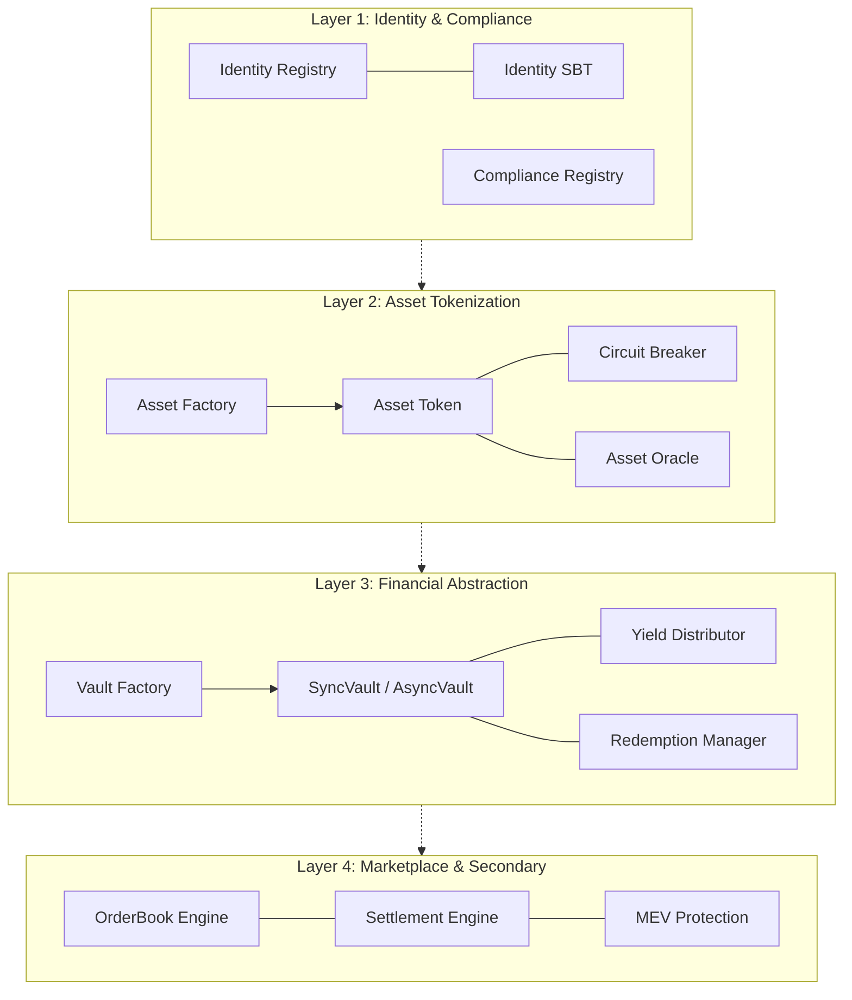

# CRATS Protocol Reference: Technical Layers & Architecture

This document provides a comprehensive technical breakdown of the CRATS Nexus Institutional RWA Protocol. It covers the 4-layer architecture, contract functions, and the real-world operational workflow.

---

## 🏛️ High-Level Architecture

CRATS Nexus is organized into four modular layers, each serving a specific role in the RWA tokenization lifecycle:

---

## 🛠️ Low-Level Architecture (Interaction Flow)

When an investor interacts with the protocol, multiple layers collaborate synchronously:

1.  **Identity Check**: Every transaction on `AssetToken` or `SyncVault` triggers a hook to `IdentityRegistry` to verify the sender's `IdentitySBT`.
2.  **Compliance Enforcement**: `AssetToken` executes `ICompliance` modules (e.g., Transfer Rule, Country Blacklist) before moving any balance.
3.  **VAULT Settlement**: `SyncVault` interacts with the `Institutional Treasury` (the primary holder of `AssetToken`) to swap tokens for yield-bearing shares.

---

## 📦 Layer 1: Identity & Compliance
**The "Gatekeeper" of the Protocol.**

### [IdentityRegistry.sol](file:///c:/Users/anask/Desktop/CRATS-Protocol/contracts/identity/IdentityRegistry.sol)
*   **Purpose**: Stores and manages verified identities.
*   **Key Functions**:
    *   `registerIdentity(address user, uint16 country)`: Registers a user in the registry.
    *   `isVerified(address user)`: Returns `true` if user possesses a valid Identity SBT.
    *   `setIdentityStorage(address storage)`: Points to the persistent identity database.

### [IdentitySBT.sol](file:///c:/Users/anask/Desktop/CRATS-Protocol/contracts/identity/IdentitySBT.sol)
*   **Purpose**: Non-transferable ERC721 representing KYC completion.
*   **Key Functions**:
    *   `mint(address to, string uri)`: Mints the SBT to an onboarded institutional wallet.
    *   `burn(uint256 tokenId)`: Revokes verification.

---

## 💎 Layer 2: Asset Tokenization
**Digital Twins of Real-World Assets.**

### [AssetFactory.sol](file:///c:/Users/anask/Desktop/CRATS-Protocol/contracts/asset/AssetFactory.sol)
*   **Purpose**: Deploys compliant, upgradeable RWA tokens.
*   **Key Functions**:
    *   `deployAsset(name, symbol, supply, category)`: Deploys a new `AssetToken` via UUPS Proxy.
    *   `approveIssuer(address issuer)`: Enables an institution to tokenize assets.
    *   `registerPlugin(category, plugin)`: Attaches category-specific logic (e.g., Real Estate specialized rules).

### [AssetToken.sol](file:///c:/Users/anask/Desktop/CRATS-Protocol/contracts/asset/AssetToken.sol)
*   **Purpose**: ERC-3643 / ERC-7518 hybrid with regulatory overrides.
*   **Key Functions**:
    *   `mint(to, amount)`: Mints tokens (only if recipient is verified).
    *   `forceTransfer(from, to, amount, reason)`: Allows regulators to recover/seize tokens.
    *   `setNAV(newNAV)`: Updates the Net Asset Value (Price) of the asset.
    *   `freezeAddress(account)`: Halts transfers for a specific suspicious wallet.

---

## 📈 Layer 3: Financial Abstraction
**Liquid Investment Vehicles.**

### [VaultFactory.sol](file:///c:/Users/anask/Desktop/CRATS-Protocol/contracts/financial/VaultFactory.sol)
*   **Purpose**: Deploys ERC-4626 compatible investment vaults.
*   **Key Functions**:
    *   `createSyncVault(assetToken, name, symbol, category)`: Creates an investable vault for an asset.
    *   `getVaultInfo(vault)`: Returns metadata, asset link, and status.

### [SyncVault.sol](file:///c:/Users/anask/Desktop/CRATS-Protocol/contracts/vault/SyncVault.sol)
*   **Purpose**: Tokenized Vault that converts Stablecoins to Asset Shares.
*   **Key Functions**:
    *   `deposit(assets, receiver)`: Mints shares to investors in exchange for underlying assets.
    *   `maxDeposit(receiver)`: Checks if the receiver is compliant before allowing deposit.
    *   `totalAssets()`: Returns the total valuation of all assets held by the vault.

---

## 🔄 Real-World Workflow: The 14-Step Lifecycle

The CRATS Protocol automates the entire lifecycle of an institutional RWA:

| # | Phase | Description | Key Contract |
|---|---|---|---|
| **1** | **Onboarding** | Issuer undergoes KYC and receives an `IdentitySBT`. | `IdentityRegistry` |
| **2** | **Appraisal** | Physical asset value is determined (off-chain). | - |
| **3** | **Studio Setup** | Asset parameters (name, supply, category) are configured. | `TokenStudio.tsx` |
| **4** | **Tokenization** | Asset is minted as `AssetToken` to the Treasury. | `AssetFactory` |
| **5** | **Compliance** | Transfer rules (e.g., max investors) are set. | `ComplianceRegistry` |
| **6** | **Listing** | A `SyncVault` is deployed for the asset. | `VaultFactory` |
| **7** | **Investment** | Investors deposit Stablecoins to buy Vault shares. | `SyncVault` |
| **8** | **Settlement**| Treasury delivers `AssetTokens` to the Vault atomically. | `SettlementEngine` |
| **9** | **Management** | Real-world operations (e.g., tenant management) begin. | - |
| **10**| **Valuation** | NAV is updated periodically via external data or auditors. | `AssetToken` |
| **11**| **Yield Accrual**| Rental income or dividends are collected. | - |
| **12**| **Distribution**| Yield is pumped into the Vault, increasing share price. | `YieldDistributor` |
| **13**| **Secondary** | Investors trade Vault shares on the order book. | `OrderBookEngine` |
| **14**| **Exit** | Investors redeem shares for capital or underlying tokens. | `RedemptionManager` |

---

## 🛡️ Security & Guardrails

*   **Circuit Breaker**: `CircuitBreakerModule` can halt trading for specific assets or the entire protocol during extreme volatility or security breaches.
*   **Verification Engine**: Every critical function (Mint, Deposit, Transfer) includes a `require(isVerified(addr))` check.
*   **MEV Protection**: `MEVProtection` module ensures institutional orders are protected from front-running during large settlements.

> [!IMPORTANT]
> **Audit Status**: The core of Layer 1 and Layer 2 (Identity and Asset) are based on the audited ERC-3643 standard. Layer 3 and Layer 4 are protocol-specific and should be used with caution during the pilot phase.
