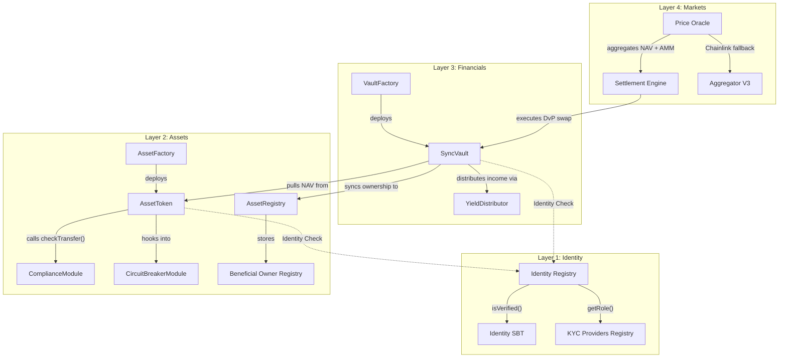

# CRATS Nexus: Institutional RWA Protocol Architecture

This document provides a deep-dive analysis of the CRATS Nexus Protocol, mapping the 4-layer architecture to specific smart contracts, functions, and real-world operational workflows.

---

## 🏛️ High-Level Architecture (The 4-Layer Stack)

The protocol is designed as a hybrid of **Tokeny (ERC-3643)** for compliance, **Centrifuge** for vault-based financing, and **MakerDAO** for risk management.

### Layer 1: Identity & Compliance (The Trust Foundation)
*   **Role**: Multi-jurisdictional gatekeeping.
*   **Security Model**: Whitelist-based access via Soulbound Tokens (SBTs).
*   **Compliance Types**: KYC/AML, accredited status, jurisdictional transfer rules.

### Layer 2: Asset Tokenization (Digital Lifecycle)
*   **Role**: Issuance and lifecycle management of RWA digital twins.
*   **Compliance Features**: Force transfer (legal overrides), freezing, and document linking.
*   **Beneficial Ownership**: Real-time transparency of indirect holdings (Layer 3 Vaults) on Layer 2.
*   **Auditability**: OpenZeppelin UUPS upgradeable proxies for state persistence.

### Layer 3: Financial Abstraction (Commitment & Yield)
*   **Role**: Decoupling real-world exposure from on-chain liquidity.
*   **Mechanism**: ERC-4626 Vaults that hold AssetTokens and issue tradable shares.
*   **Cashflow**: Automated yield distribution (rentals, dividends) via price appreciation.

### Layer 4: Marketplace & Secondary (Liquidity)
*   **Role**: Efficient price discovery and settlement.
*   **Mechanisms**: Atomic DvP (Delivery vs Payment) settlement and multi-source oracles.

---

## 🏗️ Low-Level Architecture (Contract Relationships)

---

## 📦 Comprehensive Contract Analysis

### 🔐 Layer 1: Identity & Compliance

| Contract | Primary Functions | Institutional Role |
|:---|:---|:---|
| **IdentityRegistry.sol** | `registerIdentity`, `isVerified`, `freeze`, `revoke`, `updateExpiry` | Compliance enforcement and lifecycle management of verified actors. |
| **IdentitySBT.sol** | `mint`, `burn`, `tokenIdOf`, `updateRole` | Non-transferable identity proof (Soulbound) for regulatory compliance. |
| **ComplianceModule.sol**| `checkTransfer`, `addRule`, `removeRule` | Logic engine for enforcing jurisdictional transfer restrictions. |

### 💎 Layer 2: Asset Management

| Contract | Primary Functions | Institutional Role |
|:---|:---|:---|
| **AssetFactory.sol** | `deployAsset`, `approveIssuer`, `registerPlugin` | Automated issuance engine for compliant RWA tokens. |
| **AssetRegistry.sol**| `syncOwner`, `uploadDocument`, `submitPOR` | Source of Truth for Beneficial Ownership, Documents, and Proof of Reserve. |
| **AssetToken.sol** | `mint`, `forceTransfer`, `setNAV`, `freezeAddress`, `haltTrading` | The digital twin of the RWA. Includes "Regulator" roles for legal overrides. |
| **CircuitBreakerModule** | `checkTradingAllowed`, `activateAssetHalt` | Protocol-level safety switch to prevent systemic risk. |

### 📈 Layer 3: Financial Layer

| Contract | Primary Functions | Institutional Role |
|:---|:---|:---|
| **VaultFactory.sol** | `createSyncVault`, `createAsyncVault` | Standardized deployment of investable RWA vehicles. |
| **SyncVault.sol** | `deposit`, `mint`, `withdraw`, `totalAssets` | ERC-4626 compliant investment vault with auto-yield compounding. |
| **YieldDistributor.sol** | `createYieldSchedule`, `distributeYieldToVault` | Handles complex income streams (rent, dividends) schedules. |
| **RedemptionManager.sol**| `requestRedemption`, `processBatchRedemptions` | Manages FIFO exit queues and redemption gating (pro-rata). |

### 🛒 Layer 4: Market & Settlement

| Contract | Primary Functions | Institutional Role |
|:---|:---|:---|
| **PriceOracle.sol** | `getAggregatedPrice`, `getTWAPPrice`, `updatePrice` | Weighted aggregation of NAV, OrderBook, and external feeds. |
| **SettlementEngine.sol** | `initiateSettlement`, `executeSettlement`, `cancelSettlement` | Atomic DvP (Delivery versus Payment) for secure asset transfers. |

---

## 🔄 The 14-Step Institutional Workflow

1.  **Onboarding**: Issuer passes KYC; receives `IdentitySBT` via `IdentityRegistry`.
2.  **Asset Sourcing**: Physical asset (Property, Debt) appraising is finalized off-chain.
3.  **Studio Setup**: Token parameters (Category, Supply) defined in `TokenStudio`.
4.  **Tokenization**: `AssetFactory` deploys `AssetToken`; supply minted to **Institutional Treasury**.
5.  **Compliance Config**: `ComplianceModule` rules applied (e.g., "Max 99 investors").
6.  **Vault Setup**: `VaultFactory` deploys `SyncVault` linked to the asset metadata.
7.  **Fundraising**: Marketplace listing goes live; primary market opens.
8.  **Investment**: Institutional investors (KYC'd) deposit Stablecoins via `SyncVault`.
9.  **Atomic Settlement**: `SettlementEngine` swaps Treasury AssetTokens for Investor Stablecoins.
10. **Valuation & Sync**: `AssetToken` NAV updated via `PriceOracle`; Vaults trigger `syncBeneficialOwners` to update Layer 2 registry.
11. **Yield Accrual**: Real-world lease/interest payments collected by Treasury.
12. **Yield Distribution**: `YieldDistributor` pushes yield to Vault, increasing share price.
13. **Secondary Market**: Investors trade Vault shares P2P via the `OrderBook`.
14. **Redemption**: Investors exit via `RedemptionManager` (T+1 to T+7 settlement).

---

## ⚠️ Institutional Reality Checks (Gap Analysis)

Based on brutal institutional standards, the following considerations must be acknowledged:

### 1. Regulatory Framework Support
*   **Status**: Protocol is *designed to support* regulatory compliance under SEC (Reg D/S), MiCA (ART/CASP), and FATF frameworks.
*   **Fix**: Compliance resides in the *Deployment*, not just the code. Regulator roles must be mapped to legal entities.

### 2. Audit Scope
*   **Status**: Core primitives (ERC-3643, ERC-4626) utilize audited patterns.
*   **Caution**: The **Integration Layers** (Treasury mediation, Settlement logic, and OrderBook) are custom logic and represent the primary attack surface requiring a dedicated security audit.

### 3. Identity Lifecycle
*   **Existing**: Expiry and Freeze logic is implemented.
*   **Gap**: Real-world systems require an **Active Sanctions Oracle** for real-time re-validation of onboarded users.

### 4. Oracle Resilience
*   **Status**: Weighted aggregation and TWAP are implemented.
*   **Missing**: Manual NAV updates should transition to **EIP-712 Signed Payloads** to prevent admin-key hijacking and provide cryptographic proof of valuation.

### 5. Treasury Risk (Custodial Risk)
*   **Observation**: The Treasury mediates settlement.
*   **Mitigation**: To minimize counterparty risk, the `SettlementEngine` includes `expiry` timeouts. Future iterations should use **Escrow Intermediaries** for larger-scale DvP settlements.

### 6. Beneficial Ownership Transparency (IMPLEMENTED)
*   **Status**: On-chain link between Layer 3 (Vault shares) and Layer 2 (Asset claims) is active.
*   **Benefit**: Regulators can now see "through" the vault nominee holder to the underlying investors in real-time.

---

> [!TIP]
> **Conclusion**: The CRATS Nexus architecture is an institutional-grade competitor to Tokeny and Centrifuge. By separating logic into distinct layers, it provides the required "Atomic" control needed for trillion-dollar RWA markets.
