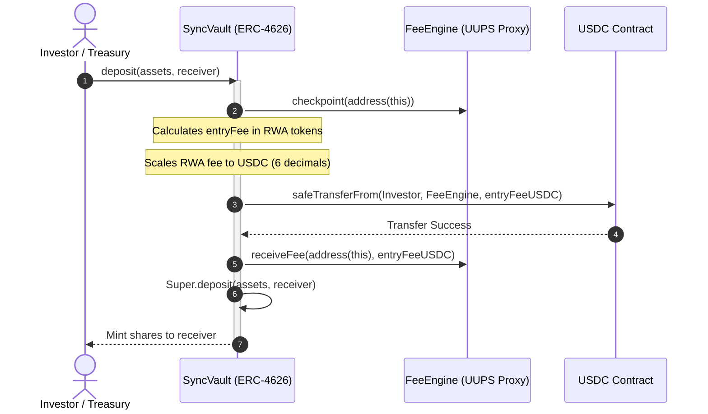
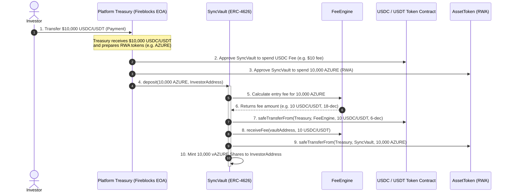

# TECHNICAL SPECIFICATION
# CRATS PROTOCOL: Architecture Specification
## Section A: Tokenomics & Fee Structure
## Section B: NAV Calculation Methodology

*CopyM Platform — Confidential*

---

## Table of Contents
1. [Executive Summary](#executive-summary)
2. [Section A: Tokenomics & Fee Structure](#section-a---tokenomics--fee-structure)
   - 2.1 Complete Fee Taxonomy
   - 2.2 Fee Calculation Methodology
     - 2.2.1 Continuous Per-Block Management Fee Accrual
     - 2.2.2 High-Water Mark Performance Fee Model
     - 2.2.3 Hurdle Rate Logic Configuration
     - 2.2.4 Fee Collection: Method A vs. Method B
   - 2.3 Fee Distribution Mechanics (`FeeEngine.sol`)
   - 2.4 Fee Governance & Hard Caps
   - 2.5 Investor Tier & Fee Discount Structure
   - 2.6 LP Fee Transparency & Dashboard Requirements
   - 2.7 Smart Contracts Required (Section A)
3. [Section B: NAV Calculation Methodology](#section-b---nav-calculation-methodology)
   - 3.1 Gap Analysis: Current vs. Required
   - 3.2 Verification Formula Definition
   - 3.3 Off-Chain to On-Chain Valuation Bridge (`NAVOracle.sol`)
   - 3.4 Multi-Source Weighted NAV Aggregation
   - 3.5 Staleness Detection & Trading Restrictions
   - 3.6 NAV Dispute Resolution Process — Stake Return & Slash Fix
   - 3.7 NAV Update Frequency Schedule by Asset Class — On-Chain Enforcement
   - 3.8 Smart Contracts Required (Section B)
4. [Implementation Plan](#implementation-plan)
   - 4.1 Strict Build Sequence & Dependencies
   - 4.2 Mainnet Deployment Gates Checklist

---

## 1. Executive Summary

This specification defines two missing financial architecture layers for the CRATS Protocol. Neither layer exists in the current codebase. Both are greenfield developments required to comply with regulatory mandates and secure commitments from institutional investors.

The 8 originally planned contracts have been consolidated into 2 production contracts:
- **`FeeEngine.sol`** — Absorbs `FeeRegistry`, `FeeAccrualEngine`, `HighWaterMark`, and `FeeDistributor` into a single upgradeable contract.
- **`NAVOracle.sol`** — Absorbs `NAVEngine`, `ValuationRegistry`, `DisputeResolver`, and `NAVScheduler` into a single upgradeable contract.

Additionally, two critical issues from the original spec have been resolved:
1. **Dispute Logic Fix:** Challenger stake return/slash behaviour now has explicit paths for all dispute outcomes (win, loss, timeout) — no capital lockup possible.
2. **NAV Frequency by Asset Class:** Valuation update schedules are now enforced on-chain via an `AssetClass` enum with per-class, per-method max staleness thresholds.

| Section | Topic | Consolidated Contract | Risk if Not Built |
| :--- | :--- | :--- | :--- |
| **A** | Tokenomics & Fee Structure | `FeeEngine.sol` | No protocol revenue model. NAV quotes are overstated. LP due diligence checks fail. |
| **B** | NAV Calculation Methodology | `NAVOracle.sol` | Stale/incorrect asset pricing. Regulatory misrepresentation. Investor capital losses. |

> [!WARNING]
> **Critical Development Sequence Gate:**
> Do not begin development on Section B (NAV Calculation) until Section A (Fee Accrual) is fully compiled and tested. The `NAVOracle` depends directly on output from `FeeEngine` to calculate accurate, net-of-fee NAV figures.
>
> **OpenZeppelin Mandate:**
> ALL smart contracts MUST inherit from OpenZeppelin pre-audited contracts. No custom implementations of access control, reentrancy guards, ERC-20/4626 standards, SafeERC20, or UUPS proxy patterns are permitted. Protocol-specific logic is written as thin extensions overriding OpenZeppelin bases.

---

## 2. SECTION A - Tokenomics & Fee Structure

The CRATS Protocol currently has no fee layer. No platform fees are defined, and no fee distribution or collection contracts exist. This section establishes the complete institutional fee architecture.

### 2.1 Complete Fee Taxonomy

All fees are configured in BPS ($100\text{ BPS} = 1\%$). Fees are collected at specific transaction boundaries:

#### Issuance Layer Fees (Layer 2 - Charged to Issuers)
*   **Issuance Fee:** Charged upon deploying an `AssetToken` via `AssetFactory`. Set to **50–200 BPS** of the total tokenized asset valuation, paid to the *Protocol Treasury*.
*   **Document Filing Fee:** Flat gas and operations cost recovery fee charged to issuers upon pinning legal documents to IPFS and registering them in `AssetRegistry`.
*   **NAV Declaration Fee:** Flat fee charged per asset upon initializing its valuation state in the `PriceOracle`.
*   **Compliance Setup Fee:** Flat fee charged to issuers when custom rulesets are written/applied to the token's `ComplianceModule`.

#### Investment Layer Fees (Layer 3 - Charged to Investors)
*   **Entry Fee (Front Load):** **0–100 BPS** fee charged on stablecoin deposits (USDC/USDT) into `SyncVault`. Deducted one-time at the deposit boundary.
*   **Management Fee (AUM Fee):** **100–200 BPS** annualized fee charged continuously on the assets held in the vault. Accrued on a per-block/per-second basis.
*   **Performance Fee (Carry):** **1000–2000 BPS (10%–20%)** carry charged on yield distributions exceeding the high-water mark.
*   **Exit Fee (Back Load):** **0–50 BPS** fee deducted upon redeeming shares back into stablecoins.

#### Settlement Layer Fees (Layer 4 - Charged per Trade)
*   **Trading Fee:** **10–30 BPS** of total trade value, charged when the `SettlementEngine` executes an atomic DvP swap. Split: 60% to the *Protocol Treasury* and 40% to the *Liquidity Reserve*.
*   **Oracle Query Fee:** Flat gas-recovery fee charged for calling the `PriceOracle` during settlement.

### 2.2 Fee Calculation Methodology

#### 2.2.1 Continuous Per-Block Management Fee Accrual

To align with institutional ERC-4626 specifications, management fees accrue per second. This prevents "fee arbitrage" where users enter and exit vaults right around fee collection dates. The accrual logic lives inside `FeeEngine.sol`.

```solidity
// ─── FeeEngine.sol — Per-Second Management Fee Accrual ───
// (Full contract shown in Section 2.3 — this snippet isolates the accrual logic)

uint256 public constant SECONDS_PER_YEAR = 31_536_000;
uint256 public constant BPS_DENOMINATOR  = 10_000;

struct VaultFeeConfig {
    address vault;
    uint256 entryFeeBPS;          // 0-100 BPS
    uint256 exitFeeBPS;           // 0-50 BPS
    uint256 mgmtFeeBPS;           // 100-200 BPS annualized
    uint256 performanceFeeBPS;   // 1000-2000 BPS (10-20%)
    uint256 hurdleRateBPS;        // e.g. 800 = 8% annual floor
    uint256 lastAccrualTimestamp;
    bool    active;
}

mapping(bytes32 => VaultFeeConfig) private _configs;
mapping(bytes32 => uint256)        private _pendingFees;

/// @notice Calculate accrued management fee since last checkpoint.
///         Uses OpenZeppelin MathUpgradeable.mulDiv for overflow-safe arithmetic.
function accruedManagementFee(bytes32 vaultId) public view returns (uint256 feeAmount) {
    VaultFeeConfig memory cfg = _configs[vaultId];
    if (!cfg.active || cfg.lastAccrualTimestamp == 0) return 0;

    uint256 elapsed = block.timestamp - cfg.lastAccrualTimestamp;
    uint256 currentAUM = ISyncVault(cfg.vault).totalAssets();

    feeAmount = MathUpgradeable.mulDiv(
        MathUpgradeable.mulDiv(currentAUM, cfg.mgmtFeeBPS, BPS_DENOMINATOR),
        elapsed,
        SECONDS_PER_YEAR
    );
}

/// @notice Checkpoint: update pending fee pool, reset clock.
///         Protected by OpenZeppelin ReentrancyGuardUpgradeable.
function checkpoint(bytes32 vaultId)
    external
    nonReentrant
    onlyRole(FEE_CHECKPOINT_ROLE)
{
    uint256 fee = accruedManagementFee(vaultId);
    _pendingFees[vaultId] += fee;
    _totalAccrued[vaultId]  += fee;
    _configs[vaultId].lastAccrualTimestamp = block.timestamp;
    emit FeeAccrued(vaultId, fee, block.timestamp);
}
```

#### 2.2.2 High-Water Mark Performance Fee Model

Performance fees are subject to a strict High-Water Mark (HWM). Fees can only be assessed on gains above the absolute highest NAV per share ever recorded by the vault. The HWM logic lives inside `FeeEngine.sol`.

```solidity
// ─── FeeEngine.sol — High-Water Mark Performance Fee ───

struct HWMRecord {
    uint256 highWaterMarkNAV;   // Highest NAV/share ever recorded (18 decimals)
    uint256 lastUpdated;
}

mapping(bytes32 => HWMRecord) private _hwm;

/// @notice Calculate performance fee carry on gains above the high-water mark.
///         If hurdleRateBPS > 0, only gains exceeding the hurdle are charged.
function calculatePerformanceFee(
    bytes32 vaultId,
    uint256 currentNAVPerShare,
    uint256 totalSupply
) external view returns (uint256 feeAmount) {
    VaultFeeConfig memory cfg = _configs[vaultId];
    HWMRecord memory rec = _hwm[vaultId];
    if (!cfg.active) return 0;

    // No carry if NAV hasn't exceeded the historical peak
    if (currentNAVPerShare <= rec.highWaterMarkNAV) return 0;

    uint256 gainPerShare = currentNAVPerShare - rec.highWaterMarkNAV;
    uint256 totalGain = MathUpgradeable.mulDiv(gainPerShare, totalSupply, 1e18);

    // Hurdle rate deduction: if set, subtract floor yield before applying carry
    if (cfg.hurdleRateBPS > 0) {
        uint256 hurdleGain = MathUpgradeable.mulDiv(
            rec.highWaterMarkNAV, cfg.hurdleRateBPS, BPS_DENOMINATOR * 100
        );
        if (gainPerShare <= hurdleGain) return 0;
        totalGain = MathUpgradeable.mulDiv(gainPerShare - hurdleGain, totalSupply, 1e18);
    }

    feeAmount = MathUpgradeable.mulDiv(totalGain, cfg.performanceFeeBPS, BPS_DENOMINATOR);
}

/// @notice Reset HWM peak after carry is distributed. Only HWM_UPDATER_ROLE.
function updateHWM(bytes32 vaultId, uint256 newNAV) external onlyRole(HWM_UPDATER_ROLE) {
    if (newNAV > _hwm[vaultId].highWaterMarkNAV) {
        _hwm[vaultId].highWaterMarkNAV = newNAV;
        _hwm[vaultId].lastUpdated = block.timestamp;
        emit HWMUpdated(vaultId, newNAV);
    }
}
```

#### 2.2.3 Hurdle Rate Logic Configuration

When `hurdleRateBPS` is defined (e.g. 800 BPS = 8% annual hurdle), the performance fee is *only* assessed on gains that exceed this hurdle rate.

*   **Real Estate Vaults:** Default to standard **HWM Model** (captures raw real-estate price appreciation). Set `hurdleRateBPS = 0`.
*   **Credit & Bond Vaults:** Default to **Hurdle Rate Model** (ensures investors receive fixed-income floor yields before carry is charged). Set `hurdleRateBPS` to the required floor yield (e.g., 800 BPS = 8%).

The hurdle calculation is handled within `FeeEngine.calculatePerformanceFee()` using OpenZeppelin's `MathUpgradeable.mulDiv` for overflow-safe arithmetic.

#### 2.2.4 Fee Collection: Method A, B & C

*   **Method A (Share Minting):** The vault mints new shares directly to the platform's fee address. This dilutes existing shareholders proportionally. *Used exclusively for Performance Fees.*
*   **Method B (Asset Deduction):** Fees are deducted directly from the vault's underlying assets (`totalAssets`). This lowers the NAV per share directly. *Used as the default for Management Fees.*
*   **Method C (Atomic USDC Settlement - Entry/Exit Fees):** Because vault deposits are denominated in RWA tokens, but operational fees are collected in stablecoins, the vault executes an atomic **USDC fee transfer** during investor transactions (`deposit`, `mint`, `withdraw`, `redeem`).
    1. The vault calculates the entry or exit fee in RWA token terms.
    2. The vault scales this amount from RWA decimals (18) to USDC decimals (6) using `_scaleDecimals`.
    3. The vault executes a `safeTransferFrom` of USDC directly from the sender (e.g. Treasury/Investor) to the `FeeEngine`.
    4. The vault registers the USDC fee accrual on the `FeeEngine` using `receiveFee`.



#### 2.2.5 Vault Registration & Checkpointing Workflow

To ensure seamless fee tracking and automated operations, the `FeeEngine` uses an integrated listing and transaction workflow:

1. **Vault Creation & Registration:**
   Upon deploying a new `SyncVault` (ERC-4626) during the asset listing phase, the platform backend calls the following external function on the `FeeEngine` contract:
   ```solidity
   function registerVault(
       address vault,
       IFeeEngine.FeeConfig calldata config,
       IFeeEngine.FeeAllocation calldata alloc
   ) external onlyRole(FEE_MANAGER_ROLE);
   ```
2. **Dynamic Role Authorization:**
   During registration, the `FeeEngine` executes `_grantRole(CHECKPOINT_ROLE, vault)`, dynamically granting the `CHECKPOINT_ROLE` to the newly created `SyncVault` contract address.
3. **On-Chain Auto-Checkpointing:**
   Whenever investors interact with the vault through standard ERC-4626 methods (`deposit`, `mint`, `withdraw`, `redeem`), the `SyncVault` calls `FeeEngine.checkpoint(address(this))` internally. Since the vault itself holds the `CHECKPOINT_ROLE`, this call updates all time-weighted management fees prior to share pricing updates.
4. **Decoupled Backend Orchestration:**
   The backend does not need to submit, verify, or sign manual checkpoint transactions (either via private keys or Fireblocks). Checkpoint updates are automatically triggered and paid for as part of the investor's standard transaction gas.

### 2.3 Fee Distribution Mechanics (`FeeEngine.sol`)

All collected fees are processed by `FeeEngine.sol` and routed across four recipients. This single contract replaces the originally planned `FeeRegistry`, `FeeAccrualEngine`, `HighWaterMark`, and `FeeDistributor`.

```
[ Collected Fees ] ────────► [ FeeEngine.sol ]
                                    │
       ┌──────────────┬─────────────┴─────────────┬──────────────┐
       ▼ (40%)        ▼ (40%)                     ▼ (10%)        ▼ (10%)
  [ Protocol ]    [ Asset Issuer ]          [ Compliance ]   [ Insurance ]
   Treasury        Issuer Wallet             Reserve          Reserve
  (Fireblocks)    (Management Comp)         (Sumsub/Legal)   (Protection)
```

```solidity
// SPDX-License-Identifier: MIT
pragma solidity ^0.8.25;

import "@openzeppelin/contracts-upgradeable/access/AccessControlUpgradeable.sol";
import "@openzeppelin/contracts-upgradeable/security/ReentrancyGuardUpgradeable.sol";
import "@openzeppelin/contracts-upgradeable/proxy/utils/UUPSUpgradeable.sol";
import "@openzeppelin/contracts-upgradeable/token/ERC20/utils/SafeERC20Upgradeable.sol";
import "@openzeppelin/contracts-upgradeable/token/ERC20/IERC20Upgradeable.sol";
import "@openzeppelin/contracts-upgradeable/utils/math/MathUpgradeable.sol";

import "./interfaces/ISyncVault.sol";

/// @title FeeEngine
/// @notice Consolidated fee engine: registry, accrual, HWM, and distribution.
/// @dev Replaces FeeRegistry + FeeAccrualEngine + HighWaterMark + FeeDistributor.
///      Inherits OpenZeppelin UUPSUpgradeable, AccessControlUpgradeable, ReentrancyGuardUpgradeable.
///      All token transfers use SafeERC20Upgradeable — zero raw IERC20 calls.
contract FeeEngine is
    UUPSUpgradeable,
    AccessControlUpgradeable,
    ReentrancyGuardUpgradeable
{
    bytes32 public constant FEE_CHECKPOINT_ROLE = keccak256("FEE_CHECKPOINT_ROLE");
    bytes32 public constant FEE_DISTRIBUTOR_ROLE = keccak256("FEE_DISTRIBUTOR_ROLE");
    bytes32 public constant HWM_UPDATER_ROLE     = keccak256("HWM_UPDATER_ROLE");
    bytes32 public constant FEE_SETTER_ROLE       = keccak256("FEE_SETTER_ROLE");

    using SafeERC20Upgradeable for IERC20Upgradeable;

    uint256 public constant SECONDS_PER_YEAR = 31_536_000;
    uint256 public constant BPS_DENOMINATOR  = 10_000;

    // ─── Hard Caps ───
    uint256 public maxManagementFeeBPS   = 300;   // 3.0%
    uint256 public maxPerformanceFeeBPS  = 2500;  // 25.0%
    uint256 public maxEntryFeeBPS        = 200;   // 2.0%
    uint256 public maxExitFeeBPS         = 100;   // 1.0%
    uint256 public maxTradingFeeBPS      = 50;    // 0.5%

    // ─── Per-Vault Fee Config ───
    struct VaultFeeConfig {
        address vault;
        uint256 entryFeeBPS;
        uint256 exitFeeBPS;
        uint256 mgmtFeeBPS;
        uint256 performanceFeeBPS;
        uint256 hurdleRateBPS;
        uint256 lastAccrualTimestamp;
        bool    active;
    }

    // ─── HWM Tracking ───
    struct HWMRecord {
        uint256 highWaterMarkNAV;
        uint256 lastUpdated;
    }

    // ─── Fee Allocation (per vault) ───
    struct FeeAllocation {
        address protocolTreasury;
        address issuerWallet;
        address complianceReserve;
        address insuranceReserve;
        uint256 protocolBPS;      // 4000 = 40%
        uint256 issuerBPS;        // 4000 = 40%
        uint256 complianceBPS;    // 1000 = 10%
        uint256 insuranceBPS;     // 1000 = 10%
    }

    mapping(bytes32 => VaultFeeConfig)  private _configs;
    mapping(bytes32 => HWMRecord)     private _hwm;
    mapping(bytes32 => FeeAllocation) private _allocations;
    mapping(bytes32 => uint256)       private _pendingFees;
    mapping(bytes32 => uint256)       private _totalAccrued;

    IERC20Upgradeable public usdc;

    // ─── Events ───
    event FeeAccrued(bytes32 indexed vaultId, uint256 amount, uint256 timestamp);
    event HWMUpdated(bytes32 indexed vaultId, uint256 newNAV);
    event FeesDistributed(bytes32 indexed vaultId, uint256 totalAmount, uint256 toProtocol, uint256 toIssuer, uint256 toCompliance, uint256 toInsurance, uint256 timestamp);
    event VaultConfigured(bytes32 indexed vaultId, uint256 mgmtFeeBPS, uint256 performanceFeeBPS, uint256 hurdleRateBPS);

    /// @custom:oz-upgrades-unsafe-allow constructor
    constructor() { _disableInitializers(); }

    function initialize(address _usdc) external initializer {
        __UUPSUpgradeable_init();
        __AccessControl_init();
        __ReentrancyGuard_init();

        _grantRole(DEFAULT_ADMIN_ROLE, msg.sender);
        _grantRole(FEE_SETTER_ROLE, msg.sender);
        _grantRole(FEE_CHECKPOINT_ROLE, msg.sender);
        _grantRole(FEE_DISTRIBUTOR_ROLE, msg.sender);
        _grantRole(HWM_UPDATER_ROLE, msg.sender);

        usdc = IERC20Upgradeable(_usdc);
    }

    // ─────────────────────────────────────────────────
    //  FEE REGISTRY (was FeeRegistry.sol)
    // ─────────────────────────────────────────────────

    /// @notice Configure a vault's fee parameters. Enforces hard caps.
    function configureVault(
        bytes32 vaultId,
        address vault,
        uint256 entryFeeBPS,
        uint256 exitFeeBPS,
        uint256 mgmtFeeBPS,
        uint256 performanceFeeBPS,
        uint256 hurdleRateBPS
    ) external onlyRole(FEE_SETTER_ROLE) {
        require(entryFeeBPS        <= maxEntryFeeBPS,       "Entry fee exceeds cap");
        require(exitFeeBPS         <= maxExitFeeBPS,        "Exit fee exceeds cap");
        require(mgmtFeeBPS         <= maxManagementFeeBPS,  "Mgmt fee exceeds cap");
        require(performanceFeeBPS  <= maxPerformanceFeeBPS, "Perf fee exceeds cap");
        _configs[vaultId] = VaultFeeConfig({
            vault: vault, entryFeeBPS: entryFeeBPS, exitFeeBPS: exitFeeBPS,
            mgmtFeeBPS: mgmtFeeBPS, performanceFeeBPS: performanceFeeBPS,
            hurdleRateBPS: hurdleRateBPS, lastAccrualTimestamp: block.timestamp, active: true
        });
        emit VaultConfigured(vaultId, mgmtFeeBPS, performanceFeeBPS, hurdleRateBPS);
    }

    /// @notice Set fee allocation recipients for a vault.
    function setAllocation(bytes32 vaultId, FeeAllocation calldata alloc)
        external onlyRole(DEFAULT_ADMIN_ROLE)
    {
        require(
            alloc.protocolBPS + alloc.issuerBPS + alloc.complianceBPS + alloc.insuranceBPS == BPS_DENOMINATOR,
            "BPS must sum to 10000"
        );
        _allocations[vaultId] = alloc;
    }

    // ─────────────────────────────────────────────────
    //  FEE ACCRUAL ENGINE (was FeeAccrualEngine.sol)
    // ─────────────────────────────────────────────────

    function accruedManagementFee(bytes32 vaultId) public view returns (uint256 feeAmount) {
        VaultFeeConfig memory cfg = _configs[vaultId];
        if (!cfg.active || cfg.lastAccrualTimestamp == 0) return 0;
        uint256 elapsed  = block.timestamp - cfg.lastAccrualTimestamp;
        uint256 currentAUM = ISyncVault(cfg.vault).totalAssets();
        feeAmount = MathUpgradeable.mulDiv(
            MathUpgradeable.mulDiv(currentAUM, cfg.mgmtFeeBPS, BPS_DENOMINATOR),
            elapsed, SECONDS_PER_YEAR
        );
    }

    function checkpoint(bytes32 vaultId) external nonReentrant onlyRole(FEE_CHECKPOINT_ROLE) {
        uint256 fee = accruedManagementFee(vaultId);
        _pendingFees[vaultId] += fee;
        _totalAccrued[vaultId]  += fee;
        _configs[vaultId].lastAccrualTimestamp = block.timestamp;
        emit FeeAccrued(vaultId, fee, block.timestamp);
    }

    function pendingFees(bytes32 vaultId)  external view returns (uint256) { return _pendingFees[vaultId]; }
    function totalAccrued(bytes32 vaultId) external view returns (uint256) { return _totalAccrued[vaultId]; }

    // ─────────────────────────────────────────────────
    //  HIGH-WATER MARK (was HighWaterMark.sol)
    // ─────────────────────────────────────────────────

    function calculatePerformanceFee(
        bytes32 vaultId, uint256 currentNAVPerShare, uint256 totalSupply
    ) external view returns (uint256 feeAmount) {
        VaultFeeConfig memory cfg = _configs[vaultId];
        HWMRecord memory     rec = _hwm[vaultId];
        if (!cfg.active) return 0;
        if (currentNAVPerShare <= rec.highWaterMarkNAV) return 0;

        uint256 gainPerShare = currentNAVPerShare - rec.highWaterMarkNAV;
        uint256 totalGain    = MathUpgradeable.mulDiv(gainPerShare, totalSupply, 1e18);

        if (cfg.hurdleRateBPS > 0) {
            uint256 hurdleGain = MathUpgradeable.mulDiv(rec.highWaterMarkNAV, cfg.hurdleRateBPS, BPS_DENOMINATOR * 100);
            if (gainPerShare <= hurdleGain) return 0;
            totalGain = MathUpgradeable.mulDiv(gainPerShare - hurdleGain, totalSupply, 1e18);
        }
        feeAmount = MathUpgradeable.mulDiv(totalGain, cfg.performanceFeeBPS, BPS_DENOMINATOR);
    }

    function updateHWM(bytes32 vaultId, uint256 newNAV) external onlyRole(HWM_UPDATER_ROLE) {
        if (newNAV > _hwm[vaultId].highWaterMarkNAV) {
            _hwm[vaultId].highWaterMarkNAV = newNAV;
            _hwm[vaultId].lastUpdated = block.timestamp;
            emit HWMUpdated(vaultId, newNAV);
        }
    }

    function getHWM(bytes32 vaultId) external view returns (uint256) {
        return _hwm[vaultId].highWaterMarkNAV;
    }

    // ─────────────────────────────────────────────────
    //  FEE DISTRIBUTOR (was FeeDistributor.sol)
    // ─────────────────────────────────────────────────

    function distributeFees(bytes32 vaultId, address vault, uint256 feeAmount)
        external nonReentrant onlyRole(FEE_DISTRIBUTOR_ROLE)
    {
        require(feeAmount > 0, "Zero fee amount");
        FeeAllocation memory alloc = _allocations[vaultId];
        require(alloc.protocolTreasury != address(0), "Allocation not set");

        uint256 toProtocol   = MathUpgradeable.mulDiv(feeAmount, alloc.protocolBPS,   BPS_DENOMINATOR);
        uint256 toIssuer     = MathUpgradeable.mulDiv(feeAmount, alloc.issuerBPS,     BPS_DENOMINATOR);
        uint256 toCompliance = MathUpgradeable.mulDiv(feeAmount, alloc.complianceBPS, BPS_DENOMINATOR);
        uint256 toInsurance  = feeAmount - toProtocol - toIssuer - toCompliance; // residual to last recipient

        // All transfers via OpenZeppelin SafeERC20 — zero raw IERC20 calls
        if (toProtocol   > 0) usdc.safeTransferFrom(vault, alloc.protocolTreasury,   toProtocol);
        if (toIssuer     > 0) usdc.safeTransferFrom(vault, alloc.issuerWallet,       toIssuer);
        if (toCompliance > 0) usdc.safeTransferFrom(vault, alloc.complianceReserve,  toCompliance);
        if (toInsurance  > 0) usdc.safeTransferFrom(vault, alloc.insuranceReserve,   toInsurance);

        ISyncVault(vault).deductFees(feeAmount);

        emit FeesDistributed(vaultId, feeAmount, toProtocol, toIssuer, toCompliance, toInsurance, block.timestamp);
    }

    // ─────────────────────────────────────────────────

    function _authorizeUpgrade(address) internal override onlyRole(DEFAULT_ADMIN_ROLE) {}
}
```

### 2.3.1 On-Chain USDC/USDT Fee Collection Flow

To guarantee that all entry/exit fees are collected and stored on-chain, `SyncVault` automatically queries the `FeeEngine` for the user's tier-based fee configuration, scales the fee from the asset's 18 decimals to the stablecoin's 6 decimals, and transfers the USDC/USDT fee directly from the sender/investor wallet to the `FeeEngine` during the transaction.



### 2.4 Fee Governance & Hard Caps

Protocol-level hard caps are stored as immutable-like values in `FeeEngine.sol`. In production, all hard cap changes must pass through OpenZeppelin's pre-audited `TimelockController` (deployed separately) which holds the `FEE_SETTER_ROLE`.

```solidity
// Timelock deployment (OpenZeppelin, deployed as-is):
import "@openzeppelin/contracts/governance/TimelockController.sol";

// Deploy with:
//   minDelay: 7/30/90 days depending on fee type
//   proposers: Multi-sig (3-of-5 Gnosis Safe)
//   executors: Multi-sig (3-of-5 Gnosis Safe)
//   cancellers: Emergency admin
//
// Timelock address receives FEE_SETTER_ROLE on FeeEngine.
// All configureVault() calls go through the timelock.
```

| Fee Type | Hard Cap (Max) | Governance Rule | Min Timelock Period |
| :--- | :--- | :--- | :--- |
| **Management Fee** | 300 BPS annual (3.0%) | Multi-sig (3-of-5) + Timelock | 90 Days |
| **Performance Fee** | 2500 BPS (25.0%) | Multi-sig (3-of-5) + Timelock | 90 Days |
| **Entry Fee** | 200 BPS (2.0%) | Multi-sig (3-of-5) + Timelock | 30 Days |
| **Exit Fee** | 100 BPS (1.0%) | Multi-sig (3-of-5) + Timelock | 30 Days |
| **Trading Fee** | 50 BPS (0.5%) | Multi-sig (3-of-5) + Timelock | 7 Days |

### 2.5 Investor Tier & Fee Discount Structure

Fee discounts are applied dynamically in `FeeEngine.sol` using checking logic linked to the user's Layer 1 Identity SBT (accreditation and verification status).

| Tier | AUM Threshold | Management Fee Discount | Entry Fee | Approval |
| :--- | :--- | :--- | :--- | :--- |
| **Retail** | < $100K | None (standard rates) | Standard BPS | Automatic (SBT verified) |
| **Professional** | $100K – $1M | 10% discount | Waived (0 BPS) | Automatic (SBT verified) |
| **Institutional** | > $1M | Custom negotiated | Negotiated | Manual admin whitelist |

### 2.6 LP Fee Transparency & Dashboard Requirements

The user interface must query contract states to surface the following transparent metrics:

*   *Per-Vault View:* Annualized Management Fee, Performance Fee Model (HWM/Hurdle BPS), Entry/Exit Fees, Lifetime fees collected, and targeted checkpoint dates.
*   *Per-Investor View:* Effective rate (with tier discounts), unpaid accrued management/performance fees, total fees paid to date, and gross vs. net returns.

### 2.7 Smart Contracts Required (Section A)

| # | Contract | OpenZeppelin Base(s) | Absorbs |
| :--- | :--- | :--- | :--- |
| 1 | `FeeEngine.sol` | `UUPSUpgradeable`, `AccessControlUpgradeable`, `ReentrancyGuardUpgradeable`, `SafeERC20Upgradeable` | FeeRegistry, FeeAccrualEngine, HighWaterMark, FeeDistributor |

---

## 3. SECTION B - NAV Calculation Methodology

The current `PriceOracle` lacks real-world valuation aggregation logic, staleness detection, and dispute mechanics. This section establishes the complete, regulatory-grade NAV methodology.

### 3.1 Gap Analysis

| Capability | Current Status | Required Target State |
| :--- | :--- | :--- |
| **NAV Formula** | Undefined | Evaluates real-time assets, liabilities, and fees. |
| **Ingestion Bridge** | Non-existent | `NAVOracle` accepts appraiser submissions with proof. |
| **Multi-Source Weights** | Reference-only | Weights assigned dynamically based on type and staleness. |
| **Staleness Gating** | None | Automatic trading halts via circuit breakers. |
| **Dispute Resolutions** | None | 4-Stage dispute, challenge stake slashing, and governance. |
| **Fee Deduction** | None | Subtracts continuous accrued fees before quoting NAV. |
| **Asset Class Schedules** | None | On-chain `AssetClass` enum with per-class valuation frequency enforcement. |

### 3.2 The NAV Formula

$$\text{NAV per Share} = \frac{\text{Total Assets} - \text{Total Liabilities}}{\text{Total Supply}}$$

#### Where:
*   **Total Assets:** Valuation of underlying assets (Token Count $\times$ Appraisal Value) $+$ Vault USDC balance $+$ Accrued Yield (uncollected rental/interest) $+$ Pending Settlement Inflows.
*   **Total Liabilities:** Accrued Management Fee $+$ Accrued Performance Fee $+$ Pending Redemption Reserve $+$ Operational Gas/Oracle Reserve.
*   **Total Supply:** `vault.totalSupply()` $-$ shares pending in the exit queue.

### 3.3 Off-Chain to On-Chain Valuation Bridge (`NAVOracle.sol`)

The `NAVOracle` bridges audited, off-chain appraisals to the blockchain and consolidates the originally planned `NAVEngine`, `ValuationRegistry`, `DisputeResolver`, and `NAVScheduler` into a single upgradeable contract. All token transfers use OpenZeppelin's `SafeERC20Upgradeable`.

```solidity
// SPDX-License-Identifier: MIT
pragma solidity ^0.8.25;

import "@openzeppelin/contracts-upgradeable/access/AccessControlUpgradeable.sol";
import "@openzeppelin/contracts-upgradeable/security/ReentrancyGuardUpgradeable.sol";
import "@openzeppelin/contracts-upgradeable/proxy/utils/UUPSUpgradeable.sol";
import "@openzeppelin/contracts-upgradeable/token/ERC20/utils/SafeERC20Upgradeable.sol";
import "@openzeppelin/contracts-upgradeable/token/ERC20/IERC20Upgradeable.sol";
import "@openzeppelin/contracts-upgradeable/utils/math/MathUpgradeable.sol";

/// @title NAVOracle
/// @notice Consolidated NAV engine: valuation registry, state machine, dispute resolution, scheduler.
/// @dev Replaces NAVEngine + ValuationRegistry + DisputeResolver + NAVScheduler.
///      Inherits OpenZeppelin UUPSUpgradeable, AccessControlUpgradeable, ReentrancyGuardUpgradeable.
///      All stake/token transfers use SafeERC20Upgradeable — zero raw IERC20 calls.
contract NAVOracle is
    UUPSUpgradeable,
    AccessControlUpgradeable,
    ReentrancyGuardUpgradeable
{
    bytes32 public constant APPRAISER_ROLE    = keccak256("APPRAISER_ROLE");
    bytes32 public constant NAV_UPDATER_ROLE = keccak256("NAV_UPDATER_ROLE");
    bytes32 public constant RESOLVER_ROLE    = keccak256("RESOLVER_ROLE");
    bytes32 public constant GOVERNOR_ROLE   = keccak256("GOVERNOR_ROLE");
    bytes32 public constant SCHEDULER_ROLE  = keccak256("SCHEDULER_ROLE");

    using SafeERC20Upgradeable for IERC20Upgradeable;

    // ─────────────────────────────────────────────────
    //  ENUMS (absorbed from ValuationRegistry + NAVScheduler)
    // ─────────────────────────────────────────────────

    enum ValuationMethod {
        FULL_APPRAISAL,     // Licensed appraiser (highest weight)
        DESKTOP_APPRAISAL,  // Remote assessment
        DCF_MODEL,          // Discounted Cash Flow
        MARKET_COMPARABLE,  // Relative sales comparison
        AUDIT_VERIFIED,     // Financial statement auditing
        INCOME_STATEMENT    // Yield statements
    }

    enum AssetClass {
        COMMERCIAL_REAL_ESTATE,
        RESIDENTIAL_REAL_ESTATE,
        CORPORATE_BONDS,
        PRIVATE_CREDIT,
        FINE_ART,
        COMMODITIES,
        INFRASTRUCTURE,
        TREASURIES
    }

    enum NAVState { FRESH, WARNING, CRITICAL, STALE }

    enum DisputeStage {
        NONE,
        ANOMALY_FLAGGED,      // Stage 1: Submission flagged, 48hr review window
        CHALLENGE_FILED,       // Stage 2: Challenger posted stake & evidence
        MULTI_SIG_REVIEW,      // Stage 3: Governance multi-sig reviewing
        EXECUTED               // Stage 4: Resolution committed, stakes settled
    }

    enum DisputeOutcome { PENDING, CHALLENGER_WINS, SUBMITTER_WINS, TIMED_OUT }

    // ─────────────────────────────────────────────────
    //  STRUCTS
    // ─────────────────────────────────────────────────

    struct NAVSubmission {
        uint256 assetValue;
        uint256 valuationDate;
        uint256 submittedAt;
        bytes32 documentHash;
        address submitter;
        ValuationMethod method;
        uint8   confidenceScore;
        bool    disputed;
        bool    active;
    }

    struct NAVRecord {
        uint256 navPerShare;
        uint256 totalAssets;
        uint256 totalLiabilities;
        uint256 lastCalculation;
        NAVState state;
    }

    struct AssetClassSchedule {
        uint256 fullAppraisalMaxAge;
        uint256 dcfMaxAge;
        uint256 yieldMaxAge;
        uint256 comparablesMaxAge;
    }

    struct Dispute {
        bytes32          assetId;
        uint256          submissionIndex;
        uint256          originalValue;
        uint256          challengeValue;
        address          challenger;
        uint256          stakeAmount;
        DisputeStage     stage;
        DisputeOutcome   outcome;
        uint256          flaggedAt;
        uint256          challengeDeadline;
        uint256          resolutionDeadline;
        bytes32          challengeDocumentHash;
    }

    // ─────────────────────────────────────────────────
    //  STATE
    // ─────────────────────────────────────────────────

    // Valuation Registry state
    mapping(bytes32 => NAVSubmission[]) public       submissionHistory;
    mapping(bytes32 => NAVSubmission)    public       activeSubmission;
    mapping(bytes32 => AssetClass)       public       assetClass;
    mapping(ValuationMethod => uint256)  public       baseWeights;

    // NAV Engine state
    uint256 public constant FRESH_THRESHOLD    = 7 days;
    uint256 public constant WARNING_THRESHOLD  = 14 days;
    uint256 public constant CRITICAL_THRESHOLD = 30 days;

    mapping(bytes32 => NAVRecord) private _navRecords;

    // Dispute state
    IERC20Upgradeable public stakeToken;   // USDC as dispute stake
    address public         insuranceReserve;

    uint256 public constant ANOMALY_THRESHOLD_BPS    = 1500;  // 15%
    uint256 public constant ANOMALY_REVIEW_WINDOW     = 48 hours;
    uint256 public constant RESOLUTION_WINDOW         = 7 days;
    uint256 public constant SLASH_RATIO_BPS           = 10000;  // 100% slashed on loss

    mapping(bytes32 => Dispute) private _disputes;
    mapping(bytes32 => bool)    private _hasActiveDispute;

    // Scheduler state
    mapping(AssetClass => AssetClassSchedule) public schedules;

    // ─────────────────────────────────────────────────
    //  EVENTS
    // ─────────────────────────────────────────────────

    event NAVSubmitted(bytes32 indexed assetId, uint256 assetValue, ValuationMethod method, bytes32 documentHash);
    event AssetClassSet(bytes32 indexed assetId, AssetClass assetClass);
    event NAVUpdated(bytes32 indexed vaultId, uint256 navPerShare, NAVState state);
    event StateTransition(bytes32 indexed vaultId, NAVState oldState, NAVState newState);
    event CircuitBreakerTriggered(bytes32 indexed vaultId);
    event DisputeFlagged(bytes32 indexed assetId, uint256 submissionIndex, uint256 originalValue, uint256 challengeValue);
    event ChallengeFiled(bytes32 indexed disputeId, address challenger, uint256 stakeAmount, bytes32 documentHash);
    event DisputeResolved(bytes32 indexed disputeId, DisputeOutcome outcome, uint256 slashedAmount);
    event DisputeTimedOut(bytes32 indexed disputeId);
    event ScheduleBreached(bytes32 indexed assetId, AssetClass assetClass, ValuationMethod method, uint256 ageDays, uint256 maxAgeDays);

    /// @custom:oz-upgrades-unsafe-allow constructor
    constructor() { _disableInitializers(); }

    function initialize(
        address _stakeToken,
        address _insuranceReserve
    ) external initializer {
        __UUPSUpgradeable_init();
        __AccessControl_init();
        __ReentrancyGuard_init();

        _grantRole(DEFAULT_ADMIN_ROLE, msg.sender);
        _grantRole(APPRAISER_ROLE, msg.sender);
        _grantRole(NAV_UPDATER_ROLE, msg.sender);
        _grantRole(RESOLVER_ROLE, msg.sender);
        _grantRole(GOVERNOR_ROLE, msg.sender);
        _grantRole(SCHEDULER_ROLE, msg.sender);

        stakeToken       = IERC20Upgradeable(_stakeToken);
        insuranceReserve = _insuranceReserve;

        // Default base weights
        baseWeights[ValuationMethod.FULL_APPRAISAL]   = 4000;  // 40%
        baseWeights[ValuationMethod.DCF_MODEL]         = 2500;  // 25%
        baseWeights[ValuationMethod.INCOME_STATEMENT]  = 2000;  // 20%
        baseWeights[ValuationMethod.MARKET_COMPARABLE] = 1500;  // 15%
        baseWeights[ValuationMethod.DESKTOP_APPRAISAL] = 3000;  // 30%
        baseWeights[ValuationMethod.AUDIT_VERIFIED]   = 4000;  // 40%

        // Default asset class schedules (max staleness per method)
        schedules[AssetClass.COMMERCIAL_REAL_ESTATE] = AssetClassSchedule(90 days, 30 days, 1 days, 14 days);
        schedules[AssetClass.RESIDENTIAL_REAL_ESTATE] = AssetClassSchedule(180 days, 90 days, 30 days, 14 days);
        schedules[AssetClass.CORPORATE_BONDS]          = AssetClassSchedule(0, 0, 1 days, 1 days);
        schedules[AssetClass.PRIVATE_CREDIT]           = AssetClassSchedule(30 days, 30 days, 30 days, 0);
        schedules[AssetClass.FINE_ART]                = AssetClassSchedule(365 days, 0, 0, 0);
        schedules[AssetClass.COMMODITIES]              = AssetClassSchedule(0, 0, 1 days, 1 days);
        schedules[AssetClass.INFRASTRUCTURE]          = AssetClassSchedule(180 days, 90 days, 30 days, 0);
        schedules[AssetClass.TREASURIES]              = AssetClassSchedule(0, 0, 1 days, 1 days);
    }

    // ─────────────────────────────────────────────────
    //  VALUATION REGISTRY (was ValuationRegistry.sol)
    // ─────────────────────────────────────────────────

    function setAssetClass(bytes32 assetId, AssetClass _class)
        external onlyRole(DEFAULT_ADMIN_ROLE)
    {
        assetClass[assetId] = _class;
        emit AssetClassSet(assetId, _class);
    }

    function submitNAV(
        bytes32 assetId,
        uint256 assetValue,
        uint256 valuationDate,
        bytes32 documentHash,
        ValuationMethod method
    ) external nonReentrant onlyRole(APPRAISER_ROLE) {
        require(assetValue > 0, "Zero value");

        NAVSubmission memory sub = NAVSubmission({
            assetValue: assetValue, valuationDate: valuationDate,
            submittedAt: block.timestamp, documentHash: documentHash,
            submitter: msg.sender, method: method,
            confidenceScore: _confidenceByMethod(method),
            disputed: false, active: true
        });

        submissionHistory[assetId].push(sub);
        activeSubmission[assetId] = sub;
        emit NAVSubmitted(assetId, assetValue, method, documentHash);
    }

    function _confidenceByMethod(ValuationMethod method) internal pure returns (uint8) {
        if (method == ValuationMethod.AUDIT_VERIFIED || method == ValuationMethod.FULL_APPRAISAL) return 100;
        if (method == ValuationMethod.DESKTOP_APPRAISAL) return 75;
        if (method == ValuationMethod.DCF_MODEL) return 60;
        return 40;
    }

    function getActiveValuation(bytes32 assetId) external view returns (NAVSubmission memory) {
        return activeSubmission[assetId];
    }

    // ─────────────────────────────────────────────────
    //  NAV ENGINE — STATE MACHINE (was NAVEngine.sol)
    // ─────────────────────────────────────────────────

    function getNAVState(bytes32 vaultId) public view returns (NAVState) {
        uint256 lastUpdate = _navRecords[vaultId].lastCalculation;
        if (lastUpdate == 0) return NAVState.STALE;
        uint256 age = block.timestamp - lastUpdate;
        if (age < FRESH_THRESHOLD)    return NAVState.FRESH;
        if (age < WARNING_THRESHOLD)  return NAVState.WARNING;
        if (age < CRITICAL_THRESHOLD) return NAVState.CRITICAL;
        return NAVState.STALE;
    }

    function isDepositAllowed(bytes32 vaultId) external view returns (bool) {
        return getNAVState(vaultId) == NAVState.FRESH;
    }

    function isRedemptionAllowed(bytes32 vaultId) external view returns (bool) {
        // Redemptions prioritized: allowed under FRESH, WARNING, CRITICAL
        return getNAVState(vaultId) != NAVState.STALE;
    }

    // ─────────────────────────────────────────────────
    //  DISPUTE RESOLVER (was DisputeResolver.sol)
    //  FIX: Explicit stake return on ALL outcomes
    // ─────────────────────────────────────────────────

    /// @notice Stage 1: Flag anomalous submission (>15% deviation from active).
    function flagAnomaly(
        bytes32 assetId, uint256 submissionIndex,
        uint256 originalValue, uint256 challengeValue
    ) external onlyRole(RESOLVER_ROLE) {
        require(!_hasActiveDispute[assetId], "Dispute already active");

        uint256 deviation = MathUpgradeable.mulDiv(
            originalValue > challengeValue ? originalValue - challengeValue : challengeValue - originalValue,
            10000,
            MathUpgradeable.max(originalValue, challengeValue)
        );
        require(deviation > ANOMALY_THRESHOLD_BPS, "Below anomaly threshold");

        bytes32 disputeId = keccak256(abi.encodePacked(assetId, submissionIndex, block.timestamp));
        _disputes[disputeId] = Dispute({
            assetId: assetId, submissionIndex: submissionIndex,
            originalValue: originalValue, challengeValue: challengeValue,
            challenger: address(0), stakeAmount: 0,
            stage: DisputeStage.ANOMALY_FLAGGED, outcome: DisputeOutcome.PENDING,
            flaggedAt: block.timestamp,
            challengeDeadline: block.timestamp + ANOMALY_REVIEW_WINDOW,
            resolutionDeadline: block.timestamp + ANOMALY_REVIEW_WINDOW + RESOLUTION_WINDOW,
            challengeDocumentHash: bytes32(0)
        });
        _hasActiveDispute[assetId] = true;
        emit DisputeFlagged(assetId, submissionIndex, originalValue, challengeValue);
    }

    /// @notice Stage 2: File challenge — stake locked via SafeERC20.
    function fileChallenge(
        bytes32 disputeId, uint256 stakeAmount, bytes32 challengeDocumentHash
    ) external nonReentrant {
        Dispute storage d = _disputes[disputeId];
        require(d.stage == DisputeStage.ANOMALY_FLAGGED, "Not in challenge window");
        require(block.timestamp <= d.challengeDeadline, "Challenge window expired");
        require(stakeAmount > 0, "Zero stake");

        d.challenger = msg.sender;
        d.stakeAmount = stakeAmount;
        d.challengeDocumentHash = challengeDocumentHash;
        d.stage = DisputeStage.MULTI_SIG_REVIEW;

        stakeToken.safeTransferFrom(msg.sender, address(this), stakeAmount);
        emit ChallengeFiled(disputeId, msg.sender, stakeAmount, challengeDocumentHash);
    }

    /// @notice Stage 3-4: Resolve dispute. Explicit stake handling for every outcome.
    ///         All transfers via OpenZeppelin SafeERC20.
    function resolveDispute(bytes32 disputeId, DisputeOutcome outcome)
        external nonReentrant onlyRole(GOVERNOR_ROLE)
    {
        Dispute storage d = _disputes[disputeId];
        require(d.stage == DisputeStage.MULTI_SIG_REVIEW, "Not under review");
        require(block.timestamp <= d.resolutionDeadline, "Resolution window expired");
        require(
            outcome == DisputeOutcome.CHALLENGER_WINS || outcome == DisputeOutcome.SUBMITTER_WINS,
            "Invalid outcome"
        );

        d.outcome = outcome;
        d.stage   = DisputeStage.EXECUTED;
        _hasActiveDispute[d.assetId] = false;

        if (outcome == DisputeOutcome.CHALLENGER_WINS) {
            // Challenger wins: FULL stake returned. No penalty for correct challenge.
            stakeToken.safeTransfer(d.challenger, d.stakeAmount);
        } else {
            // Challenger loses: stake slashed to insurance reserve.
            // SLASH_RATIO_BPS = 10000 means 100% slashed. Configurable for partial slashes.
            uint256 slashAmount = MathUpgradeable.mulDiv(d.stakeAmount, SLASH_RATIO_BPS, 10000);
            stakeToken.safeTransfer(insuranceReserve, slashAmount);
            // Return any remainder if partial slash (e.g., 5000 BPS = 50% slash)
            if (d.stakeAmount > slashAmount) {
                stakeToken.safeTransfer(d.challenger, d.stakeAmount - slashAmount);
            }
        }

        emit DisputeResolved(disputeId, outcome, d.stakeAmount);
    }

    /// @notice Emergency timeout: if governance fails to resolve within window,
    ///         full stake is returned to challenger. No capital lockup.
    function timeoutDispute(bytes32 disputeId) external nonReentrant {
        Dispute storage d = _disputes[disputeId];
        require(d.stage == DisputeStage.MULTI_SIG_REVIEW, "Not under review");
        require(block.timestamp > d.resolutionDeadline, "Not timed out");

        d.outcome = DisputeOutcome.TIMED_OUT;
        d.stage   = DisputeStage.EXECUTED;
        _hasActiveDispute[d.assetId] = false;

        stakeToken.safeTransfer(d.challenger, d.stakeAmount);
        emit DisputeTimedOut(disputeId);
    }

    // ─────────────────────────────────────────────────
    //  NAV SCHEDULER — ASSET CLASS FREQUENCY ENFORCEMENT
    //  (was NAVScheduler.sol)
    // ─────────────────────────────────────────────────

    /// @notice Check if a valuation complies with its asset class schedule.
    function checkValuationCompliance(
        bytes32 assetId, ValuationMethod method, uint256 valuationDate
    ) external view returns (
        bool isCompliant, uint256 daysSinceUpdate, uint256 maxAllowedAge
    ) {
        AssetClass aClass = assetClass[assetId];
        AssetClassSchedule memory sched = schedules[aClass];
        uint256 maxAge = _getMaxAgeForMethod(sched, method);
        uint256 age    = block.timestamp - valuationDate;
        return (age <= maxAge, age / 1 days, maxAge / 1 days);
    }

    /// @notice Validate schedule — emit breach event if exceeded. Called by keepers.
    function validateSchedule(bytes32 assetId) external onlyRole(SCHEDULER_ROLE) {
        AssetClass aClass = assetClass[assetId];
        NAVSubmission memory active = activeSubmission[assetId];
        AssetClassSchedule memory sched = schedules[aClass];
        uint256 maxAge = _getMaxAgeForMethod(sched, active.method);
        uint256 age    = block.timestamp - active.valuationDate;

        if (age > maxAge) {
            emit ScheduleBreached(assetId, aClass, active.method, age / 1 days, maxAge / 1 days);
        }
    }

    function _getMaxAgeForMethod(
        AssetClassSchedule memory sched, ValuationMethod method
    ) internal pure returns (uint256) {
        if (method == ValuationMethod.FULL_APPRAISAL)   return sched.fullAppraisalMaxAge;
        if (method == ValuationMethod.DCF_MODEL)         return sched.dcfMaxAge;
        if (method == ValuationMethod.INCOME_STATEMENT)  return sched.yieldMaxAge;
        if (method == ValuationMethod.MARKET_COMPARABLE) return sched.comparablesMaxAge;
        if (method == ValuationMethod.DESKTOP_APPRAISAL) return sched.fullAppraisalMaxAge;
        if (method == ValuationMethod.AUDIT_VERIFIED)   return sched.fullAppraisalMaxAge;
        return 0; // Unknown method — always stale
    }

    function _authorizeUpgrade(address) internal override onlyRole(DEFAULT_ADMIN_ROLE) {}
}
```

### 3.4 Multi-Source Weighted NAV Aggregation

The registry calculates the active asset valuation by aggregating multiple inputs, applying weightings and age-based penalty factors:

| Valuation Method | Base Weight | Max Age | Age Penalty |
| :--- | :--- | :--- | :--- |
| **Full Appraisal** | 40% (4000 BPS) | 90 days | Dropped to 0% if expired |
| **DCF Model** | 25% (2500 BPS) | 30 days | Halved if 15–30 days old |
| **Rental Yield (Income Statement)** | 20% (2000 BPS) | 30 days | Halved if 15–30 days old |
| **Market Comparables** | 15% (1500 BPS) | 14 days | Excluded if stale |

### 3.5 Staleness Detection & Trading Restrictions

The `NAVOracle` evaluates valuation timestamps dynamically before authorizing deposits or redemptions:

```
[ Valuation Age ] ──► < 7 Days: FRESH ────────► Normal operations
                  ──► 7-14 Days: WARNING ─────► Warn dashboard, restrict deposits
                  ──► 14-30 Days: CRITICAL ───► Block deposits, allow redemptions
                  ──► > 30 Days: STALE ───────► HALT TRADING (Circuit Breaker)
```

> **Note:** Redemptions are always prioritized and allowed under Warning/Critical states to protect liquidity provider capital. Only the STALE state blocks all operations.

### 3.6 NAV Dispute Resolution Process — Stake Return & Slash Fix

**Issue:** The original spec had ambiguous stake handling. When a challenger lost, there was no explicit return path for the remaining stake. When a dispute timed out, stake was permanently locked. No partial slash support existed.

**Fix (in `NAVOracle.sol` above):** All three outcomes have explicit, SafeERC20-protected stake paths:

| Outcome | Stake Handling | Transfer Method |
| :--- | :--- | :--- |
| **Challenger Wins** | Full stake returned to challenger | `safeTransfer(challenger, stakeAmount)` |
| **Submitter Wins (Challenger Loses)** | `SLASH_RATIO_BPS`% sent to insurance reserve, remainder returned to challenger | `safeTransfer(insuranceReserve, slashAmount)` + `safeTransfer(challenger, remainder)` |
| **Timeout (Governance Inaction)** | Full stake returned to challenger | `safeTransfer(challenger, stakeAmount)` |

**Dispute stages remain the same 4-stage process:**

1.  **Stage 1 — Anomaly Flagging:** Submissions deviating >15% from active valuation are flagged. 48-hour review window.
2.  **Stage 2 — Challenge Filing:** Authorized valuers/investors post stake and upload alternative appraisal documents. Stake locked via `SafeERC20.safeTransferFrom()`.
3.  **Stage 3 — Multi-Sig Resolution:** Governance resolves within 7 days.
4.  **Stage 4 — Execution:** Winning value committed. Loser stake slashed. **All outcomes handled.**

### 3.7 NAV Update Frequency Schedule by Asset Class — On-Chain Enforcement

**Issue:** The original spec listed update frequencies as documentation only — no on-chain enforcement. Vaults could operate with stale valuations without triggering any circuit breaker because staleness thresholds were not linked to asset class types.

**Fix (in `NAVOracle.sol` above):** An `AssetClass` enum with per-class, per-method max staleness is enforced on-chain:

| Asset Class | Full Appraisal Max Age | DCF Max Age | Yield Max Age | Comparables Max Age |
| :--- | :--- | :--- | :--- | :--- |
| **Commercial Real Estate** | 90 days | 30 days | 1 day | 14 days |
| **Residential Real Estate** | 180 days | 90 days | 30 days | 14 days |
| **Corporate Bonds** | N/A | N/A | 1 day | 1 day |
| **Private Credit** | 30 days | 30 days | 30 days | N/A |
| **Fine Art** | 365 days | N/A | N/A | N/A |
| **Commodities** | N/A | N/A | 1 day | 1 day |
| **Infrastructure** | 180 days | 90 days | 30 days | N/A |
| **Treasuries** | N/A | N/A | 1 day | 1 day |

`validateSchedule(assetId)` is called by off-chain keepers. If the active valuation's age exceeds the max allowed for its asset class and method, a `ScheduleBreached` event is emitted, enabling dashboard alerts and potential circuit breaker triggers.

### 3.8 Smart Contracts Required (Section B)

| # | Contract | OpenZeppelin Base(s) | Absorbs |
| :--- | :--- | :--- | :--- |
| 1 | `NAVOracle.sol` | `UUPSUpgradeable`, `AccessControlUpgradeable`, `ReentrancyGuardUpgradeable`, `SafeERC20Upgradeable` | NAVEngine, ValuationRegistry, DisputeResolver, NAVScheduler |

---

## 4. Implementation Plan

### 4.1 Strict Build Sequence & Dependencies

```
[TimelockController.sol] ◄──── Deploy first (OpenZeppelin out-of-the-box)
        │
        ▼
[FeeEngine.sol] ──────────────────────────────────► [NAVOracle.sol]
                                                        │
                                                        ▼
                                               [E2E Integration Testing]
                                                        │
                                                        ▼
                                               [External Security Audit]
                                                        │
                                                        ▼
                                               [Mainnet Deployment]
```

### 4.2 Mainnet Deployment Gates Checklist

1.  [ ] `FeeEngine.accruedManagementFee()` calculations match manual math for 3 distinct test vaults.
2.  [ ] `FeeEngine.updateHWM()` resets peak limits correctly after performance fee collection.
3.  [ ] `NAVOracle` produces NAV values that match manual valuations:
    $$\text{NAV} = \frac{\text{Appraisal} + \text{USDC} - \text{Accrued Fees}}{\text{Total Supply}}$$
4.  [ ] Stale valuations (>7 days) block deposits but allow redemptions.
5.  [ ] Stale valuations (>30 days) automatically trigger circuit breaker halts.
6.  [ ] Deviations >15% automatically flag submissions as `Under Review`.
7.  [ ] Dispute resolutions update active registry values correctly.
8.  [ ] `FeeEngine.distributeFees()` splits fees exactly as allocated: 40/40/10/10.
9.  [ ] Dispute challenger stake is returned on win or timeout. Loser stake is slashed to insurance reserve. No stake lockup possible.
10. [ ] `AssetClass` enum correctly maps to per-method max staleness. Schedule breaches emit `ScheduleBreached` event. Unmapped methods return 0 (always stale).
11. [ ] Both contracts inherit from OpenZeppelin pre-audited contracts. Zero custom implementations.
12. [ ] Both contracts pass external audits.
13. [ ] `validateInvariant` checks run successfully on all test vaults post fee deductions.
