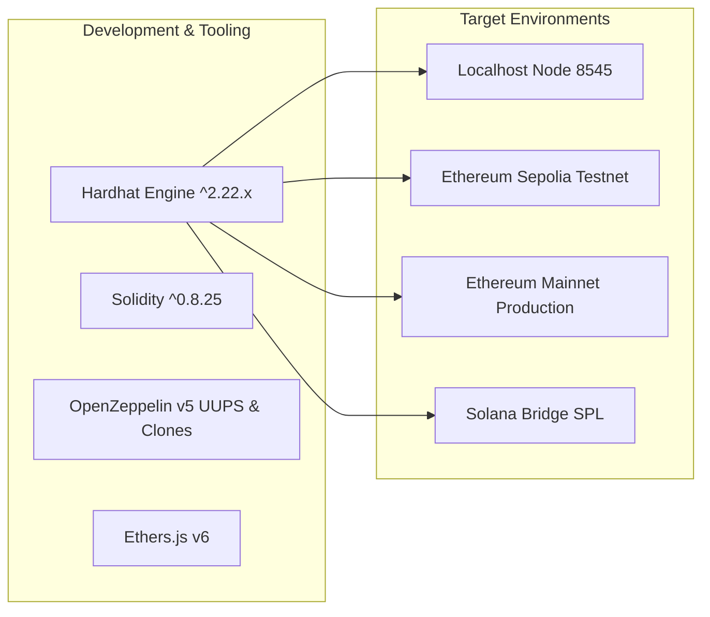
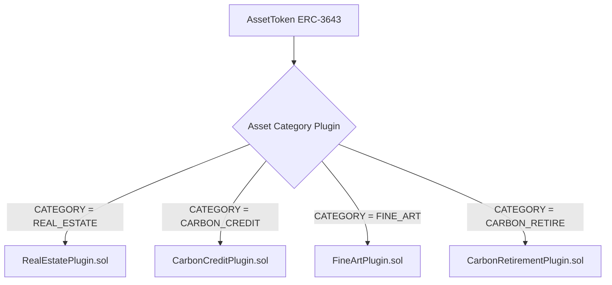
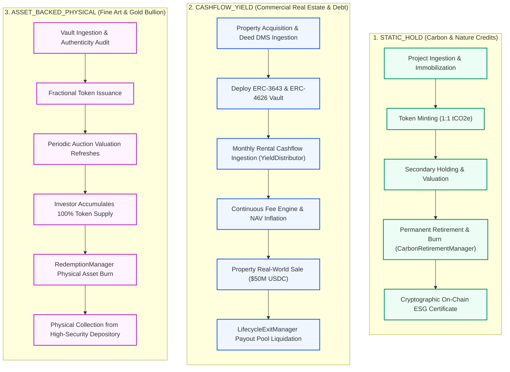
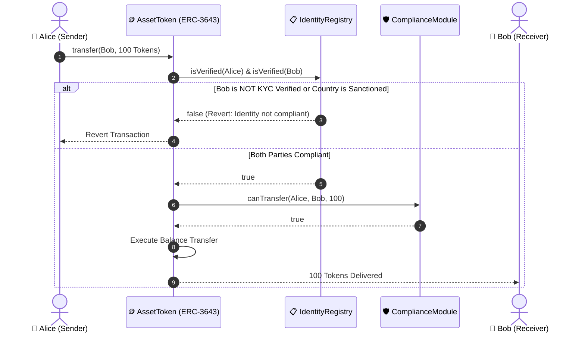
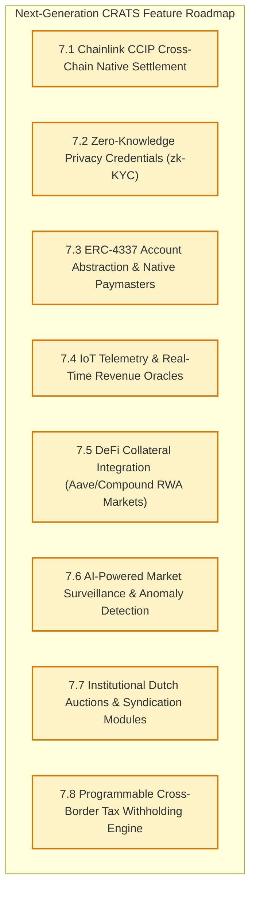

# CRATS Protocol — Master Protocol Architecture & Technical Specification

> **Document Type:** Master Protocol Blueprint & Developer Handbook  
> **Target Project:** `CRATS-EVM` (Hardhat Enterprise Smart Contract Suite)  
> **Protocol Version:** CRATS Protocol v10.0 (Nexus Architecture)  
> **Target Networks:** Ethereum Sepolia (Current Live Testnet) · Ethereum Mainnet · Solana Bridge  
> **Classification:** Technical Platform Standard & Engineering Handbook  

---

## Executive Summary

The **CRATS (Compliant Real Asset Tokenization Standard) Protocol** is an institutional-grade, multi-layer decentralized protocol engineered specifically for Real-World Asset (RWA) tokenization, fractional investment, vault accounting, and secondary trading. 

Built using Solidity `^0.8.25` and the Hardhat development framework, CRATS integrates established institutional standards:
* **ERC-3643 (T-REX)** for regulated, permissioned token issuance and automated on-chain compliance.
* **ERC-4626 & ERC-7540** for synchronous yield-bearing vaults and asynchronous liquidity/redemption queues.
* **EIP-5192 (Soulbound Identity)** for non-transferable investor and issuer verification.
* **EIP-1167 Minimal Proxy Clones** for gas-efficient ($>90\%$ savings) asset token and vault deployments.
* **UUPS (Universal Upgradeable Proxy Standard)** for transparent, multi-sig controlled smart contract upgrades.

---

## Table of Contents

1. [Hardhat Project Setup & Tooling Architecture](#1-hardhat-project-setup--tooling-architecture)
2. [The 4-Layer CRATS Protocol Architecture](#2-the-4-layer-crats-protocol-architecture)
   - 2.1 [Layer 1: Identity, Compliance & Gatekeeping](#21-layer-1-identity-compliance--gatekeeping)
   - 2.2 [Layer 2: Asset Tokenization & Digital Twins](#22-layer-2-asset-tokenization--digital-twins)
   - 2.3 [Layer 2.1: Specialized RWA Asset Plugins](#23-layer-21-specialized-rwa-asset-plugins)
   - 2.4 [Layer 3: Financial Abstraction, Vaults & Accounting](#24-layer-3-financial-abstraction-vaults--accounting)
   - 2.5 [Layer 3.1: Redemption, Exit & Retirement Infrastructure](#25-layer-31-redemption-exit--retirement-infrastructure)
   - 2.6 [Layer 4: Marketplace, Order Book & Secondary Settlement](#26-layer-4-marketplace-order-book--secondary-settlement)
   - 2.7 [Cross-Chain & Solana Mirroring Architecture](#27-cross-chain--solana-mirroring-architecture)
3. [The 3 Core Archetype Lifecycles in Code](#3-the-3-core-archetype-lifecycles-in-code)
   - 3.1 [Archetype 1: STATIC_HOLD (Carbon & Environmental Credits)](#31-archetype-1-static_hold-carbon--environmental-credits)
   - 3.2 [Archetype 2: CASHFLOW_YIELD (Commercial Real Estate & Debt)](#32-archetype-2-cashflow_yield-commercial-real-estate--debt)
   - 3.3 [Archetype 3: ASSET_BACKED_PHYSICAL (Fine Art & Precious Commodities)](#33-archetype-3-asset_backed_physical-fine-art--precious-commodities)
4. [Key On-Chain Smart Contract Mechanisms](#4-key-on-chain-smart-contract-mechanisms)
   - 4.1 [Automated Regulatory Compliance & Asset Recovery (ERC-3643)](#41-automated-regulatory-compliance--asset-recovery-erc-3643)
   - 4.2 [Continuous Management Fee Accrual & High-Water Mark Carry](#42-continuous-management-fee-accrual--high-water-mark-carry)
   - 4.3 [Valuation Oracles, Circuit Breakers & Stake-Based Disputes](#43-valuation-oracles-circuit-breakers--stake-based-disputes)
   - 4.4 [Gasless Treasury Mediation & Beneficial Owner Registry (BOR)](#44-gasless-treasury-mediation--beneficial-owner-registry-bor)
5. [Hardhat Scripting, Deployment & Automation Suite](#5-hardhat-scripting-deployment--automation-suite)
   - 5.1 [Deployment Scripts Directory](#51-deployment-scripts-directory)
   - 5.2 [Interactive CLI Tools & Verification Scripts](#52-interactive-cli-tools--verification-scripts)
6. [Testing & Quality Assurance Suite](#6-testing--quality-assurance-suite)
7. [Future Protocol Roadmap & Potential Features](#7-future-protocol-roadmap--potential-features)
   - 7.1 [Chainlink CCIP Cross-Chain Native Settlement](#71-chainlink-ccip-cross-chain-native-settlement)
   - 7.2 [Zero-Knowledge Privacy Credentials (zk-KYC / ERC-734/735)](#72-zero-knowledge-privacy-credentials-zk-kyc--erc-734735)
   - 7.3 [ERC-4337 Account Abstraction & Native Gas Paymasters](#73-erc-4337-account-abstraction--native-gas-paymasters)
   - 7.4 [IoT Telemetry & Automated Real-Time Revenue Oracles](#74-iot-telemetry--automated-real-time-revenue-oracles)
   - 7.5 [DeFi Collateral Integration & Lending Markets (Aave/Compound RWAs)](#75-defi-collateral-integration--lending-markets-aavecompound-rwas)
   - 7.6 [AI-Powered On-Chain Market Surveillance & Anomaly Detection](#76-ai-powered-on-chain-market-surveillance--anomaly-detection)
   - 7.7 [Institutional Dutch Auctions & Primary Syndication Modules](#77-institutional-dutch-auctions--primary-syndication-modules)
   - 7.8 [Programmable Cross-Border Tax Withholding Engine](#78-programmable-cross-border-tax-withholding-engine)
8. [Complete Smart Contract Inventory & Specification Catalog](#8-complete-smart-contract-inventory--specification-catalog)

---

## 1. Hardhat Project Setup & Tooling Architecture

The `CRATS-EVM` project is configured as a standalone, enterprise-grade Hardhat workspace with support for local simulated development, multi-stage testnet deployments, and Ethereum mainnet targets.



### 1.1 Hardhat Configuration (`hardhat.config.js`)
* **Solidity Version**: `^0.8.25`
* **Optimizer Configuration**: `enabled: true`, `runs: 200`
* **EVM Target**: `paris` / `cancun`
* **Plugin Integrations**:
  * `@nomicfoundation/hardhat-toolbox` (Ethers, Chai assertions, Hardhat Network helpers)
  * `@openzeppelin/hardhat-upgrades` (UUPS and Transparent Upgradeable Proxy verification)
  * `@nomicfoundation/hardhat-ignition` (Declarative smart contract deployment modules)
* **Configured Networks**:
  * `hardhat` / `localhost`: In-memory EVM with 20 pre-funded test accounts ($10,000\text{ ETH}$ each).
  * `sepolia`: Ethereum Sepolia Testnet connected via Alchemy / Infura RPC endpoints.
  * `mainnet`: Ethereum Mainnet production deployment profile with gas estimation protections.

---

## 2. The 4-Layer CRATS Protocol Architecture

```mermaid
graph TD
    classDef l1 fill:#e0f2fe,stroke:#0284c7,stroke-width:2px;
    classDef l2 fill:#fef3c7,stroke:#d97706,stroke-width:2px;
    classDef l3 fill:#dcfce7,stroke:#16a34a,stroke-width:2px;
    classDef l4 fill:#f3e8ff,stroke:#9333ea,stroke-width:2px;

    subgraph L1["Layer 1: Identity & Compliance (Trust Foundation)"]
        direction TB
        L1_KYC["KYCProvidersRegistry.sol"]:::l1
        L1_SBT["IdentitySBT.sol (EIP-5192)"]:::l1
        L1_REG["IdentityRegistry.sol"]:::l1
        L1_CMP["Compliance.sol"]:::l1
        L1_TRV["TravelRuleModule.sol"]:::l1
        L1_SNC["SanctionsOracle.sol"]:::l1
        L1_RGT["InvestorRightsRegistry.sol"]:::l1
        L1_KYC --> L1_SBT --> L1_REG --> L1_CMP
        L1_CMP --> L1_TRV
        L1_CMP --> L1_SNC
    end

    subgraph L2["Layer 2: Asset Tokenization (Digital Twin Engine)"]
        direction TB
        L2_FAC["AssetFactory.sol (EIP-1167 Clones)"]:::l2
        L2_TOK["AssetToken.sol (ERC-3643 / T-REX)"]:::l2
        L2_REG["AssetRegistry.sol"]:::l2
        L2_DMS["DMSRegistry.sol"]:::l2
        L2_BRK["CircuitBreakerModule.sol"]:::l2
        L2_OSM["OwnershipSyncManager.sol"]:::l2
        L2_FAC --> L2_TOK
        L2_TOK --> L2_REG
        L2_TOK --> L2_DMS
        L2_TOK --> L2_BRK
        L2_TOK --> L2_OSM
    end

    subgraph L2P["Layer 2.1: RWA Smart Contract Plugins"]
        direction TB
        P_RE["RealEstatePlugin.sol"]:::l2
        P_CC["CarbonCreditPlugin.sol"]:::l2
        P_FA["FineArtPlugin.sol"]:::l2
        P_CR["CarbonRetirementPlugin.sol"]:::l2
        P_ORC["AssetOracle.sol"]:::l2
    end
    L2_TOK --> L2P

    subgraph L3["Layer 3: Financial Abstraction & Vaults"]
        direction TB
        L3_FAC["VaultFactory.sol (EIP-1167 Clones)"]:::l3
        L3_SYN["SyncVault.sol (ERC-4626)"]:::l3
        L3_ASY["AsyncVault.sol (ERC-7540)"]:::l3
        L3_BAS["BaseVault.sol (BOR Transfer Hook)"]:::l3
        L3_FEE["FeeEngine.sol (Continuous BPS & HWM)"]:::l3
        L3_NAV["NAVOracle.sol & NAVScheduler.sol"]:::l3
        L3_DSP["DisputeResolver.sol"]:::l3
        L3_YLD["YieldDistributor.sol"]:::l3
        L3_EXT["LifecycleExitManager.sol"]:::l3
        L3_RED["RedemptionManager.sol"]:::l3
        L3_RET["CarbonRetirementManager.sol"]:::l3
        L3_FAC --> L3_SYN
        L3_FAC --> L3_ASY
        L3_SYN --> L3_BAS
        L3_SYN --> L3_FEE
        L3_SYN --> L3_NAV
        L3_SYN --> L3_YLD
        L3_SYN --> L3_EXT
        L3_SYN --> L3_RED
        L3_SYN --> L3_RET
    end

    subgraph L4["Layer 4: Marketplace, Order Book & Secondary Settlement"]
        direction TB
        L4_ORD["OrderBookEngine.sol"]:::l4
        L4_MAT["MatchingEngine.sol"]:::l4
        L4_SET["SettlementEngine.sol (Atomic DvP)"]:::l4
        L4_CLR["ClearingHouse.sol"]:::l4
        L4_AMM["AMMPool.sol"]:::l4
        L4_GAT["ComplianceGate.sol"]:::l4
        L4_SRV["MarketSurveillance.sol"]:::l4
        L4_MEV["MEVProtection.sol"]:::l4
        L4_ORD --> L4_MAT --> L4_SET --> L4_CLR
        L4_SET --> L4_AMM
        L4_SET --> L4_GAT
    end

    L1_REG -.->|Authorize Transfers| L2_TOK
    L2_TOK -.->|Underlying Collateral| L3_SYN
    L3_SYN -.->|Liquid Share Trading| L4_SET
```



---

### 2.1 Layer 1: Identity, Compliance & Gatekeeping

Layer 1 establishes the decentralized identity and permissioning foundation of the CRATS Protocol.

| Contract File | Standard / Interface | Architectural Role | Key Functions |
| :--- | :--- | :--- | :--- |
| `IdentityRegistry.sol` | `IIdentityRegistry` | Primary registry storing verified investor DIDs, country codes, and accreditation tiers. | `registerIdentity()`, `isVerified()`, `getInvestorCountry()`, `freezeIdentity()`. |
| `IdentitySBT.sol` | `EIP-5192` (Soulbound) | Non-transferable identity token bound to an investor's wallet address after Sumsub KYC. | `mint()`, `burn()`, `locked()`, `getIdentityDetails()`. |
| `KYCProvidersRegistry.sol` | Multi-Provider Auth | Whitelists and manages accredited KYC/KYB oracle providers (e.g. Sumsub, Onfido). | `authorizeProvider()`, `revokeProvider()`, `isProviderAuthorized()`. |
| `Compliance.sol` | `ICompliance` | Modular rule engine evaluating investor country restrictions, investor limits, and caps. | `canTransfer()`, `checkRule()`, `bindAssetToken()`, `setCountryRestriction()`. |
| `TravelRuleModule.sol` | FATF Recommendation 16 | Enforces FATF Travel Rule compliance metadata requirements on transfers $> \$1,000$. | `verifyTravelRuleData()`, `recordVASPDetails()`, `requireVASPDeclaration()`. |
| `SanctionsOracle.sol` | Chainlink / OFAC Feeds | Real-time sanctions checking oracle filtering restricted addresses and countries. | `isSanctioned()`, `updateSanctionList()`, `checkJurisdiction()`. |
| `InvestorRightsRegistry.sol` | Governance Rights | Records legal rights, voting power, and legal claim entitlements per token class. | `registerRights()`, `verifyVotingEligibility()`, `claimEntitlement()`. |

---

### 2.2 Layer 2: Asset Tokenization & Digital Twins

Layer 2 creates the on-chain digital twin of the physical asset using regulated token standards.

| Contract File | Standard / Interface | Architectural Role | Key Functions |
| :--- | :--- | :--- | :--- |
| `AssetFactory.sol` | `EIP-1167` Minimal Proxy | Deploys lightweight, gas-efficient clones of `AssetToken` ($>90\%$ cheaper than standard deployment). | `createAssetToken()`, `predictTokenAddress()`, `getDeployedAssets()`. |
| `AssetToken.sol` | `ERC-3643` (T-REX Standard) | Regulated fractional security token with built-in transfer validation hooks and admin clawback. | `transfer()`, `transferFrom()`, `freeze()`, `unfreeze()`, `forceTransfer()`, `burn()`. |
| `AssetRegistry.sol` | Central Asset Repository | Maps token contract addresses to asset legal IDs, categories, and DMS IPFS hashes. | `registerAsset()`, `getAssetMetadata()`, `updateLegalDeedHash()`. |
| `DMSRegistry.sol` | `IDMS` | Cryptographic registry recording document hashes (SHA-256) and verifying compliance completeness. | `registerDocument()`, `verify3PillarGate()`, `checkDocumentExpiry()`. |
| `OwnershipSyncManager.sol` | Cap Table Bridge | Propagates token balance updates to external registers and regulatory reporting feeds. | `syncBalance()`, `notifyTransfer()`, `getHistoricalCapTable()`. |
| `CircuitBreakerModule.sol` | Emergency Control | Halts transfers or redemptions when valuation oracles detect stale prices or anomalies. | `triggerHalt()`, `resumeOperations()`, `checkFreshness()`. |

---

### 2.3 Layer 2.1: Specialized RWA Asset Plugins

To support diverse real-world asset classes without altering the core token logic, CRATS implements pluggable metadata and validation modules implementing `IAssetPlugin.sol`:



#### Plugin Data Schemas & Responsibilities:
1. **`RealEstatePlugin.sol`**:
   - **Category ID**: `keccak256("REAL_ESTATE")`
   - **Validation Rules**: Requires property title deed registry, independent appraisal report, building inspection report, and property insurance document.
   - **Metadata**: GPS coordinates, square footage, occupancy percentage, lease expiry schedules, and net yield.
2. **`CarbonCreditPlugin.sol`**:
   - **Category ID**: `keccak256("CARBON_CREDIT")`
   - **Archetype**: `STATIC_HOLD (0)`
   - **Exit Mechanism**: `RETIRE_BURN (1)`
   - **Validation Rules**: Requires PDD validation report, verification report, monitoring report, and immobilization proof.
   - **Metadata**: Registry ID (Verra/Gold Standard), vintage year, methodology (e.g. `VM0048`), serial number range, CORSIA, ICVCM Core Carbon Principles, Article 6 status, and GFW satellite coordinates.
3. **`FineArtPlugin.sol`**:
   - **Category ID**: `keccak256("FINE_ART")`
   - **Archetype**: `ASSET_BACKED_PHYSICAL`
   - **Redemption Policy**: `defaultEnabled = true`, `issuerCanOverride = true`
   - **Validation Rules**: Requires Certificate of Authenticity, physical condition report, and museum/vault custody agreement.

---

### 2.4 Layer 3: Financial Abstraction, Vaults & Accounting

Layer 3 abstracts underlying physical collateral into liquid, yield-bearing vaults.

| Contract File | Standard / Standard | Architectural Role | Key Functions |
| :--- | :--- | :--- | :--- |
| `VaultFactory.sol` | `EIP-1167` Proxy Factory | Deploys cloned instances of `SyncVault` and `AsyncVault` per asset token. | `createSyncVault()`, `createAsyncVault()`, `getVaultsByAsset()`. |
| `SyncVault.sol` | `ERC-4626` Synchronous Vault | Liquid yield vault that calculates dynamic share-to-asset exchange rates and mints `vASSET` shares. | `deposit()`, `mint()`, `withdraw()`, `redeem()`, `convertToShares()`, `convertToAssets()`. |
| `AsyncVault.sol` | `ERC-7540` Asynchronous Vault | Manages multi-day settlement queues ($T+1, T+2, T+7$) for illiquid private assets. | `requestDeposit()`, `requestRedeem()`, `claimDeposit()`, `claimRedeem()`. |
| `BaseVault.sol` | Inheritance Base | Extends ERC-4626 with automated transfer hooks syncing the Beneficial Owner Registry (BOR). | `_afterTokenTransfer()`, `syncBOR()`, `isBORActive()`. |
| `FeeEngine.sol` | `IFeeEngine` | Computes continuous per-second management fees and High-Water Mark (HWM) performance carry. | `calculateAccruedFee()`, `accrueFees()`, `assessPerformanceCarry()`, `setFeeTaxonomy()`. |
| `NAVOracle.sol` | Multi-Source Valuation Oracle | Aggregates independent appraisals, DCF cashflows, and market comparables into an on-chain NAV. | `submitValuation()`, `getLatestNAV()`, `getStalenessStatus()`, `triggerCircuitBreaker()`. |
| `NAVScheduler.sol` | Chainlink Automation Keeper | Automated contract checking valuation staleness and triggering warning/halt events periodically. | `checkUpkeep()`, `performUpkeep()`, `forceScheduleCheck()`. |
| `DisputeResolver.sol` | Decentralized Court | Stake-based dispute resolution where investors challenge fraudulent appraisals and slash bad actors. | `raiseDispute()`, `voteOnDispute()`, `resolveDispute()`, `slashStake()`. |
| `YieldDistributor.sol` | Dividend Router | Deposits rental income or bond coupons and inflates NAV per share to distribute dividends. | `depositYield()`, `distributeProRata()`, `claimHistoricalDividends()`. |

---

### 2.5 Layer 3.1: Redemption, Exit & Retirement Infrastructure

CRATS implements three distinct smart contracts to manage the different end-of-life and redemption behaviors of tokenized assets:

```mermaid
graph TD
    subgraph "1. Carbon Credits: Retire & Burn"
        M1[CarbonRetirementManager.sol] -->|Permanent Burn| CERT[Cryptographic On-Chain Certificate]
    end

    subgraph "2. Real Estate: Asset Sale Liquidation"
        M2[LifecycleExitManager.sol] -->|Issuer Deposits $50M USDC| POOL[Pro-Rata USDC Settlement Pool]
        POOL -->|Investors Burn Shares| CASH[Claim Liquid USDC Cash]
    end

    subgraph "3. Fine Art & Commodities: Physical Depository Claim"
        M3[RedemptionManager.sol] -->|Investor Burns 100% Shares| VAULT[Physical Vault Depository Delivery]
    end
```



1. **`CarbonRetirementManager.sol`** (Retire & Burn ESG Engine):
   - Users permanently retire carbon credits to offset emissions.
   - Emits `CreditsRetired(assetToken, holder, amount, memo, timestamp)`.
   - Burns tokens permanently and records immutable retirement claims on-chain.
2. **`LifecycleExitManager.sol`** (Real-World Asset Sale Liquidation):
   - When a commercial building or infrastructure asset is sold in the real world:
     1. The issuer deposits the total USDC liquidation proceeds (e.g. $\$50\text{M}$ USDC).
     2. All outstanding `AssetTokens` and `SyncVault` shares are frozen and burned.
     3. Investors call `claimExitPayout()` to claim their pro-rata USDC cash.
3. **`RedemptionManager.sol`** (Physical Depository Custody Collection):
   - Manages physical asset redemption for gold bullion or fine art.
   - Features FIFO queue processing, scheduled redemption windows, and batch processing for institutional holders.

---

### 2.6 Layer 4: Marketplace, Order Book & Secondary Settlement

Layer 4 provides decentralized, compliant secondary liquidity with atomic Delivery-vs-Payment (DvP) settlement:

| Contract File | Architectural Role | Key Functions |
| :--- | :--- | :--- |
| `OrderBookEngine.sol` | On-chain limit order book storing resting bid/ask orders with expiration timestamps. | `createLimitOrder()`, `cancelOrder()`, `getOrderDetails()`, `getOrderDepth()`. |
| `MatchingEngine.sol` | Matches crossing limit orders with price-time priority. | `matchOrders()`, `validateMatchPrice()`, `calculateFillAmount()`. |
| `SettlementEngine.sol` | Executes atomic Delivery-vs-Payment (DvP) swaps: simultaneous swap of stablecoins for vault shares. | `settleTrade()`, `executeAtomicSwap()`, `deductPlatformTradeFee()`. |
| `ClearingHouse.sol` | Manages collateral margins, trade finality locks, and net settlement reconciliations. | `lockCollateral()`, `releaseMargin()`, `reconcileDailyVolume()`. |
| `AMMPool.sol` | Constant-product liquidity pool ($x \cdot y = k$) for instant retail swap liquidity. | `swap()`, `addLiquidity()`, `removeLiquidity()`, `getSpotPrice()`. |
| `ComplianceGate.sol` | Pre-trade validation gate verifying that both buyer and seller satisfy KYC and country restrictions. | `verifyTradeCompliance()`, `isTradeAuthorized()`. |
| `MarketSurveillance.sol` | On-chain monitor detecting suspicious trading behaviors, wash trading, and rapid spoofing. | `recordTrade()`, `detectAnomalies()`, `flagSuspiciousAccount()`. |
| `MEVProtection.sol` | Protects traders from front-running and sandwich attacks via commit-reveal schemes and private mempools. | `commitOrder()`, `revealOrder()`, `enforceSlippageGuard()`. |

---

### 2.7 Cross-Chain & Solana Mirroring Architecture

To enable multi-chain liquidity while maintaining the canonical state on Ethereum, CRATS provides cross-chain bridging contracts:
* **`SolanaMirrorToken.sol`**: An EVM-side mirror contract that binds canonical Ethereum RWA vault shares to synthetic SPL tokens on Solana.
* **`ProofVerifier.sol`**: Verifies cryptographic Merkle proofs and state commitments sent across chain relayers.

---

## 3. The 3 Core Archetype Lifecycles in Code

The CRATS Protocol enforces distinct financial lifecycles based on the physical properties of the underlying real-world asset:



### 3.1 Archetype Comparison Summary

| Feature / Metric | Carbon Credits (`STATIC_HOLD`) | Commercial Real Estate (`CASHFLOW_YIELD`) | Fine Art & Gold (`ASSET_BACKED_PHYSICAL`) |
| :--- | :---: | :---: | :---: |
| **Plugin Contract** | `CarbonCreditPlugin.sol` | `RealEstatePlugin.sol` | `FineArtPlugin.sol` |
| **Yield Cashflow Distribution** | ❌ None (Carbon offset purpose) | ✅ Yes (`YieldDistributor.sol`) | ❌ None (Appreciation only) |
| **Fee Structure** | 50 – 100 BPS management | 100 – 200 BPS + HWM Carry | 75 – 200 BPS + HWM Carry |
| **End-of-Life Exit Mechanism** | **Retire & Burn** (`CarbonRetirementManager`) | **Property Sale Liquidation** (`LifecycleExitManager`) | **Physical Collection** (`RedemptionManager`) |
| **Physical Delivery Allowed** | ❌ No | ❌ No (Liquid USDC Payout) | ✅ Yes (100% Token Burn) |

---

## 4. Key On-Chain Smart Contract Mechanisms

### 4.1 Automated Regulatory Compliance & Asset Recovery (ERC-3643)

Unlike standard unpermissioned ERC-20 tokens, every transfer in CRATS passes through `Compliance.sol` and `IdentityRegistry.sol`:



#### Court-Ordered Asset Recovery (`forceTransfer`):
In legal forfeiture cases or lost private keys, compliance administrators execute `AssetToken.forceTransfer(from, to, amount)`:
1. Burns the compromised or court-ordered tokens from the original address.
2. Re-mints identical tokens to the compliant beneficiary address.
3. Emits `RecoveryExecuted` event with court case hash.

---

### 4.2 Continuous Management Fee Accrual & High-Water Mark Carry

`FeeEngine.sol` eliminates front-running and lump-sum volatility through continuous per-second accrual:

$$\text{Accrued Fee} = \frac{\text{Vault AUM} \times \text{Management Fee (BPS)} \times \Delta t}{10,000 \times 31,536,000}$$

#### High-Water Mark (HWM) Carry Rules:
* Performance fees ($10\% - 20\%$) are charged **only** when the current NAV per share exceeds the historical highest NAV ever recorded ($HWM$).
* If the asset valuation declines, zero carry is assessed until all historical losses are fully recouped.

---

### 4.3 Valuation Oracles, Circuit Breakers & Stake-Based Disputes

`NAVOracle.sol` aggregates 4 distinct data sources with automated Circuit Breakers:

```
[ Valuation Age ] ──► < 7 Days:   🟢 FRESH      ──► Full platform deposits & trading active
                  ──► 7-14 Days:  🟡 WARNING    ──► Restrict deposits; alert compliance admins
                  ──► 14-30 Days: 🟠 CRITICAL   ──► Block deposits; allow redemptions only
                  ──► > 30 Days:  🔴 STALE HALT ──► Freeze all secondary trading immediately
```

#### Stake-Based Dispute Resolution (`DisputeResolver.sol`):
1. **Raising a Dispute**: Any verified investor holding $>5\%$ of vault shares can post a challenge stake ($5,000\text{ USDC}$) and submit counter-appraisals.
2. **Auditor Review**: Certified independent appraisers review evidence on-chain.
3. **Slashing**:
   * If challenge is **Valid**: Stale valuation is rolled back, the malicious appraiser is blacklisted, and the challenger receives a reward.
   * If challenge is **Invalid**: Challenger's stake is slashed into the Protocol Insurance Reserve.

---

### 4.4 Gasless Treasury Mediation & Beneficial Owner Registry (BOR)

To resolve the industry "Nominee Problem" where only the vault smart contract appears as the token holder:
1. `BaseVault.sol` intercepts every deposit, withdrawal, and transfer hook.
2. Automatically calls `AssetRegistry.syncBeneficialOwner(investor, shares, percentage)`.
3. Issuers and regulators have real-time visibility into the legal cap table at all times.

---

## 5. Hardhat Scripting, Deployment & Automation Suite

The `CRATS-EVM` workspace includes over **40 specialized automation scripts** located in `scripts/`:

```
┌─────────────────────────────────────────────────────────────────────────────┐
│                    CRATS HARDHAT AUTOMATION SCRIPTS CATALOG                 │
├──────────────────────────┬──────────────────────────────────────────────────┤
│ Script Name              │ Core Responsibility                              │
├──────────────────────────┼──────────────────────────────────────────────────┤
│ deploy-master.js         │ Deploys all 4 layers in one unified execution.   │
│ deploy-layer1.js         │ Deploys Identity, SBT, Registry, and Compliance. │
│ deploy-layer2.js         │ Deploys AssetFactory, ERC-3643, and DMS registry.│
│ deploy-layer3.js         │ Deploys Vaults, FeeEngine, NAVOracle, and Exits. │
│ deploy-layer4.js         │ Deploys OrderBook, SettlementEngine, and Pools.  │
│ deploy-carbon-v10.js     │ Deploys CarbonCreditPlugin & Retirement Manager. │
│ deploy-fineart-plugin.js │ Deploys FineArtPlugin & Physical Redemption suite│
│ deploy-v10-sepolia.js    │ End-to-end deployment of v10 suite to Sepolia.   │
│ nav-cli.js               │ Interactive CLI for managing NAVs & disputes.    │
│ audit-live-state.js      │ Reads and audits all live contract state variables│
│ verify-sepolia-txs.js    │ Verifies on-chain transaction hashes & receipts. │
│ simulate_deposit.js      │ Simulates end-to-end investor purchase lifecycle.│
└──────────────────────────┴──────────────────────────────────────────────────┘
```

---

## 6. Testing & Quality Assurance Suite

The protocol features a comprehensive test suite across `test/layer1/`, `test/layer2/`, and `test/layer3/`:
* **Unit Tests**: Verifying mathematical invariants (continuous BPS accruals, share conversion rounding, EIP-1167 clone initialization).
* **Compliance Invariant Tests**: Ensuring unverified wallets cannot receive tokens under any condition.
* **Circuit Breaker Tests**: Simulating stale oracle feeds and verifying immediate halts of secondary markets.
* **Exit & Redemption Fuzzing**: Validating that liquidation payout pools distribute exactly $100.000\%$ of funds without rounding dust leaks.

```bash
# Run all protocol tests
npx hardhat test

# Run test with gas reporting
REPORT_GAS=true npx hardhat test
```

---

## 7. Future Protocol Roadmap & Potential Features

The following innovations represent the planned development trajectory to expand CRATS into the global multi-chain RWA institutional standard:



### 7.1 Chainlink CCIP Cross-Chain Native Settlement
* **Objective**: Allow an investor on **Arbitrum, Base, Polygon, or Solana** to buy shares in an Ethereum-based commercial real estate vault seamlessly without manual bridging.
* **Implementation**: Implement Chainlink Cross-Chain Interoperability Protocol (CCIP) routers in `SyncVault.sol` to enable programmable cross-chain token transfers and remote share minting.

### 7.2 Zero-Knowledge Privacy Credentials (zk-KYC / ERC-734/735)
* **Objective**: Enable full regulatory KYC compliance without exposing investor personal identity, passport details, or country data publicly on the blockchain.
* **Implementation**: Deploy Circom/SnarkJS zk-SNARK circuits generating cryptographic zero-knowledge proofs (e.g. *“Proof that Investor is over 18, non-sanctioned, and an Accredited US Investor”*) verified by `ZKIdentityVerifier.sol`.

### 7.3 ERC-4337 Account Abstraction & Native Gas Paymasters
* **Objective**: Completely eliminate the need for centralized gas auto-fueling scripts (`Gas Vault 88`) by making all RWA interactions natively gasless.
* **Implementation**: Implement an ERC-4337 `CRATSPaymaster.sol` where the platform treasury or asset issuers sponsor gas fees directly via UserOperations.

### 7.4 IoT Telemetry & Automated Real-Time Revenue Oracles
* **Objective**: Stream live physical asset revenues directly into yield distribution contracts without human intermediary accounting.
* **Implementation**: Integrate smart electric meters (for solar farms) and digital tenant payment gateways with Chainlink Decentralized Oracle Networks (DON) to trigger `YieldDistributor.depositYield()` automatically in real time.

### 7.5 DeFi Collateral Integration & Lending Markets (Aave/Compound RWAs)
* **Objective**: Allow investors holding `vASSET` vault shares to use them as collateral to borrow stablecoins (USDC/USDT) without selling their underlying property tokens.
* **Implementation**: Build an isolated lending pool plugin (`RWALendingPool.sol`) that utilizes `NAVOracle.sol` as the liquidation price feed with dynamic Loan-to-Value (LTV) limits ($50\% - 70\%$).

### 7.6 AI-Powered On-Chain Market Surveillance & Anomaly Detection
* **Objective**: Real-time detection of wash trading, spoofing, front-running, and coordinated market manipulation across secondary order books.
* **Implementation**: On-chain machine learning oracle hooks that monitor order cancellation rates, wallet clustering, and trade velocity, automatically placing suspicious accounts into a temporary review state.

### 7.7 Institutional Dutch Auctions & Primary Syndication Modules
* **Objective**: Facilitate dynamic, market-driven price discovery for multi-million dollar bond offerings and private equity tokenizations.
* **Implementation**: Deploy `DutchAuctionEngine.sol` featuring configurable price descent curves, minimum reserve floors, and batched investor commitments.

### 7.8 Programmable Cross-Border Tax Withholding Engine
* **Objective**: Automatically deduct and route international tax withholdings (e.g. IRS W-8BEN $30\%$ withholding vs. $15\%$ bilateral tax treaties) upon dividend yield distributions.
* **Implementation**: `TaxWithholdingModule.sol` that queries the investor's residency country in `IdentityRegistry.sol` and splits yield payments between the investor's net wallet and the jurisdiction tax escrow vault.

---

## 8. Complete Smart Contract Inventory & Specification Catalog

```
┌─────────────────────────────────────────────────────────────────────────────┐
│                     COMPLETE CRATS PROTOCOL CONTRACT CATALOG                │
├──────────────────────┬──────────────────────┬───────────────────────────────┤
│ Contract Name        │ Layer / Category     │ Core Business Responsibility  │
├──────────────────────┼──────────────────────┼───────────────────────────────┤
│ IdentitySBT          │ Layer 1: Identity    │ EIP-5192 Soulbound KYC Token  │
│ IdentityRegistry     │ Layer 1: Identity    │ Verified Investor Registry    │
│ KYCProvidersRegistry │ Layer 1: Identity    │ Accredited KYC Provider Auth  │
│ Compliance           │ Layer 1: Compliance  │ Modular Regulatory Gatekeeper │
│ TravelRuleModule     │ Layer 1: Compliance  │ FATF Recommendation 16 Engine │
│ SanctionsOracle      │ Layer 1: Compliance  │ Real-Time OFAC Sanctions Feed │
│ InvestorRightsReg    │ Layer 1: Governance  │ Legal Rights & Claim Registry │
│ AssetFactory         │ Layer 2: Assets      │ EIP-1167 Minimal Proxy Factory│
│ AssetToken           │ Layer 2: Assets      │ ERC-3643 Regulated Asset Twin │
│ AssetRegistry        │ Layer 2: Assets      │ Legal Deeds & DMS CID Storage │
│ DMSRegistry          │ Layer 2: Assets      │ SHA-256 Hashes & 3-Pillar Gate│
│ CircuitBreakerModule │ Layer 2: Safety      │ Stale NAV Halt Kill-Switch    │
│ OwnershipSyncManager │ Layer 2: Cap Table   │ Cross-Contract Cap Table Sync │
│ RealEstatePlugin     │ Layer 2.1: Plugins   │ Real Estate Metadata & Rules  │
│ CarbonCreditPlugin   │ Layer 2.1: Plugins   │ Carbon Serial & ICVCM Metadata│
│ FineArtPlugin        │ Layer 2.1: Plugins   │ Art Provenance & Vault Rules  │
│ CarbonRetirementPlug │ Layer 2.1: Plugins   │ Carbon Offset Burn Rules      │
│ AssetOracle          │ Layer 2.1: Plugins   │ Specialized Asset Price Feeds │
│ VaultFactory         │ Layer 3: Vaults      │ Cloned Vault Deployment Engine│
│ SyncVault            │ Layer 3: Vaults      │ ERC-4626 Liquid Yield Vault   │
│ AsyncVault           │ Layer 3: Vaults      │ ERC-7540 Queued Exit Vault    │
│ BaseVault            │ Layer 3: Vaults      │ BOR Cap Table Transfer Hooks  │
│ FeeEngine            │ Layer 3: Financials  │ Continuous BPS & HWM Carry    │
│ NAVOracle            │ Layer 3: Financials  │ Multi-Source Valuation Oracle │
│ NAVScheduler         │ Layer 3: Financials  │ Chainlink Automation Keeper   │
│ DisputeResolver      │ Layer 3: Financials  │ Stake-Based Valuation Court   │
│ YieldDistributor     │ Layer 3: Financials  │ Dividend & Rental Cash Router │
│ LifecycleExitManager │ Layer 3: Financials  │ Property Sale USDC Payout Pool│
│ RedemptionManager    │ Layer 3: Financials  │ Physical Depository Collection│
│ CarbonRetirementMgr  │ Layer 3: Financials  │ Carbon Retirement Certificate │
│ GovernanceMultisig   │ Layer 3: Governance  │ Multi-Party Treasury Control  │
│ OrderBookEngine      │ Layer 4: Marketplace │ On-Chain Limit Order Book     │
│ MatchingEngine       │ Layer 4: Marketplace │ Price-Time Order Matcher      │
│ SettlementEngine     │ Layer 4: Marketplace │ Atomic Delivery-vs-Payment DvP│
│ ClearingHouse        │ Layer 4: Marketplace │ Trade Margins & Net Finality  │
│ AMMPool              │ Layer 4: Marketplace │ Automated Liquidity Pool      │
│ BestExecution        │ Layer 4: Marketplace │ Smart Order Routing           │
│ ComplianceGate       │ Layer 4: Marketplace │ Pre-Trade KYC Validation Gate │
│ MarketSurveillance   │ Layer 4: Marketplace │ Wash Trading & Spoof Monitor  │
│ MEVProtection        │ Layer 4: Marketplace │ Anti-Sandwich Slippage Guards │
│ MarketplaceFactory   │ Layer 4: Marketplace │ Pair & Pool Deployment Factory│
│ PriceOracle          │ Layer 4: Marketplace │ Secondary Market Price Feed   │
│ SolanaMirrorToken    │ Cross-Chain Bridge   │ Synthetic SPL Mirror Token    │
│ ProofVerifier        │ Cross-Chain Bridge   │ Merkle Relayer Proof Verifier │
└──────────────────────┴──────────────────────┴───────────────────────────────┘
```

---

## 9. Conclusion & Protocol Value Proposition

The **CRATS Protocol** establishes a robust, institutional-grade infrastructure for bringing multi-trillion-dollar real-world assets onto the blockchain. By uniting:
1. **Regulated Security Token Issuance (`ERC-3643`)** with non-transferable Soulbound identity (`IdentitySBT`),
2. **Liquid Financial Vaults (`ERC-4626`)** with continuous per-second fee accounting and high-water mark protection,
3. **Dedicated Asset Archetypes** tailored for Carbon Offsets (`Retire & Burn`), Real Estate (`USDC Liquidation Exit`), and Fine Art (`Physical Redemption`),
4. **Atomic Secondary Market Settlement (DvP)** with automated compliance enforcement,

CRATS delivers the complete, turnkey technology foundation powering the modern tokenized real-world asset economy.
