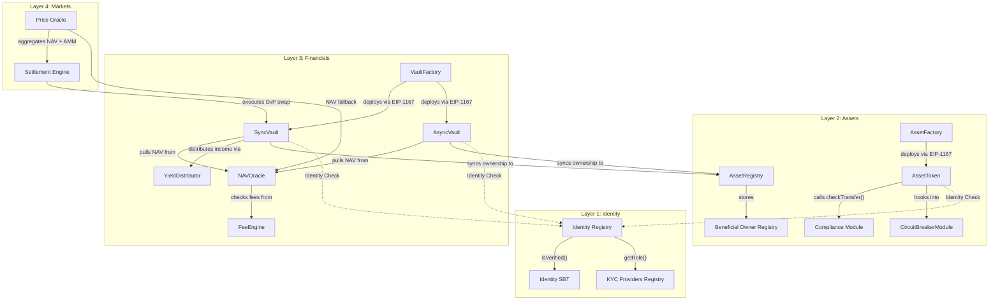
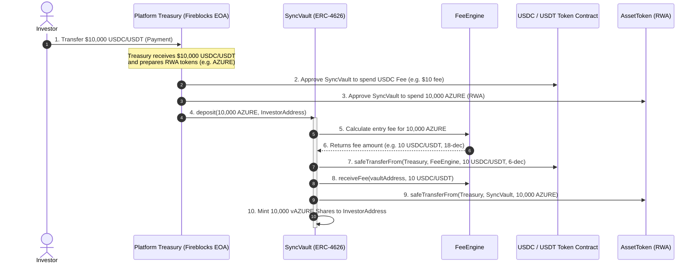
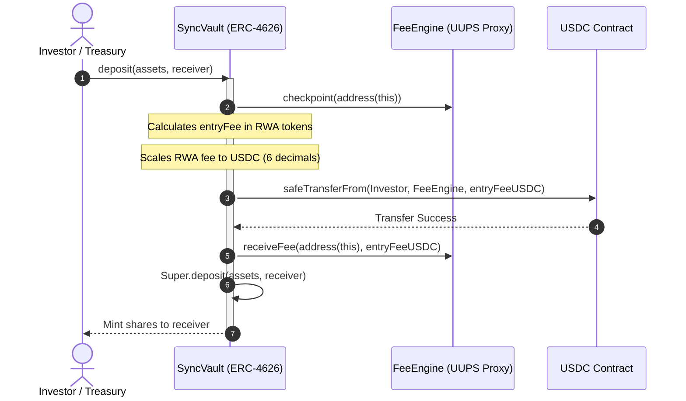

# TECHNICAL SPECIFICATION
## CRATS Protocol Technical Specification & Development Lifecycle
### Requirements, Design & Development Phases (Current State - v6.0.0)
**Real-World Asset Tokenization Platform**  
**Ethereum Sepolia (Development Network)**

*CopyM Platform — Confidential*

---

## Table of Contents
1. [Protocol Overview & Architecture](#1-protocol-overview--architecture)
   - 1.1 High-Level Architecture (The 4-Layer Stack)
   - 1.2 Low-Level Contract Relationships (Architecture Diagram)
2. [Requirements Phase](#2-requirements-phase)
   - 2.1 Business Requirements (Investor, Issuer, Admin)
   - 2.2 Compliance Requirements (Sumsub Integration)
   - 2.3 Custody & Wallet Requirements (Fireblocks MPC)
   - 2.4 Blockchain & Protocol Requirements
3. [Design Phase](#3-design-phase)
   - 3.1 Layer 1 Design: Identity & Compliance (Soulbound Gatekeeping)
   - 3.2 Layer 2 Design: Asset Tokenization (ERC-3643 & Compliance Modules)
   - 3.3 Layer 3 Design: Financial Vaults (EIP-1167 Templates & EIP-7540 Async Logic)
   - 3.4 Layer 4 Design: Marketplace & Secondary Settlement (Atomic DvP)
4. [Development Phase](#4-development-phase)
   - 4.1 Frontend Portals Architecture (Vite + React + Tailwind CSS)
   - 4.2 Backend Services & SDK Architecture (Node.js + Express + Prisma + Ethers)
   - 4.3 Fireblocks Integration & Transaction Flow
   - 4.4 Smart Contract Architecture (Solidity Analysis)
5. [Protocol Operations & Workflows](#5-protocol-operations--workflows)
   - 5.1 The 14-Step Institutional Lifecycle
   - 5.2 The Tri-Stage Investment Lifecycle (Retail Mediation)
6. [Section A: Tokenomics & Fee Structure](#6-section-a-tokenomics--fee-structure)
   - 6.1 Fee Configurations & Distribution Models
   - 6.2 High Water Mark (HWM) Validation Rules
   - 6.3 Accrual Mechanics (Management & Performance Fees)
7. [Section B: NAV Calculation Methodology](#7-section-b-nav-calculation-methodology)
   - 7.1 Multi-source Price Aggregation & Valuation Registry
   - 7.2 Staleness Circuit Breakers (FRESH, WARNING, CRITICAL, STALE)
   - 7.3 Stake-based Dispute Resolution & Slashing Rules
8. [Institutional Reality Checks & Gap Analysis](#8-institutional-reality-checks--gap-analysis)
9. [Appendix: Core Smart Contract Code Snippets](#9-appendix-core-smart-contract-code-snippets)
   - 9.1 Layer 1: Identity & Compliance (Gatekeeping)
   - 9.2 Layer 2: Asset Management & RWA Plugins
   - 9.3 Layer 3: Financial Layer & Vault Share Minting (Sync/Async Vaults)
   - 9.4 Layer 3 Financials: FeeEngine & NAVOracle
   - 9.5 Layer 4: Marketplace & Secondary Settlement

---

## 1. Protocol Overview & Architecture

The CRATS Protocol (Nexus) is an institutional-grade Real-World Asset (RWA) tokenization platform. The architecture is built on top of established industry standards: **ERC-3643 (T-REX)** for compliance and identity registry, **ERC-4626** for yield-bearing vaults, and **MakerDAO/Centrifuge** structures for risk management.

### 1.1 High-Level Architecture (The 4-Layer Stack)

The system is segregated into four distinct layers, each communicating with adjacent layers through strictly defined interfaces to enforce compliance at every transaction boundary:

*   **Layer 1: Identity & Compliance (The Trust Foundation):** Governs multi-jurisdictional gatekeeping. It acts as an on-chain registry of verified participants. Access is restricted using Soulbound Tokens (SBTs) and Decentralized Identifiers (DIDs).
*   **Layer 2: Asset Tokenization (Digital Lifecycle):** Manages the lifecycle of the RWA digital twins (represented as `AssetToken` contracts). This layer enforces compliance modules, force transfers (regulatory overrides), freezes, and document linking.
*   **Layer 3: Financial Abstraction (Commitment & Yield):** Decouples direct asset exposure from retail/institutional liquidity via EIP-1167 minimal proxy vaults (both Synchronous ERC-4626 and Asynchronous ERC-7540 models). It distributes yields automatically, charges asset fees, and maintains the **Beneficial Owner Registry (BOR)** for regulatory transparency.
*   **Layer 4: Marketplace & Secondary (Liquidity):** Integrates the settlement engine, pricing oracles, and order books. It facilitates atomic Delivery vs. Payment (DvP) trades, mitigating counterparty and execution risks.

### 1.2 Low-Level Contract Relationships

The following diagram details how the smart contracts interact across all four layers:



---

## 2. Requirements Phase

### 2.1 Business Requirements

The platform handles three core user profiles with distinct operational boundaries:

#### Investor Requirements
1.  **Register Account:** Securely sign up and connect a web3 wallet (MetaMask/Phantom) or establish an institutional custodial wallet.
2.  **Complete KYC:** Complete identity verification (individuals) or entity verification (businesses) via Sumsub.
3.  **Receive Compliance Approval:** Once verified, receive an Identity SBT to whitelist the wallet address.
4.  **Invest in Tokenized Assets:** Deposit stablecoins (USDT/USDC) into vaults to receive yield-bearing vault shares.
5.  **Receive Yield:** Earn returns from underlying real-world assets.
6.  **Trade Investments:** Buy or sell vault shares on the secondary marketplace.

#### Issuer Requirements
1.  **Register Organization:** Create an institutional issuer profile.
2.  **Complete KYB:** Verify business entity credentials via Sumsub KYB.
3.  **Upload Asset Documents:** Submit property titles, legal claims, and proof-of-reserve documents (pinned on IPFS).
4.  **Tokenize Assets:** Create compliant digital tokens representing the fractional ownership of physical assets.
5.  **Create Vaults:** Set up investment vaults linked to specific tokenized assets with predefined yield and fee rules.
6.  **Raise Capital:** List vaults on the primary marketplace.

#### Admin Requirements
1.  **Manage Users:** Oversee user compliance, roles, and vault mappings.
2.  **Approve Issuers:** Review and whitelist authorized organizations as asset issuers.
3.  **Monitor Assets:** Track the lifecycle, trading activity, and status of tokenized assets.
4.  **Monitor Compliance:** Track KYC/KYB webhook logs and verify AML screening hits.
5.  **System Dashboard:** Real-time metrics for platform-wide liquidity, gas levels, and oracle status.

### 2.2 Compliance Requirements (Sumsub Integration)
*   **Provider:** Sumsub SDK & Webhooks.
*   **Capabilities:**
    *   *Identity Verification:* Government-issued ID validation.
    *   *Liveness Detection:* Biometric checks to prevent spoofing.
    *   *AML/Sanctions Screening:* Automated cross-checking against OFAC, EU, UN, and PEP lists.
    *   *KYB verification:* Entity verification, registry checks, and ultimate beneficial ownership mapping.

### 2.3 Custody & Wallet Requirements (Fireblocks MPC)
*   **Provider:** Fireblocks Sandbox/Production API.
*   **Capabilities:**
    *   *MPC Wallet Infrastructure:* Key shares are distributed in secure enclaves, removing single-point-of-failure private keys.
    *   *Vault Accounts:* Programmatic generation of dedicated investor and treasury wallets.
    *   *Gas Station Auto-Fueling:* Automatically fuels user wallets with Sepolia ETH to cover transaction gas fees.
    *   *Approval Policies:* Programmatic rules enforcing multi-sig consensus for high-value treasury allocations.

### 2.4 Blockchain & Protocol Requirements
*   **Network:** Ethereum Sepolia (Development) migrating to Ethereum Mainnet.
*   **Standard Frameworks:**
    *   *ERC-3643 (T-REX):* Regulated token standard with compliance rules.
    *   *ERC-5192:* Minimal Soulbound Token interface for identity registry whitelist.
    *   *ERC-7540:* Asynchronous tokenized vault standard for illiquid assets.
    *   *ERC-4626:* Standardized, yield-bearing vaults.
    *   *Clone Pattern:* EIP-1167 Minimal Proxies for gas-efficient deployment of Sync/Async vaults from pre-deployed templates.

---

## 3. Design Phase

### 3.1 Layer 1 Design: Identity & Compliance (Soulbound Gatekeeping)
Layer 1 acts as the gatekeeper. Users and issuers interact with Sumsub; the backend processes webhook notifications and registers the wallet on-chain via the `IdentityRegistry`. An Identity Soulbound Token (`IdentitySBT`) is minted to the wallet, acting as a non-transferable passport.
*   **Component Flow:**
    `User Wallet` -> `Sumsub Verification` -> `Webhook` -> `Backend Signer` -> `IdentityRegistry.registerIdentity()` -> `IdentitySBT.mint()`
*   **Outputs:** Verified DID, On-chain Whitelist Entry, SBT.

### 3.2 Layer 2 Design: Asset Tokenization (ERC-3643 & Compliance Modules)
Asset issuers deploy tokens representing RWAs (e.g. Real Estate, Debt). The `AssetFactory` deploys upgradeable `AssetToken` instances. The token hooks into compliance modules (e.g. `CircuitBreakerModule`, `TravelRuleModule`) during transfer loops.
*   **Component Flow:**
    `Issuer Studio` -> `IPFS Metadata Upload` -> `AssetFactory.deployAsset()` -> `AssetToken` deployment -> Link `AssetRegistry` metadata -> Assign Regulator Roles.
*   **Outputs:** ERC-3643 Token Contract, IPFS-anchored Documents, Registry Mapping.

### 3.3 Layer 3 Design: Financial Vaults (EIP-1167 Templates & EIP-7540 Async Logic)
Layer 3 aggregates asset tokens into investment vehicles. 
- **Synchronous Vaults (`SyncVault`):** Standard ERC-4626 implementation for liquid assets where deposits/redemptions are executed atomically.
- **Asynchronous Vaults (`AsyncVault`):** Compliance-gated, ERC-7540 asynchronous vaults. Deposits and redemptions undergo a multi-step request, fulfillment (by whitelisted operators/fulfillers), and claim lifecycle to accommodate RWA liquidity locks and regulatory settlement times.
- **Look-Through Transparency:** Supported via the **Beneficial Owner Registry (BOR)**. During vault actions, the vault automatically syncs ownership state to the Layer 2 `AssetRegistry`.
- **EIP-1167 Clone Architecture:** Instantiated via `VaultFactory` using minimal proxies pointing to logic templates, ensuring ultra-low deployment gas costs.
- **V6 Security Controls:** Zero-address guards on all state setters, admin-controlled emergency withdrawal, and UUPS upgrades for system-wide logic.

### 3.4 Layer 4 Design: Marketplace & Settlement (Atomic DvP)
Facilitates primary issuance and secondary trading. The `SettlementEngine` operates as an escrow contract. Buyers post payments (USDC/USDT), sellers post RWA assets, and the engine executes the swap atomically.
*   **Component Flow:**
    `Buyer Order` + `Seller Offer` -> `SettlementEngine.initiateSettlement()` -> `ComplianceGate` verification -> `PriceOracle` NAV check -> Atomic swap execution.
*   **Outputs:** Atomic Trade Settlement, Price discovery, Automated clearing.

---

## 4. Development Phase

### 4.1 Frontend Portals Architecture
Built using **React, Vite, and Tailwind CSS** for performance and modern UI aesthetics.
*   **Investor Portal:** Allows users to link MetaMask/Phantom, perform Sumsub KYC, browse listed RWA vaults, deposit stablecoins, monitor yield earnings, and view transactional logs.
*   **Issuer Portal:** Features the "Tokenization Studio" where issuers configure tokens (Name, Symbol, Supply, NAV), upload legal documents to IPFS, deploy SyncVaults, and trigger yield distributions.
*   **Admin Portal:** Dashboard for whitelisting issuers, auditing user KYC logs, managing compliance limits, monitoring gas levels, and viewing system health metrics.

### 4.2 Backend Services & SDK Architecture
Built on **Node.js, Express, Prisma ORM, MySQL, and Ethers.js**.
*   **`cratsIdentityService.js`:** Interfaces with `IdentityRegistry` and `IdentitySBT`. Handles DID registration and role updates.
*   **`cratsAssetService.js`:** Interacts with `AssetFactory` and `AssetToken` to manage RWA token deployment, approve authorized issuers, and execute treasury transfers.
*   **`cratsVaultService.js`:** Interacts with `SyncVault`, `AsyncVault`, and `VaultFactory`. Tracks vault shares, deposits, redemptions, and triggers beneficial ownership syncing.
*   **`cratsSettlementService.js`:** Interfaces with `SettlementEngine` to coordinate trade matching, compliance verification, and execution.
*   **`sumsubService.js` / `enhancedSumSubStorage.js`:** Manages Sumsub SDK configurations, retrieves KYC tokens, and processes incoming webhook verification events.
*   **`fireblocks.service.js`:** Handles wallet creation, generates multi-chain deposit addresses, and manages transaction payloads.
*   **`balance.service.js`:** Queries multi-chain and local database asset, share, and gas balances.
*   **`smartContractService.js`:** Low-level provider wrapper that interacts with blockchain RPC nodes.

### 4.3 Fireblocks Integration & Transaction Flow
Fireblocks is used for **MPC custodial wallets and secure transaction signing**, not for smart contract storage.

```
+---------------------------------------------------------------------------------+
|                                COPYM PLATFORM                                   |
|                                                                                 |
|  +--------------------+      +--------------------+      +--------------------+  |
|  |   Investor Portal  |      |    Admin Portal    |      |    Issuer Studio   |  |
|  +---------+----------+      +---------+----------+      +---------+----------+  |
+------------|---------------------------|---------------------------|------------+
             |                           |                           |             
             +-------------+-------------+                           |             
                           |                                         |             
                           v                                         v             
+---------------------------------------------------------------------------------+
|  CopyM Backend Service (Node.js/Express)                                        |
|                                                                                 |
|  +---------------------------+             +---------------------------------+  |
|  | Fireblocks Integration    |             | Ethers.js Smart Contract Driver |  |
|  | (API SDK/Signing Payloads) |             | (Sepolia/Mainnet Provider)      |  |
|  +-------------+-------------+             +----------------+----------------+  |
+----------------|--------------------------------------------|-------------------+
                 |                                            |                    
   [REST API Calls via SDK]                                   |                    
                 |                                            |                    
                 v                                            |                    
+-----------------------------------+                         |                    
| FIREBLOCKS MPC CUSTODY ENGINE     |                         |                    
|                                   |                         |                    
|  +-----------------------------+  |                         |                    
|  | Investor Custody Wallets    |  |                         |                    
|  +-----------------------------+  |                         |                    
|  | Platform Treasury Wallet    |  |                         |                    
|  +-----------------------------+  |                         |                    
|  | Gas Station Auto-Fueler     |  |                         |                    
|  +-----------------------------+  |                         |                    
+----------------+------------------+                         |                    
                 |                                            |                    
                 | [Sign Transaction & Broadcast]             | [Interact]         
                 +-----------------------+   +----------------+                    
                                         |   |                                     
                                         v   v                                     
+---------------------------------------------------------------------------------+
| BLOCKCHAIN LAYER (Sepolia Testnet / Ethereum Mainnet)                           |
|                                                                                 |
|  +-------------------------+    +-----------------------+    +---------------+  |
|  | Layer 1: Identity & KYC |    | Layer 2: Asset Tokens |    | Layer 3:      |  |
|  | (IdentityRegistry/SBT)  |    | (AssetToken/Registry) |    | Sync/Async    |  |
|  +-------------------------+    +-----------------------+    | Vaults        |  |
|                                                              +---------------+  |
+---------------------------------------------------------------------------------+
```

### 4.4 Smart Contract Architecture
The EVM smart contracts represent the **execution and state layer**. All identity registration, compliance enforcement, vault logic, and settlement occur on-chain. The Fireblocks MPC API signs and broadcasts transactions from the Copym Backend to execute calls on these contracts.

---

## 5. Protocol Operations & Workflows

### 5.1 The 14-Step Institutional Lifecycle

```
[Onboarding] -> [Asset Sourcing] -> [Studio Setup] -> [Tokenization] -> [Rules Setup]
                                                                             |
[Atomic Settlement] <- [Investment] <- [Primary Listing] <- [Vault Setup] <--+
       |
[Valuation Sync] -> [Yield Accrual] -> [Yield Payout] -> [Secondary Trade] -> [Redemption]
```

1.  **Onboarding:** Issuer passes KYC/KYB; receives an `IdentitySBT` via the `IdentityRegistry`.
2.  **Asset Sourcing:** Issuer appraises physical assets (e.g. real estate) off-chain.
3.  **Studio Setup:** Issuer inputs asset parameters (NAV, supply, ticker) in the Portal.
4.  **Tokenization:** `AssetFactory` deploys `AssetToken`; the supply is minted to the **Platform Treasury**.
5.  **Compliance Config:** `Compliance.sol` modules are applied (e.g., maximum limits on non-accredited investors).
6.  **Vault Setup:** `VaultFactory` deploys a `SyncVault` or `AsyncVault` clone linked to the asset.
7.  **Primary Listing:** Vault is whitelisted on the Marketplace.
8.  **Investment:** Onboarded investors deposit stablecoins (USDT) into the vault.
9.  **Atomic Settlement:** `SettlementEngine` swaps the Treasury's `AssetTokens` for the investor's stablecoins.
10. **Valuation & Sync:** `AssetToken` NAV is updated in `NAVOracle`. The Vault calls `syncOwner` on the `AssetRegistry` to update the Beneficial Owner Registry (BOR).
11. **Yield Accrual:** Underlying asset rents/revenues are collected by the platform treasury.
12. **Yield Distribution:** `YieldDistributor` pushes yield to the vault, inflating the share price to reflect yield accrual.
13. **Secondary Market:** Investors exchange vault shares peer-to-peer via the `OrderBookEngine`.
14. **Redemption:** Investors exit the vault, initiating a redemption workflow.

### 5.2 The Tri-Stage Investment Lifecycle (Retail Mediation)

To enable retail investors holding standard assets (USDC/USDT) in non-custodial wallets to seamlessly invest in compliant vaults, the protocol utilizes a mediated settlement flow. During this process, entry fees are calculated on-chain and pulled directly in USDC/USDT from the Treasury's wallet to the `FeeEngine`:

*   **Stage 1: Public Capital Transfer (User Initiated):**
    The investor transfers stablecoins (USDT/USDC) from their connected browser wallet (MetaMask) to the Platform Treasury Wallet.
    *Logic:* `ERC20.transfer(treasuryAddress, stablecoinAmount)`
*   **Stage 2: Institutional Conversion (Treasury Mediation):**
    The Treasury detects the transfer and performs the conversion on-chain. It approves the required amount of RWA `AssetTokens` and USDC Fee for the destination Vault.
    *Logic:* `AssetToken.approve(vaultAddress, assetAmount)` and `USDC.approve(vaultAddress, feeAmount)`
*   **Stage 3: Vault Share Minting & On-Chain Fee Pulling (Atomic Settlement):**
    The Treasury deposits the RWA assets into the Vault, specifying the **Investor's Wallet Address** as the share recipient. The Vault automatically queries the `FeeEngine` for the entry fee, scales the decimals to match USDC (6 decimals), pulls the USDC fee from the Treasury, and mints the yield-bearing shares directly to the investor's wallet.
    *Logic:* `SyncVault.deposit(assetAmount, investorAddress)`

#### On-Chain USDC/USDT Fee Collection Sequence




---

## 6. Section A: Tokenomics & Fee Structure

The CRATS Protocol incorporates a fully programmatic, customizable, and audit-compliant Fee Engine (`FeeEngine.sol`) to regulate financial flows, incentivize operators, and capture protocol revenue without compromising NAV accuracy.

### 6.1 Fee Configurations & Distribution Models
The `FeeEngine` defines fee structures on a per-vault basis using the `FeeConfig` structure. This includes:
- **Management Fee (BPS):** An annual basis points fee calculated on time-weighted Assets Under Management (AUM).
- **Performance Fee (BPS):** A basis points fee applied to net profits generated by the vault, calculated using a High Water Mark (HWM) mechanism to avoid double-charging during volatility.
- **Protocol Split (BPS):** Defines how the collected fees are divided between the **Protocol Treasury** (platform revenue) and the **Asset Manager** (operational incentive).

### 6.2 High Water Mark (HWM) Validation Rules
To ensure institutional fairness, the `FeeEngine` enforces High Water Mark protection:
1.  **Checkpoint Records:** A `HWMRecord` is maintained for each vault, storing the highest NAV per share achieved at any prior fee distribution checkpoint.
2.  **Performance Fee Qualification:** Performance fees are only calculated on the growth of the NAV per share above the HWM.
3.  **HWM Adjustments:** If the NAV per share increases past the HWM at a checkpoint, the HWM is updated to the new peak. If the NAV falls, the HWM remains unchanged, preventing fees from being charged on recovered losses.

### 6.3 Accrual Mechanics (Management & Performance Fees)
- **Management Fee Accrual:**
  $$\text{Accrued Fee} = \frac{\text{AUM} \times \text{Management Fee BPS}}{10,000} \times \frac{\text{Time Elapsed}}{\text{Seconds in a Year}}$$
  Calculated continuously using block timestamps to prevent front-running.
- **Performance Fee Accrual:**
  $$\text{Performance Fee} = \max\left(0, \frac{(\text{Current NAV} - \text{HWM}) \times \text{Total Shares} \times \text{Performance Fee BPS}}{10,000}\right)$$
  Charged during valuation updates and checkpoints, with the corresponding amount minted or transferred to the fee receiver.

### 6.4 Vault Registration & Auto-Checkpointing Integration Workflow

To ensure seamless fee management during platform operations, the `FeeEngine` integrates with the listing and investment layers via an automated on-chain checkpointing workflow:

1. **Vault Creation & Registration (Listing Stage):**
   When an issuer lists an asset and a new `SyncVault` (ERC-4626) is deployed, the backend calls the `FeeEngine.registerVault(vaultAddress, config, allocation)` function.
2. **Auto-Granted Roles:**
   Upon registration, the `FeeEngine` automatically grants the `CHECKPOINT_ROLE` to the newly deployed `SyncVault` contract address.
3. **On-Chain Checkpointing:**
   During investor transactions (e.g. `deposit`, `mint`, `withdraw`, `redeem`), the `SyncVault` contract automatically calls `FeeEngine.checkpoint(address(this))` on-chain.
4. **Decoupled Backend Execution:**
   Because the vault contract holds the `CHECKPOINT_ROLE` directly, it updates its own fee state within the `FeeEngine` as part of the user's transaction. The backend does not need to send or sign separate checkpoint transactions via private keys or Fireblocks.

### 6.5 Atomic USDC Fee Settlement Flow (Direct Fee Deduction)

To avoid locking up real-world assets (RWA) as fees and to align with investor expectations, the protocol enforces atomic collection of entry and exit fees directly in stablecoins (USDC/USDT):

*   **Atomic Extractions:** When an investor interacts with `SyncVault`, the entry/exit fee is calculated in RWA token terms, scaled down to 6 decimals to match USDC/USDT, and then pulled directly from the sender's wallet to the `FeeEngine`.
*   **On-Chain Registry:** The `FeeEngine` tracks each vault's accumulated stablecoin fees, which can then be distributed programmatically to the platform treasury, compliance reserves, and the asset issuer.



---

## 7. Section B: NAV Calculation Methodology

Net Asset Value (NAV) is the cornerstone of RWA backing. The `NAVOracle` contract aggregates valuation inputs and enforces staleness circuit breakers to prevent stale or manipulated pricing.

### 7.1 Multi-source Price Aggregation & Valuation Registry
The `NAVOracle` supports weighted blending of four core valuation inputs defined in `ValuationMethod`:
- `FULL_APPRAISAL`: Third-party physical appraisal (highest weight, longest lifespan).
- `DCF_MODEL`: Discounted cash flow projections.
- `INCOME_STATEMENT`: Actual net operating income reports.
- `MARKET_COMPARABLE`: Comparable transactional data.

**Dynamic Category Resolution:**
To prevent mispricing, asset classes (e.g. `REAL_ESTATE`, `CARBON_CREDITS`) have distinct schedules. If an asset class is not explicitly configured, the `NAVOracle` dynamically resolves the category by querying the `AssetFactory` and checking the associated RWA document verification plugins.

### 7.2 Staleness Circuit Breakers
Based on the time elapsed since the last NAV update, the asset transitions through four states:
1.  **FRESH:** Normal operations allowed.
2.  **WARNING:** Normal operations allowed; platform logs alert.
3.  **CRITICAL:** Deposits are restricted to protect incoming capital; redemptions remain open.
4.  **STALE:** Trading and vault actions are completely halted. The oracle triggers an emergency circuit breaker that pauses the contract.

### 7.3 Stake-based Dispute Resolution & Slashing Rules
To ensure decentralized consensus and data integrity:
1.  **Challenging NAV:** Anyone can file a challenge against a submitted NAV by locking a `challengeStakeAmount` in USDC.
2.  **Dispute Window:** Resolvers have a `CHALLENGE_DEADLINE` (default: 7 days) to evaluate the challenge and evidence signatures.
3.  **Resolution Outcomes:**
    - **Challenger Wins:** The challenger's stake is refunded in full, the incorrect NAV is updated, and the submitter is penalized.
    - **Submitter Wins:** The challenger's stake is slashed and transferred to the `insuranceReserve` or `protocolTreasury`.
    - **Dispute Timeout:** If no resolution is submitted before the deadline, the dispute expires and the stake is returned to the challenger.

---

## 8. Institutional Reality Checks & Gap Analysis

1.  **Regulatory Role Accountability:** The regulator roles in `AssetToken.sol` (e.g. `forceTransfer` capability) must be mapped to multi-sig addresses managed by designated legal compliance entities, rather than a single admin private key.
2.  **Sanctions Oracle Integration:** While `IdentityRegistry` enforces static KYC check dates, a live compliance integration requires a continuous sanctions scanner oracle (e.g. Chainlink/Sumsub integration) to dynamically trigger address freezing on-chain.
3.  **Integration Attack Surfaces:** Core standards (ERC-3643, ERC-4626) utilize battle-tested implementations. The custom logic implemented in the `SettlementEngine`, `OrderBookEngine`, and the Treasury mediation scripts represents the primary attack surface requiring external smart contract audits.
4.  **Proof of Reserve Oracle Resilience:** Manual NAV updates present key compromise risks. Transitions to EIP-712 cryptographically signed valuations or automated multi-oracle feeds (Chainlink PoR) are required to avoid centralized valuation manipulation.
5.  **Nominee vs. Beneficial Owner Mapping (Solved):** The Beneficial Owner Registry (BOR) module resolves a common institutional drawback by mapping underlying vault shareholders to the parent asset token ledger in real-time, satisfying strict KYC/AML transparency regulations.

---

## 9. Appendix: Core Smart Contract Code Snippets

This appendix contains high-fidelity code snippets focusing on the core business logic, regulatory rules, and state transitions of the CRATS Protocol. Standard imports, boilerplate getters, and events have been omitted for clarity.

### 9.1 Layer 1: Identity & Compliance (Gatekeeping)

#### `IdentityRegistry.sol` (KYC & Role Registration)
```solidity
// Registers an onboarding investor/issuer identity after Sumsub KYC verification
function registerIdentity(
    address primaryWallet,
    uint8 role,
    uint16 jurisdiction,
    bytes32 didHash,
    string calldata did,
    uint64 expiresAt
) external onlyRole(CRATSConfig.KYC_PROVIDER_ROLE) returns (uint256) {
    require(kycProvidersRegistry.isProviderApproved(msg.sender), "IdentityRegistry: unauthorized provider");

    uint256 tokenId = identitySBT.registerIdentity(
        primaryWallet,
        role,
        jurisdiction,
        didHash,
        did,
        expiresAt
    );

    emit IdentityRegistered(primaryWallet, tokenId, role, jurisdiction);
    return tokenId;
}
```

#### `IdentitySBT.sol` (Enforcing Soulbound Non-Transferability)
```solidity
// Overrides the ERC-721 transfer hook to prevent passport tokens from being transferred
function _update(address to, uint256 tokenId, address auth) 
    internal 
    override 
    returns (address) 
{
    address from = _ownerOf(tokenId);
    if (from == address(0)) {
        return super._update(to, tokenId, auth); // Allow initial minting
    }
    if (to == address(0)) {
        return super._update(to, tokenId, auth); // Allow burning
    }
    revert("IdentitySBT: soulbound, non-transferable");
}
```

### 9.2 Layer 2: Asset Management & RWA Plugins

#### `AssetToken.sol` (Force Transfer / Regulatory Clawback)
```solidity
// Allows legal/regulatory compliance role to force transfer tokens (e.g. court orders)
function forceTransfer(
    address from,
    address to,
    uint256 amount,
    bytes32 reasonCode,
    bytes32 evidenceHash
) external override onlyRole(CRATSConfig.REGULATOR_ROLE) returns (bool) {
    require(IIdentityRegistry(identityRegistry).isVerified(to), "AssetToken: recipient not verified");
    require(balanceOf(from) >= amount, "AssetToken: insufficient balance");

    _transfer(from, to, amount);

    _forceTransferHistory.push(ForceTransferRecord({
        from: from,
        to: to,
        amount: amount,
        executor: msg.sender,
        reasonCode: reasonCode,
        timestamp: block.timestamp,
        evidenceHash: evidenceHash
    }));

    emit TokensForceTransferred(from, to, amount, msg.sender, reasonCode);
    return true;
}
```

#### `RealEstatePlugin.sol` (Real Estate Document Rules Validation)
```solidity
// Ensures real estate assets contain required title deed and appraisal documents
function validateDocuments(
    AssetDocument[] calldata docs
) external pure override returns (bool) {
    bool hasTitleDeed = false;
    bool hasAppraisal = false;

    for (uint256 i = 0; i < docs.length; i++) {
        if (keccak256(bytes(docs[i].docType)) == keccak256("TITLE_DEED")) hasTitleDeed = true;
        if (keccak256(bytes(docs[i].docType)) == keccak256("APPRAISAL")) hasAppraisal = true;
    }

    require(hasTitleDeed, "RealEstate: Title Deed required");
    require(hasAppraisal, "RealEstate: Appraisal required");
    return true;
}
```

### 9.3 Layer 3: Financial Layer & Vault Share Minting (Sync/Async Vaults)

#### `SyncVault.sol` (Synchronous Compliance Gated Deposits & Minting)
```solidity
// Enforces KYC gatekeeping, calculates the entry fee, scales decimals, pulls the USDC fee, and deposits RWA
function deposit(uint256 assets, address receiver) 
    public 
    override(ERC4626Upgradeable, ISyncVault) 
    nonReentrant 
    returns (uint256) 
{
    _checkCompliance(msg.sender);
    if (feeEngine != address(0)) {
        IFeeEngine(feeEngine).checkpoint(address(this));
    }
    if (navOracle != address(0)) {
        INAVOracle(navOracle).assertDepositAllowed(assetId);
    }
    uint256 entryFee = _calcEntryFee(assets, receiver);
    if (entryFee > 0) {
        address usdcToken = address(IFeeEngine(feeEngine).usdc());
        uint256 entryFeeUSDC = _scaleDecimals(asset(), usdcToken, entryFee);
        if (entryFeeUSDC > 0) {
            IERC20(usdcToken).safeTransferFrom(msg.sender, feeEngine, entryFeeUSDC);
            IFeeEngine(feeEngine).receiveFee(address(this), entryFeeUSDC);
        }
    }
    return super.deposit(assets, receiver);
}
```

#### `AsyncVault.sol` (Asynchronous ERC-7540 Request & Execution Loops)
```solidity
// Submits a deposit request and logs the pending position to the Beneficial Owner Registry
function requestDeposit(uint256 assets, address controller, address owner) 
    external 
    override 
    nonReentrant 
    returns (uint256 requestId) 
{
    require(assets > 0, "ZERO_ASSETS");
    require(owner == msg.sender || isOperator(owner, msg.sender), "unauthorized");
    IERC20(asset()).safeTransferFrom(owner, address(this), assets);
    _pendingDeposit[controller] += assets;
    _totalPendingDepositAssets += assets;
    requestId = _nextDepositRequestId[controller]++;
    
    // BOR sync: reflect pending position
    if (address(assetRegistry) != address(0)) {
        assetRegistry.syncOwner(asset(), controller, balanceOf(controller) + convertToShares(assets));
    }
    
    emit DepositRequest(controller, owner, requestId, msg.sender, assets);
    return requestId;
}

// Submits a redemption request, transferring shares to vault escrow
function requestRedeem(uint256 shares, address controller, address owner) 
    external 
    override 
    nonReentrant 
    returns (uint256 requestId) 
{
    require(shares > 0, "ZERO_SHARES");
    require(owner == msg.sender || isOperator(owner, msg.sender), "unauthorized");
    _transfer(owner, address(this), shares);
    _pendingRedeem[controller] += shares;
    _totalPendingRedeemShares += shares;
    requestId = _nextRedeemRequestId[controller]++;
    
    // BOR sync: reflect reduction (balance already reduced by _transfer, hook auto-syncs owner)
    if (address(assetRegistry) != address(0)) {
        assetRegistry.syncOwner(asset(), owner, balanceOf(owner));
    }
    
    emit RedeemRequest(controller, owner, requestId, msg.sender, shares);
    return requestId;
}

// Fulfills the deposit, minting claimable shares to vault escrow
function fulfillDeposit(address controller, uint256 assets) external onlyRole(FULFILLER_ROLE) {
    uint256 shares = convertToShares(assets);
    _mint(address(this), shares);
    _claimableDeposit[controller].assets += assets;
    _claimableDeposit[controller].shares += shares;
    _pendingDeposit[controller] -= assets;
    _totalPendingDepositAssets -= assets;
}

// Fulfills the redemption, making assets claimable
function fulfillRedeem(address controller, uint256 shares) external onlyRole(FULFILLER_ROLE) {
    uint256 assets = convertToAssets(shares);
    _claimableRedeem[controller].shares += shares;
    _claimableRedeem[controller].assets += assets;
    _pendingRedeem[controller] -= shares;
    _totalPendingRedeemShares -= shares;
}
```

#### `BaseVault.sol` (Look-Through Beneficial Owner Registry Syncing)
```solidity
// Overrides token transfer updates to automatically update Layer 2 Beneficial Owner Registry
function _update(
    address from,
    address to,
    uint256 value
) internal virtual override {
    super._update(from, to, value);

    // Sync the sender (if not mint)
    if (from != address(0) && from != address(1)) {
        try assetRegistry.syncOwner(assetToken, from, balanceOf(from)) {} catch {}
    }

    // Sync the receiver (if not burn)
    if (to != address(0) && to != address(1)) {
        try assetRegistry.syncOwner(assetToken, to, balanceOf(to)) {} catch {}
    }
}
```

### 9.4 Layer 3 Financials: FeeEngine & NAVOracle

#### `FeeEngine.sol` (Accruals, Checkpoints & HWM calculations)
```solidity
// Calculates the accrued management fee over the elapsed time interval
function accruedManagementFee(address vault) public view returns (uint256) {
    FeeConfig storage config = feeConfigs[vault];
    if (config.managementFeeBps == 0) return 0;
    
    uint256 lastAccrued = lastAccrualTimestamp[vault];
    if (lastAccrued >= block.timestamp) return 0;

    uint256 elapsed = block.timestamp - lastAccrued;
    uint256 aum = IERC4626(vault).totalAssets();
    
    return (aum * config.managementFeeBps * elapsed) / (BPS_DENOMINATOR * SECONDS_IN_YEAR);
}

// Calculates performance fee against the high water mark (HWM)
function calculatePerformanceFee(
    address vault,
    uint256 currentNAVPerShare,
    uint256 totalShares
) external view returns (uint256) {
    FeeConfig storage config = feeConfigs[vault];
    if (config.performanceFeeBps == 0) return 0;

    HWMRecord storage hwmRecord = hwmRecords[vault];
    if (currentNAVPerShare <= hwmRecord.highWaterMarkNAV) return 0;

    uint256 profitPerShare = currentNAVPerShare - hwmRecord.highWaterMarkNAV;
    uint256 totalProfit = (profitPerShare * totalShares) / 1e18;

    return (totalProfit * config.performanceFeeBps) / BPS_DENOMINATOR;
}
```

#### `NAVOracle.sol` (Multi-Source Weighted NAV Calculation)
```solidity
// Computes weighted average NAV per share based on multiple active valuation methods
function getWeightedNAV(bytes32 assetId) public view returns (uint256) {
    WeightConfig storage cfg = weightConfigs[assetId];
    uint256 weightedSum;
    uint256 totalWeight;

    if (_getSourceAge(assetId, ValuationMethod.FULL_APPRAISAL) <= cfg.appraisalMaxAge) {
        weightedSum += _getSourceValue(assetId, ValuationMethod.FULL_APPRAISAL) * cfg.appraisalWeight;
        totalWeight += cfg.appraisalWeight;
    } else {
        revert("Appraisal stale - trading halted");
    }

    uint256 dcfAge = _getSourceAge(assetId, ValuationMethod.DCF_MODEL);
    if (dcfAge <= cfg.dcfMaxAge) {
        uint256 w = dcfAge > cfg.dcfMaxAge / 2 ? cfg.dcfWeight / 2 : cfg.dcfWeight;
        weightedSum += _getSourceValue(assetId, ValuationMethod.DCF_MODEL) * w;
        totalWeight += w;
    }

    uint256 incomeAge = _getSourceAge(assetId, ValuationMethod.INCOME_STATEMENT);
    if (incomeAge <= cfg.incomeMaxAge) {
        uint256 w = incomeAge > cfg.incomeMaxAge / 2 ? cfg.incomeWeight / 2 : cfg.incomeWeight;
        weightedSum += _getSourceValue(assetId, ValuationMethod.INCOME_STATEMENT) * w;
        totalWeight += w;
    }

    require(totalWeight > 0, "No valid NAV sources");
    return weightedSum / totalWeight;
}
```

### 9.5 Layer 4: Marketplace & Secondary Settlement

#### `SettlementEngine.sol` (Atomic Delivery vs. Payment Swap)
```solidity
// Initiates trade escrow, validating compliance for both counter-parties
function initiateSettlement(
    address to,
    address assetToken,
    address paymentToken,
    uint256 assetAmount,
    uint256 paymentAmount,
    uint256 expiry
) external nonReentrant returns (bytes32 settlementId) {
    if (address(identityRegistry) != address(0)) {
        require(identityRegistry.isVerified(msg.sender), "Sender not verified");
        require(identityRegistry.isVerified(to), "Recipient not verified");
    }

    if (address(complianceModule) != address(0)) {
        ICompliance.TransferCheckResult memory result = complianceModule.checkTransfer(
            msg.sender, to, assetAmount, assetToken
        );
        require(result.allowed, string(abi.encodePacked("Compliance check failed: ", result.reason)));
    }

    settlementId = keccak256(abi.encodePacked(msg.sender, to, assetToken, paymentToken, block.timestamp, assetAmount, paymentAmount));
    settlements[settlementId] = Settlement({
        id: settlementId, from: msg.sender, to: to, assetToken: assetToken, paymentToken: paymentToken,
        assetAmount: assetAmount, paymentAmount: paymentAmount, timestamp: block.timestamp, expiry: expiry,
        completed: false, cancelled: false
    });

    emit SettlementInitiated(settlementId, msg.sender, to, assetToken, paymentToken, assetAmount, paymentAmount);
}
```
