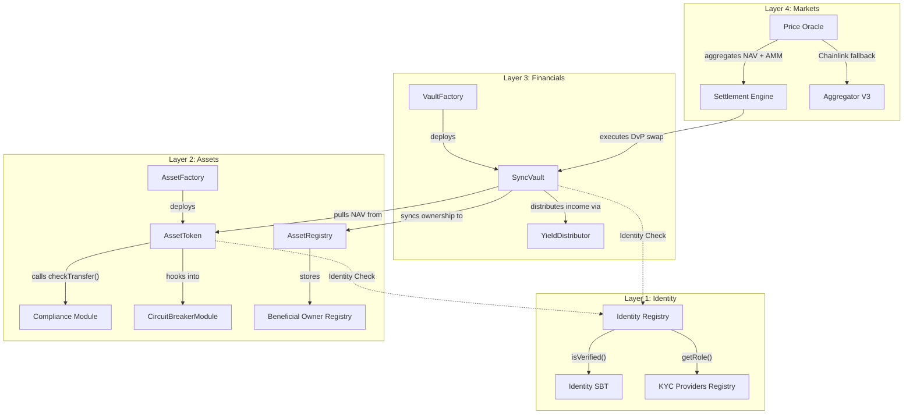

# TECHNICAL SPECIFICATION
## CRATS Protocol Technical Specification & Development Lifecycle
### Requirements, Design & Development Phases (Current State - v3.0.0)
**Real-World Asset Tokenization Platform**  
**Ethereum Sepolia (Development Network)**

*CopyM Platform — Confidential*

---

## Table of Contents
1. [Protocol Overview & Architecture](#1-protocol-overview--architecture)
   - 1.1 High-Level Architecture (The 4-Layer Stack)
   - 1.2 Low-Level Contract Relationships (Architecture Diagram)
2. [Requirements Phase](#2-requirements-phase)
   - 2.1 Business Requirements (Investor, Issuer, Admin)
   - 2.2 Compliance Requirements (Sumsub Integration)
   - 2.3 Custody & Wallet Requirements (Fireblocks MPC)
   - 2.4 Blockchain & Protocol Requirements
3. [Design Phase](#3-design-phase)
   - 3.1 Layer 1 Design: Identity & Compliance (Soulbound Gatekeeping)
   - 3.2 Layer 2 Design: Asset Tokenization (ERC-3643 & Compliance Modules)
   - 3.3 Layer 3 Design: Financial Vaults (ERC-4626 & Beneficial Owner Registry)
   - 3.4 Layer 4 Design: Marketplace & Settlement (Atomic DvP)
4. [Development Phase](#4-development-phase)
   - 4.1 Frontend Portals Architecture (Vite + React + Tailwind CSS)
   - 4.2 Backend Services & SDK Architecture (Node.js + Express + Prisma + Ethers)
   - 4.3 Fireblocks Integration & Transaction Flow
   - 4.4 Smart Contract Architecture (Solidity Analysis)
5. [Protocol Operations & Workflows](#5-protocol-operations--workflows)
   - 5.1 The 14-Step Institutional Lifecycle
   - 5.2 The Tri-Stage Investment Lifecycle (Retail Mediation)
6. [Institutional Reality Checks & Gap Analysis](#6-institutional-reality-checks--gap-analysis)
7. [Appendix: Core Smart Contract Code Snippets](#7-appendix-core-smart-contract-code-snippets)
   - 7.1 Layer 1: Identity & Compliance (Gatekeeping)
   - 7.2 Layer 2: Asset Management & RWA Plugins
   - 7.3 Layer 3: Financial Layer & Vault Share Minting
   - 7.4 Layer 4: Marketplace & Secondary Settlement

---

## 1. Protocol Overview & Architecture

The CRATS Protocol (Nexus) is an institutional-grade Real-World Asset (RWA) tokenization platform. The architecture is built on top of established industry standards: **ERC-3643 (T-REX)** for compliance and identity registry, **ERC-4626** for yield-bearing vaults, and **MakerDAO/Centrifuge** structures for risk management.

### 1.1 High-Level Architecture (The 4-Layer Stack)

The system is segregated into four distinct layers, each communicating with adjacent layers through strictly defined interfaces to enforce compliance at every transaction boundary:

*   **Layer 1: Identity & Compliance (The Trust Foundation):** Governs multi-jurisdictional gatekeeping. It acts as an on-chain registry of verified participants. Access is restricted using Soulbound Tokens (SBTs) and Decentralized Identifiers (DIDs).
*   **Layer 2: Asset Tokenization (Digital Lifecycle):** Manages the lifecycle of the RWA digital twins (represented as `AssetToken` contracts). This layer enforces compliance modules, force transfers (regulatory overrides), freezes, and document linking.
*   **Layer 3: Financial Abstraction (Commitment & Yield):** Decouples direct asset exposure from retail/institutional liquidity via ERC-4626 investment vaults. It distributes yields automatically and maintains the **Beneficial Owner Registry (BOR)** for regulatory transparency.
*   **Layer 4: Marketplace & Secondary (Liquidity):** Integrates the settlement engine, pricing oracles, and order books. It facilitates atomic Delivery vs. Payment (DvP) trades, mitigating counterparty and execution risks.

### 1.2 Low-Level Contract Relationships

The following diagram details how the smart contracts interact across all four layers:



---

## 2. Requirements Phase

### 2.1 Business Requirements

The platform handles three core user profiles with distinct operational boundaries:

#### Investor Requirements
1.  **Register Account:** Securely sign up and connect a web3 wallet (MetaMask/Phantom) or establish an institutional custodial wallet.
2.  **Complete KYC:** Complete identity verification (individuals) or entity verification (businesses) via Sumsub.
3.  **Receive Compliance Approval:** Once verified, receive an Identity SBT to whitelist the wallet address.
4.  **Invest in Tokenized Assets:** Deposit stablecoins (USDT/USDC) into ERC-4626 vaults to receive yield-bearing vault shares.
5.  **Receive Yield:** Earn returns from underlying real-world assets.
6.  **Trade Investments:** Buy or sell vault shares on the secondary marketplace.

#### Issuer Requirements
1.  **Register Organization:** Create an institutional issuer profile.
2.  **Complete KYB:** Verify business entity credentials via Sumsub KYB.
3.  **Upload Asset Documents:** Submit property titles, legal claims, and proof-of-reserve documents (pinned on IPFS).
4.  **Tokenize Assets:** Create compliant digital tokens representing the fractional ownership of physical assets.
5.  **Create Vaults:** Set up investment vaults linked to specific tokenized assets with predefined yield rules.
6.  **Raise Capital:** List vaults on the primary marketplace.

#### Admin Requirements
1.  **Manage Users:** Oversee user compliance, roles, and vault mappings.
2.  **Approve Issuers:** Review and whitelist authorized organizations as asset issuers.
3.  **Monitor Assets:** Track the lifecycle, trading activity, and status of tokenized assets.
4.  **Monitor Compliance:** Track KYC/KYB webhook logs and verify AML screening hits.
5.  **System Dashboard:** Real-time metrics for platform-wide liquidity, gas levels, and oracle status.

### 2.2 Compliance Requirements (Sumsub Integration)
*   **Provider:** Sumsub SDK & Webhooks.
*   **Capabilities:**
    *   *Identity Verification:* Government-issued ID validation.
    *   *Liveness Detection:* Biometric checks to prevent spoofing.
    *   *AML/Sanctions Screening:* Automated cross-checking against OFAC, EU, UN, and PEP lists.
    *   *KYB verification:* Entity verification, registry checks, and ultimate beneficial ownership mapping.

### 2.3 Custody & Wallet Requirements (Fireblocks MPC)
*   **Provider:** Fireblocks Sandbox/Production API.
*   **Capabilities:**
    *   *MPC Wallet Infrastructure:* Key shares are distributed in secure enclaves, removing single-point-of-failure private keys.
    *   *Vault Accounts:* Programmatic generation of dedicated investor and treasury wallets.
    *   *Gas Station Auto-Fueling:* Automatically fuels user wallets with Sepolia ETH to cover transaction gas fees.
    *   *Approval Policies:* Programmatic rules enforcing multi-sig consensus for high-value treasury allocations.

### 2.4 Blockchain & Protocol Requirements
*   **Network:** Ethereum Sepolia (Development) migrating to Ethereum Mainnet.
*   **Standard Frameworks:**
    *   *ERC-3643 (T-REX):* Regulated token standard with compliance rules.
    *   *ERC-5192:* Minimal Soulbound Token interface for identity registry whitelist.
    *   *ERC-7518 (Force Transfer):* Allows regulatory clawbacks or court-ordered recovery.
    *   *ERC-4626:* Standardized, yield-bearing vaults.
    *   *Proxy Pattern:* OpenZeppelin UUPS (UUPSUpgradeable) to enable security patches without state disruption.

---

## 3. Design Phase

### 3.1 Layer 1 Design: Identity & Compliance (Soulbound Gatekeeping)
Layer 1 acts as the gatekeeper. Users and issuers interact with Sumsub; the backend processes webhook notifications and registers the wallet on-chain via the `IdentityRegistry`. An Identity Soulbound Token (`IdentitySBT`) is minted to the wallet, acting as a non-transferable passport.
*   **Component Flow:**
    `User Wallet` -> `Sumsub Verification` -> `Webhook` -> `Backend Signer` -> `IdentityRegistry.registerIdentity()` -> `IdentitySBT.mint()`
*   **Outputs:** Verified DID, On-chain Whitelist Entry, SBT.

### 3.2 Layer 2 Design: Asset Tokenization (ERC-3643 & Compliance Modules)
Asset issuers deploy tokens representing RWAs (e.g. Real Estate, Debt). The `AssetFactory` deploys upgradeable `AssetToken` instances. The token hooks into compliance modules (e.g. `CircuitBreakerModule`, `TravelRuleModule`) during transfer loops.
*   **Component Flow:**
    `Issuer Studio` -> `IPFS Metadata Upload` -> `AssetFactory.deployAsset()` -> `AssetToken` deployment -> Link `AssetRegistry` metadata -> Assign Regulator Roles.
*   **Outputs:** ERC-3643 Token Contract, IPFS-anchored Documents, Registry Mapping.

### 3.3 Layer 3 Design: Financial Vaults (ERC-4626 & Beneficial Owner Registry)
Layer 3 aggregates asset tokens into investment vehicles. The core innovation is **Look-Through Transparency** via the **Beneficial Owner Registry (BOR)**. When investors hold shares in a Vault (nominee), the vault automatically syncs the underlying investor's address, share count, and basis points ownership to the L2 `AssetRegistry`.
*   **Component Flow:**
    `Investor` -> `USDT Deposit` -> `SyncVault.deposit()` -> `SyncVault` mints shares (vAPT) -> Triggers `syncOwner()` hook on `AssetRegistry`.
*   **Outputs:** Vault Shares (vAPT), Yield-bearing balance, On-chain ultimate beneficial ownership mapping.

### 3.4 Layer 4 Design: Marketplace & Settlement (Atomic DvP)
Facilitates primary issuance and secondary trading. The `SettlementEngine` operates as an escrow contract. Buyers post payments (USDC/USDT), sellers post RWA assets, and the engine executes the swap atomically.
*   **Component Flow:**
    `Buyer Order` + `Seller Offer` -> `SettlementEngine.initiateSettlement()` -> `ComplianceGate` verification -> `PriceOracle` NAV check -> Atomic swap execution.
*   **Outputs:** Atomic Trade Settlement, Price discovery, Automated clearing.

---

## 4. Development Phase

### 4.1 Frontend Portals Architecture
Built using **React, Vite, and Tailwind CSS** for performance and modern UI aesthetics.
*   **Investor Portal:** Allows users to link MetaMask/Phantom, perform Sumsub KYC, browse listed RWA vaults, deposit stablecoins, monitor yield earnings, and view transactional logs.
*   **Issuer Portal:** Features the "Tokenization Studio" where issuers configure tokens (Name, Symbol, Supply, NAV), upload legal documents to IPFS, deploy SyncVaults, and trigger yield distributions.
*   **Admin Portal:** Dashboard for whitelisting issuers, auditing user KYC logs, managing compliance limits, monitoring gas levels, and viewing system health metrics.

### 4.2 Backend Services & SDK Architecture
Built on **Node.js, Express, Prisma ORM, MySQL, and Ethers.js**.
*   **`cratsIdentityService.js`:** Interfaces with `IdentityRegistry` and `IdentitySBT`. Handles DID registration and role updates.
*   **`cratsAssetService.js`:** Interacts with `AssetFactory` and `AssetToken` to manage RWA token deployment, approve authorized issuers, and execute treasury transfers.
*   **`cratsVaultService.js`:** Interacts with `SyncVault` and `VaultFactory`. Tracks vault shares, deposits, and triggers beneficial ownership syncing.
*   **`cratsSettlementService.js`:** Interfaces with `SettlementEngine` to coordinate trade matching, compliance verification, and execution.
*   **`sumsubService.js` / `enhancedSumSubStorage.js`:** Manages Sumsub SDK configurations, retrieves KYC tokens, and processes incoming webhook verification events.
*   **`fireblocks.service.js`:** Handles wallet creation, generates multi-chain deposit addresses, and manages transaction payloads.
*   **`balance.service.js`:** Queries multi-chain and local database asset, share, and gas balances.
*   **`smartContractService.js`:** Low-level provider wrapper that interacts with blockchain RPC nodes.

### 4.3 Fireblocks Integration & Transaction Flow
Fireblocks is used for **MPC custodial wallets and secure transaction signing**, not for smart contract storage.

```
+---------------------------------------------------------------------------------+
|                                COPYM PLATFORM                                   |
+---------------------------------------------------------------------------------+
          |                                                         |
          v (API SDK Calls)                                         v (Ethers JSON-RPC)
+-----------------------------------+             +-------------------------------+
|         FIREBLOCKS SYSTEM         |             |      SEPOLIA BLOCKCHAIN       |
|  - MPC Vault Wallet Generation    |             |  - CRATS Registry Contracts   |
|  - Multi-Sig Co-Signing           |             |  - SyncVault (ERC-4626)       |
|  - Compliance Policy Engine       |             |  - AssetToken (ERC-3643)      |
+-----------------------------------+             +-------------------------------+
          |                                                         |
          +--- (Sends Signed Tx to broadcast to blockchain) --------+
```

#### Custodial Transaction Flow (USDC to Vault Deposit):
1.  **User Action:** Investor requests to buy 100 vault shares.
2.  **API Call:** Backend formats a `CONTRACT_CALL` transaction payload and sends it to the Fireblocks SDK.
3.  **Mediation:** The Fireblocks Policy Engine checks the transaction against white-listed contracts.
4.  **Signing:** Fireblocks MPC nodes sign the transaction using distributed key shares.
5.  **Broadcast:** Fireblocks broadcasts the signed transaction payload to the Sepolia network.
6.  **On-chain Execution:** The transaction calls `deposit()` on the `SyncVault` contract. The Vault mints shares back to the investor's Fireblocks address.
7.  **Callback:** Backend polls or listens to webhook statuses, updates database records when the status shifts to `COMPLETED`.

### 4.4 Smart Contract Architecture

The core contracts deployed to Ethereum Sepolia implement the business logic for the 4-layer stack. Detailed implementations for these contracts are provided in [Section 7 (Appendix)](#7-appendix-core-smart-contract-source-code).

#### 🔐 Layer 1: Identity & Compliance
*   `IdentityRegistry.sol`: Handles identity registration mapping and compliance verification queries (`isVerified`). Deployed as a UUPS upgradeable proxy.
*   `IdentitySBT.sol`: Implements non-transferable Soulbound Token (ERC-5192) indicating the user's compliant onboarding status.
*   `KYCProvidersRegistry.sol`: Maintains list of approved KYC/KYB screening authorities.
*   `Compliance.sol` / `CircuitBreakerModule.sol` / `TravelRuleModule.sol`: Logic modules verifying transaction sizes, jurisdictions, and travel rules before allowing transfers.

#### 💎 Layer 2: Asset Management
*   `AssetFactory.sol`: Deploys new `AssetToken` upgradeable proxy instances.
*   `AssetToken.sol`: Implements the ERC-3643 standard. Supports `forceTransfer` (regulatory override), `setAddressFrozen`, and `haltTrading`.
*   `AssetRegistry.sol`: Acts as the central ledger for asset documents, Proof of Reserve (PoR), and is home to the **Beneficial Owner Registry (BOR)**.
*   `AssetOracle.sol`: Integrates Chainlink-compliant oracle mechanisms for token valuation updates.

#### 📈 Layer 3: Financial Layer
*   `VaultFactory.sol`: Deploys SyncVault and AsyncVault instances.
*   `BaseVault.sol`: Abstract base contract linking vaults with the Layer 2 `AssetRegistry` to automate Beneficial Owner syncing.
*   `SyncVault.sol`: Synchronous ERC-4626 vault utilizing stablecoins to mint shares backed by locked `AssetTokens`.
*   `AsyncVault.sol`: Asynchronous ERC-7540 compliant vault tracking deposit and redemption requests during queue lifecycles.
*   `YieldDistributor.sol`: Coordinates yield payment cycles and pushes accrued income to active vaults.

#### 🛒 Layer 4: Market & Settlement
*   `PriceOracle.sol`: Aggregates pricing data from TWAP indices, AMMs, and NAV updates.
*   `SettlementEngine.sol`: Escrows assets and payments to execute atomic DvP trades.
*   `ClearingHouse.sol` / `ComplianceGate.sol`: Ensures clearing policies and whitelist checks are validated immediately prior to execution.
*   `OrderBookEngine.sol` / `MatchingEngine.sol`: Secondary market logic facilitating bid/ask matching and book keeping.

---

## 5. Protocol Operations & Workflows

### 5.1 The 14-Step Institutional Lifecycle

```
[Onboarding] -> [Asset Sourcing] -> [Studio Setup] -> [Tokenization] -> [Rules Setup]
                                                                             |
[Atomic Settlement] <- [Investment] <- [Primary Listing] <- [Vault Setup] <--+
       |
[Valuation Sync] -> [Yield Accrual] -> [Yield Payout] -> [Secondary Trade] -> [Redemption]
```

1.  **Onboarding:** Issuer passes KYC/KYB; receives an `IdentitySBT` via the `IdentityRegistry`.
2.  **Asset Sourcing:** Issuer appraises physical assets (e.g. real estate) off-chain.
3.  **Studio Setup:** Issuer inputs asset parameters (NAV, supply, ticker) in the Portal.
4.  **Tokenization:** `AssetFactory` deploys `AssetToken`; the supply is minted to the **Platform Treasury**.
5.  **Compliance Config:** `Compliance.sol` modules are applied (e.g., maximum limits on non-accredited investors).
6.  **Vault Setup:** `VaultFactory` deploys a `SyncVault` linked to the asset.
7.  **Primary Listing:** Vault is whitelisted on the Marketplace.
8.  **Investment:** Onboarded investors deposit stablecoins (USDT) into the `SyncVault`.
9.  **Atomic Settlement:** `SettlementEngine` swaps the Treasury's `AssetTokens` for the investor's stablecoins.
10. **Valuation & Sync:** `AssetToken` NAV is updated. The Vault calls `syncOwner` on the `AssetRegistry` to update the Beneficial Owner Registry (BOR).
11. **Yield Accrual:** Underlying asset rents/revenues are collected by the platform treasury.
12. **Yield Distribution:** `YieldDistributor` pushes yield to the vault, inflating the share price to reflect yield accrual.
13. **Secondary Market:** Investors exchange vault shares peer-to-peer via the `OrderBookEngine`.
14. **Redemption:** Investors exit the vault, initiating a redemption workflow.

### 5.2 The Tri-Stage Investment Lifecycle (Retail Mediation)

To enable retail investors holding standard assets (USDC/USDT) in non-custodial wallets to seamlessly invest in compliant vaults, the protocol utilizes a mediated settlement flow:

*   **Stage 1: Public Capital Transfer (User Initiated):**
    The investor transfers stablecoins (USDT/USDC) from their connected browser wallet (MetaMask) to the Platform Treasury Wallet.
    *Logic:* `ERC20.transfer(treasuryAddress, stablecoinAmount)`
*   **Stage 2: Institutional Conversion (Treasury Mediation):**
    The Treasury detects the transfer and performs the conversion on-chain. It approves the required amount of RWA `AssetTokens` for the destination Vault.
    *Logic:* `AssetToken.approve(vaultAddress, assetAmount)`
*   **Stage 3: Vault Share Minting (Atomic Settlement):**
    The Treasury deposits the RWA assets into the Vault, specifying the **Investor's Wallet Address** as the share recipient. The Vault atomically mints the yield-bearing shares (`vAPT`) directly to the investor's wallet.
    *Logic:* `SyncVault.deposit(assetAmount, investorAddress)`

---

## 6. Institutional Reality Checks & Gap Analysis

1.  **Regulatory Role Accountability:** The regulator roles in `AssetToken.sol` (e.g. `forceTransfer` capability) must be mapped to multi-sig addresses managed by designated legal compliance entities, rather than a single admin private key.
2.  **Sanctions Oracle Integration:** While `IdentityRegistry` enforces static KYC check dates, a live compliance integration requires a continuous sanctions scanner oracle (e.g. Chainlink/Sumsub integration) to dynamically trigger address freezing on-chain.
3.  **Integration Attack Surfaces:** Core standards (ERC-3643, ERC-4626) utilize battle-tested implementations. The custom logic implemented in the `SettlementEngine`, `OrderBookEngine`, and the Treasury mediation scripts represents the primary attack surface requiring external smart contract audits.
4.  **Proof of Reserve Oracle Resilience:** Manual NAV updates present key compromise risks. Transitions to EIP-712 cryptographically signed valuations or automated multi-oracle feeds (Chainlink PoR) are required to avoid centralized valuation manipulation.
5.  **Nominee vs. Beneficial Owner Mapping (Solved):** The Beneficial Owner Registry (BOR) module resolves a common institutional drawback by mapping underlying vault shareholders to the parent asset token ledger in real-time, satisfying strict KYC/AML transparency regulations.

---

## 7. Appendix: Core Smart Contract Code Snippets

This appendix contains high-fidelity code snippets focusing on the core business logic, regulatory rules, and state transitions of the CRATS Protocol. Standard imports, boilerplate getters, and events have been omitted for clarity.

### 7.1 Layer 1: Identity & Compliance (Gatekeeping)

#### `IdentityRegistry.sol` (KYC & Role Registration)
```solidity
// Registers an onboarding investor/issuer identity after Sumsub KYC verification
function registerIdentity(
    address primaryWallet,
    uint8 role,
    uint16 jurisdiction,
    bytes32 didHash,
    string calldata did,
    uint64 expiresAt
) external onlyRole(CRATSConfig.KYC_PROVIDER_ROLE) returns (uint256) {
    require(kycProvidersRegistry.isProviderApproved(msg.sender), "IdentityRegistry: unauthorized provider");

    uint256 tokenId = identitySBT.registerIdentity(
        primaryWallet,
        role,
        jurisdiction,
        didHash,
        did,
        expiresAt
    );

    emit IdentityRegistered(primaryWallet, tokenId, role, jurisdiction);
    return tokenId;
}
```

#### `IdentitySBT.sol` (Enforcing Soulbound Non-Transferability)
```solidity
// Overrides the ERC-721 transfer hook to prevent passport tokens from being transferred
function _update(address to, uint256 tokenId, address auth) 
    internal 
    override 
    returns (address) 
{
    address from = _ownerOf(tokenId);
    if (from == address(0)) {
        return super._update(to, tokenId, auth); // Allow initial minting
    }
    if (to == address(0)) {
        return super._update(to, tokenId, auth); // Allow burning
    }
    revert("IdentitySBT: soulbound, non-transferable");
}
```

### 7.2 Layer 2: Asset Management & RWA Plugins

#### `AssetToken.sol` (Force Transfer / Regulatory Clawback)
```solidity
// Allows legal/regulatory compliance role to force transfer tokens (e.g. court orders)
function forceTransfer(
    address from,
    address to,
    uint256 amount,
    bytes32 reasonCode,
    bytes32 evidenceHash
) external override onlyRole(CRATSConfig.REGULATOR_ROLE) returns (bool) {
    require(IIdentityRegistry(identityRegistry).isVerified(to), "AssetToken: recipient not verified");
    require(balanceOf(from) >= amount, "AssetToken: insufficient balance");

    _transfer(from, to, amount);

    _forceTransferHistory.push(ForceTransferRecord({
        from: from,
        to: to,
        amount: amount,
        executor: msg.sender,
        reasonCode: reasonCode,
        timestamp: block.timestamp,
        evidenceHash: evidenceHash
    }));

    emit TokensForceTransferred(from, to, amount, msg.sender, reasonCode);
    return true;
}
```

#### `RealEstatePlugin.sol` (Real Estate Document Rules Validation)
```solidity
// Ensures real estate assets contain required title deed and appraisal documents
function validateDocuments(
    AssetDocument[] calldata docs
) external pure override returns (bool) {
    bool hasTitleDeed = false;
    bool hasAppraisal = false;

    for (uint256 i = 0; i < docs.length; i++) {
        if (keccak256(bytes(docs[i].docType)) == keccak256("TITLE_DEED")) hasTitleDeed = true;
        if (keccak256(bytes(docs[i].docType)) == keccak256("APPRAISAL")) hasAppraisal = true;
    }

    require(hasTitleDeed, "RealEstate: Title Deed required");
    require(hasAppraisal, "RealEstate: Appraisal required");
    return true;
}
```

#### `CarbonCreditPlugin.sol` (Carbon Credit Verification Rule)
```solidity
// Ensures verification report document is provided for carbon credit assets
function validateDocuments(
    AssetDocument[] calldata docs
) external pure override returns (bool) {
    bool hasReport = false;

    for (uint256 i = 0; i < docs.length; i++) {
        if (keccak256(bytes(docs[i].docType)) == keccak256("VERIFICATION_REPORT")) hasReport = true;
    }

    require(hasReport, "CarbonCredit: Verification Report required");
    return true;
}
```

#### `FineArtPlugin.sol` (Fine Art Authentication & Insurance Rules)
```solidity
// Ensures fine art assets have authenticity certifications and active insurance documents
function validateDocuments(
    AssetDocument[] calldata docs
) external pure override returns (bool) {
    bool hasAuth = false;
    bool hasInsurance = false;

    for (uint256 i = 0; i < docs.length; i++) {
        if (keccak256(bytes(docs[i].docType)) == keccak256("AUTHENTICATION")) hasAuth = true;
        if (keccak256(bytes(docs[i].docType)) == keccak256("INSURANCE")) hasInsurance = true;
    }

    require(hasAuth, "FineArt: Authentication required");
    require(hasInsurance, "FineArt: Insurance required");
    return true;
}
```

### 7.3 Layer 3: Financial Layer & Vault Share Minting

#### `SyncVault.sol` (Synchronous Compliance Gated Deposits & Minting)
```solidity
// Enforces that investors are KYC-verified in Layer 1 before depositing stablecoins
function deposit(uint256 assets, address receiver) 
    public 
    override(ERC4626Upgradeable, ISyncVault) 
    nonReentrant 
    returns (uint256) 
{
    _checkCompliance(msg.sender);
    return super.deposit(assets, receiver);
}

function mint(uint256 shares, address receiver) 
    public 
    override(ERC4626Upgradeable, ISyncVault) 
    nonReentrant 
    returns (uint256) 
{
    _checkCompliance(msg.sender);
    return super.mint(shares, receiver);
}

function _checkCompliance(address account) internal view {
    if (identityRegistry == address(0)) return;
    require(IIdentityRegistry(identityRegistry).isVerified(account), "SyncVault: Account not verified");
}
```

#### `AsyncVault.sol` (Asynchronous Share Minting Request & Execution - ERC-7540)
```solidity
// Submits a deposit request and logs the pending position to the Beneficial Owner Registry
function requestDeposit(uint256 assets, address controller, address owner) 
    external 
    override 
    nonReentrant 
    returns (uint256 requestId) 
{
    require(owner == msg.sender || isOperator(owner, msg.sender), "unauthorized");
    IERC20(asset()).safeTransferFrom(owner, address(this), assets);
    _pendingDeposit[controller] += assets;
    _totalPendingDepositAssets += assets;
    requestId = _nextDepositRequestId[controller]++;
    
    // BOR sync: reflect pending position
    assetRegistry.syncOwner(asset(), controller, balanceOf(controller) + convertToShares(assets));
    
    emit DepositRequest(controller, owner, requestId, msg.sender, assets);
    return requestId;
}

// Fulfills the deposit after compliance/settlement checks, minting shares to the vault escrow
function fulfillDeposit(address controller, uint256 assets) external onlyRole(FULFILLER_ROLE) {
    uint256 shares = convertToShares(assets);
    _mint(address(this), shares);
    _claimableDeposit[controller].assets += assets;
    _claimableDeposit[controller].shares += shares;
    _pendingDeposit[controller] -= assets;
    _totalPendingDepositAssets -= assets;
}

// Allows the receiver to claim their finalized vault shares (minting completes)
function deposit(uint256 assets, address receiver, address controller) 
    public 
    override(IERC7540) 
    nonReentrant 
    returns (uint256 shares) 
{
    require(controller == msg.sender || isOperator(controller, msg.sender), "unauthorized");
    InternalClaim storage cl = _claimableDeposit[controller];
    require(cl.assets >= assets, "insufficient claimable assets");
    shares = assets.mulDiv(cl.shares, cl.assets, Math.Rounding.Floor);
    cl.assets -= assets; cl.shares -= shares;
    _transfer(address(this), receiver, shares);
    emit Deposit(msg.sender, receiver, assets, shares);
}
```

#### `BaseVault.sol` (Look-Through Beneficial Owner Registry Syncing)
```solidity
// Overrides token transfer updates to automatically update Layer 2 Beneficial Owner Registry
function _update(
    address from,
    address to,
    uint256 value
) internal virtual override {
    super._update(from, to, value);

    // Sync the sender (if not mint)
    if (from != address(0) && from != address(1)) {
        try assetRegistry.syncOwner(assetToken, from, balanceOf(from)) {} catch {}
    }

    // Sync the receiver (if not burn)
    if (to != address(0) && to != address(1)) {
        try assetRegistry.syncOwner(assetToken, to, balanceOf(to)) {} catch {}
    }
}

// Triggers batch updates to the AssetRegistry or falls back to off-chain reconciliation
function _afterYieldDistribution() internal virtual {
    uint256 holderCount = _getHolderCount();

    if (holderCount <= 200) {
        (address[] memory holders, uint256[] memory shares) = _getAllHolders();
        assetRegistry.syncOwnerBatch(assetToken, holders, shares);
    } else {
        emit YieldSyncRequired(assetToken, address(this), totalAssets(), block.timestamp);
    }
}
```

### 7.4 Layer 4: Marketplace & Secondary Settlement

#### `SettlementEngine.sol` (Atomic Delivery vs. Payment Swap)
```solidity
// Initiates trade escrow, validating compliance for both counter-parties
function initiateSettlement(
    address to,
    address assetToken,
    address paymentToken,
    uint256 assetAmount,
    uint256 paymentAmount,
    uint256 expiry
) external nonReentrant returns (bytes32 settlementId) {
    if (address(identityRegistry) != address(0)) {
        require(identityRegistry.isVerified(msg.sender), "Sender not verified");
        require(identityRegistry.isVerified(to), "Recipient not verified");
    }

    if (address(complianceModule) != address(0)) {
        ICompliance.TransferCheckResult memory result = complianceModule.checkTransfer(
            msg.sender, to, assetAmount, assetToken
        );
        require(result.allowed, string(abi.encodePacked("Compliance check failed: ", result.reason)));
    }

    settlementId = keccak256(abi.encodePacked(msg.sender, to, assetToken, paymentToken, block.timestamp, assetAmount, paymentAmount));
    settlements[settlementId] = Settlement({
        id: settlementId, from: msg.sender, to: to, assetToken: assetToken, paymentToken: paymentToken,
        assetAmount: assetAmount, paymentAmount: paymentAmount, timestamp: block.timestamp, expiry: expiry,
        completed: false, cancelled: false
    });

    emit SettlementInitiated(settlementId, msg.sender, to, assetToken, paymentToken, assetAmount, paymentAmount);
}

// Atomically swaps assets and payments from the escrow contract
function executeSettlement(bytes32 settlementId) external nonReentrant {
    Settlement storage settlement = settlements[settlementId];
    require(!settlement.completed && !settlement.cancelled && block.timestamp <= settlement.expiry, "Invalid state");

    IERC20(settlement.assetToken).safeTransferFrom(settlement.from, address(this), settlement.assetAmount);
    IERC20(settlement.paymentToken).safeTransferFrom(settlement.to, address(this), settlement.paymentAmount);

    IERC20(settlement.assetToken).safeTransfer(settlement.to, settlement.assetAmount);
    IERC20(settlement.paymentToken).safeTransfer(settlement.from, settlement.paymentAmount);

    settlement.completed = true;
    emit SettlementCompleted(settlementId);
}
```

#### `OrderBookEngine.sol` (Matching Order Fill Execution & Fees)
```solidity
// Fills an order against the order book, processing trade execution, compliance, and fee deduction
function fillOrder(bytes32 orderId, uint256 fillAmount) external nonReentrant {
    Order storage order = orders[orderId];
    require(!order.filled && block.timestamp <= order.expiry, "Invalid order state");

    if (address(identityRegistry) != address(0)) {
        require(identityRegistry.isVerified(msg.sender) && identityRegistry.isVerified(order.trader), "Verification failed");
    }

    uint256 tradeAmount = fillAmount;
    uint256 quoteAmount = (tradeAmount * order.price) / 1e18;
    uint256 fee = (quoteAmount * takerFee) / FEE_DENOMINATOR;

    if (order.isBuy) {
        IERC20(order.quoteToken).safeTransferFrom(msg.sender, address(this), quoteAmount + fee);
        IERC20(order.baseToken).safeTransferFrom(order.trader, msg.sender, tradeAmount);
        IERC20(order.quoteToken).safeTransfer(order.trader, quoteAmount);
    } else {
        IERC20(order.baseToken).safeTransferFrom(msg.sender, address(this), tradeAmount);
        IERC20(order.quoteToken).safeTransferFrom(order.trader, address(this), quoteAmount);
        IERC20(order.baseToken).safeTransfer(order.trader, tradeAmount);
        IERC20(order.quoteToken).safeTransfer(msg.sender, quoteAmount - fee);
    }

    order.filledAmount += tradeAmount;
    if (order.filledAmount >= order.amount) order.filled = true;

    emit OrderFilled(orderId, msg.sender, tradeAmount, order.price, fee);
}
```

#### `PriceOracle.sol` (Weighted Price Aggregation)
```solidity
// Blends spot order book pricing, AMM pool pricing, and external NAV updates based on asset liquidity
function getAggregatedPrice(address asset) 
    external 
    view 
    returns (uint256 price, uint256 confidence, IPriceOracle.PriceSource primarySource) 
{
    uint256 marketPrice = _getMarketPrice(asset);
    uint256 navPrice = _getNAVPrice(asset);
    uint256 ammPrice = _getAMMPrice(asset);
    uint256 externalPrice = _getExternalPrice(asset);
    
    IPriceOracle.LiquidityState state = _assessLiquidity(asset);
    
    if (state == IPriceOracle.LiquidityState.HIGH) {
        return (marketPrice, 95, IPriceOracle.PriceSource.ORDER_BOOK);
    } else if (state == IPriceOracle.LiquidityState.MEDIUM) {
        uint256 blended = (marketPrice * 60 + navPrice * 40) / 100;
        return (blended, 80, IPriceOracle.PriceSource.BLENDED);
    } else {
        return (navPrice, 70, IPriceOracle.PriceSource.NAV_ORACLE);
    }
}
```
