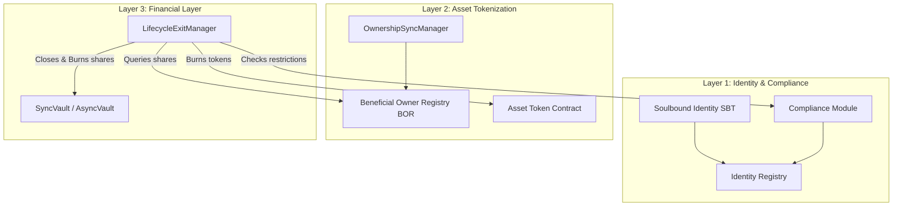
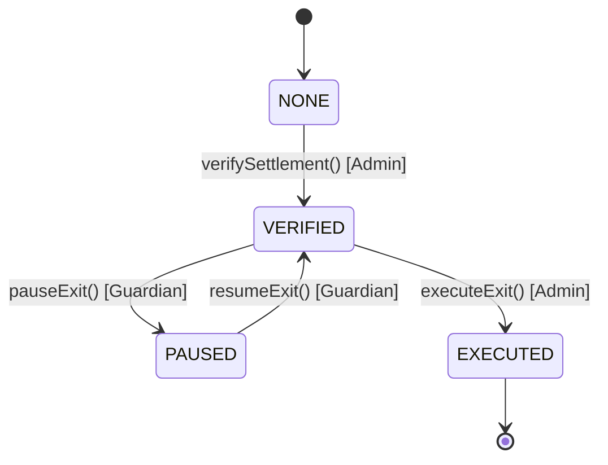
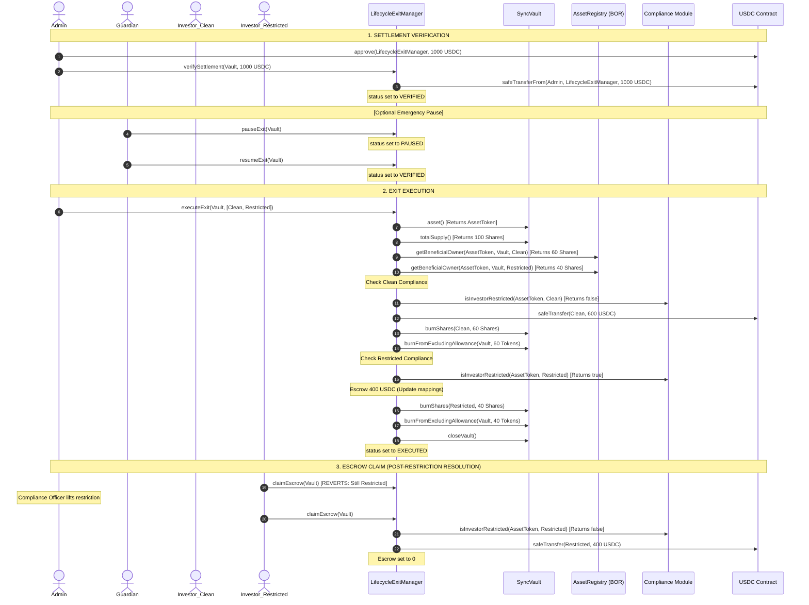

# CRATS Protocol — Lifecycle Exit Manager Specification

**CRATS Protocol v9.0.0**  |  July 2026  
**CopyM Platform**  |  Institutional Liquidation & Exit Architecture

---

## 1. Introduction

The `LifecycleExitManager` defines the standardized, institutional-grade liquidation and exit framework for fractionalized real-world assets (RWAs) in the CRATS Protocol. Unlike standard individual redemptions (managed by `RedemptionManager`), the `LifecycleExitManager` facilitates full-asset exits—such as physical property liquidations, structural wind-downs, or corporate-level asset sales—ensuring that all investors are compensated fairly and programmatically.

In standard fractionalized RWA regimes, a full-asset liquidation is one of the most operationally sensitive events. It involves large stablecoin inflows (typically USDC), compliance checks for all participating wallets, pro-rata payouts, the burning of vault shares and asset-backed tokens, and the permanent closure of the vault. The `LifecycleExitManager` automates this entire sequence, guaranteeing that:
1. **Settlement funds are verified and locked** prior to any state modification or token burn.
2. **Restricted/sanctioned wallets** do not block the exit process, but instead have their funds held in a secure escrow sub-balance until their compliance restriction is lifted.
3. **No partial or corrupted states occur** by enforcing atomic, programmatically-controlled executions within a single EVM transaction.
4. **Emergency controls** (Guardian-scoped pauses) allow the protocol to freeze the liquidation process pre-distribution without compromising transaction atomicity once execution begins.

---

## 2. Architectural Context & Design Principles

The `LifecycleExitManager` sits at **Layer 3 (Financial Layer)** of the CRATS Protocol architecture, bridging Layer 2 (Asset Tokenization & Registries) and Layer 1 (Identity & Compliance).



### 2.1 Core Principles

#### 1. Separation of Responsibilities
* **`LifecycleExitManager`** handles the verification of settlement funds, pro-rata allocations, escrow routing, and vault closure.
* **`Compliance Module`** holds the sole authority to determine if an investor's wallet is currently restricted.
* **`AssetRegistry` (BOR)** maintains the source-of-truth record for investor shareholdings.
* **`SyncVault` / `AsyncVault`** holds client assets and administers local vault operations.

#### 2. Atomic, No-Partial-State Guarantee
Once the administrator executes an exit via `executeExit`, the contract iterates through the provided investor list, calculates entitlements, routes restricted funds to escrow, pays unrestricted investors, burns vault shares, burns underlying asset tokens, and closes the vault. This entire loop is performed in a single EVM transaction. If any step fails, the entire transaction reverts, ensuring the protocol never enters a corrupt or half-liquidated state.

#### 3. Compliance Isolation
Instead of blocking the entire vault exit if one investor fails compliance checks (e.g., matching a sanctions list or failing an AML screening), the manager isolates the restricted investor's share. Their entitlement is routed to a secure escrow sub-balance within the `LifecycleExitManager` contract, while all other clean investors receive their USDC payouts immediately.

#### 4. Guardian Emergency Pause
The contract employs a pausable checkpoint allowing the `GUARDIAN_ROLE` to freeze the liquidation process. This pause is only applicable *pre-distribution* (i.e., between settlement verification and exit execution). Once `executeExit` is called, the operations remain atomic and cannot be interrupted.

---

## 3. Smart Contract Specification

The `LifecycleExitManager` is implemented as a UUPS-compliant upgradeable proxy contract.

### 3.1 Contract State & Enums

#### `ExitStatus`
Defines the current state of a vault liquidation event:
```solidity
enum ExitStatus {
    NONE,       // Liquidation not initiated
    VERIFIED,   // Settlement funds deposited and verified; ready for execution
    PAUSED,     // Frozen pre-distribution by the Guardian
    EXECUTED    // Payouts distributed, shares burned, and vault permanently closed
}
```

#### `ExitInfo`
Stores details about the settlement:
```solidity
struct ExitInfo {
    ExitStatus status;
    uint256 settlementAmount;   // Total USDC allocated to the vault liquidation
    uint256 verifiedAt;         // Timestamp when settlement was verified
}
```

#### State Mappings
```solidity
// Maps vault addresses to their respective liquidation information
mapping(address => ExitInfo) public vaultExits;

// Maps vault => investor => escrowed USDC settlement amount
mapping(address => mapping(address => uint256)) public escrowedSettlements;
```

---

## 4. Function & API Breakdown

### 4.1 `initialize`
Initializes the contract's roles, USDC address, and `AssetRegistry` reference. This is called atomically during proxy deployment.

```solidity
function initialize(
    address admin,
    address _usdc,
    address _assetRegistry
) public initializer;
```
* **Parameters**:
  * `admin`: Address granted the `DEFAULT_ADMIN_ROLE` and `GUARDIAN_ROLE`.
  * `_usdc`: Address of the platform's settlement stablecoin.
  * `_assetRegistry`: Address of the Layer 2 `AssetRegistry`.
* **Access Control**: Initializer only.

### 4.2 `verifySettlement`
Registers and locks the stablecoin (USDC) liquidation funds into the exit contract.

```solidity
function verifySettlement(
    address vault,
    uint256 settlementAmount
) external onlyRole(DEFAULT_ADMIN_ROLE);
```
* **Requirements**:
  * `vault` cannot be the zero address.
  * `settlementAmount` must be greater than zero.
  * The vault liquidation must not have already been initiated (`status` must be `ExitStatus.NONE`).
* **State Changes**:
  * Pulls `settlementAmount` of USDC from `msg.sender` into the `LifecycleExitManager` contract using `safeTransferFrom`.
  * Sets the vault's `ExitInfo` status to `VERIFIED` and logs the settlement size and timestamp.
* **Events Emitted**:
  * `SettlementVerified(address indexed vault, uint256 settlementAmount, uint256 timestamp)`

### 4.3 `pauseExit`
Halts a verified liquidation before payouts are processed. This is used if the oracle valuation or asset sale terms are disputed.

```solidity
function pauseExit(address vault) external onlyRole(GUARDIAN_ROLE);
```
* **Requirements**:
  * The vault's current liquidation status must be `VERIFIED`.
* **State Changes**:
  * Updates the status to `PAUSED`.
* **Events Emitted**:
  * `ExitPaused(address indexed vault, uint256 timestamp)`

### 4.4 `resumeExit`
Unfreezes a paused liquidation, returning it to the `VERIFIED` state.

```solidity
function resumeExit(address vault) external onlyRole(GUARDIAN_ROLE);
```
* **Requirements**:
  * The vault's current liquidation status must be `PAUSED`.
* **State Changes**:
  * Updates the status to `VERIFIED`.
* **Events Emitted**:
  * `ExitResumed(address indexed vault, uint256 timestamp)`

### 4.5 `executeExit`
Executes pro-rata distributions, escrow routing, programmatic burning, and vault closure.

```solidity
function executeExit(
    address vault,
    address[] calldata investors
) external onlyRole(DEFAULT_ADMIN_ROLE) nonReentrant;
```
* **Requirements**:
  * Vault's current status must be `VERIFIED`.
  * `investors` array length must be greater than zero.
  * Total shares of the vault must be greater than zero.
* **Logic Execution Flow**:
  1. Sets the vault's liquidation status to `EXECUTED`.
  2. Resolves the underlying `assetToken` from the vault: `IVault(vault).asset()`.
  3. Resolves the total supply of shares: `IVault(vault).totalSupply()`.
  4. Loops through the `investors` array:
     * Queries the investor's share balance from the `AssetRegistry`: `assetRegistry.getBeneficialOwner(assetToken, vault, investor).vaultShares`.
     * If the investor's balance is zero, skips to the next investor.
     * Computes the pro-rata USDC entitlement: `entitlement = (shares * settlementAmount) / totalShares`.
     * Queries the vault's Compliance Module: `IVault(vault).complianceModule()`.
     * Checks if the investor is restricted: `ICompliance(comp).isInvestorRestricted(assetToken, investor)`.
     * **If restricted**: Entitlement is added to `escrowedSettlements[vault][investor]`.
     * **If unrestricted**: USDC is transferred directly to the investor's address.
     * Programmatically burns the investor's vault shares: `IVault(vault).burnShares(investor, shares)`.
     * Programmatically burns the corresponding underlying asset tokens from the vault: `IAssetToken(assetToken).burnFromExcludingAllowance(vault, shares)`.
  5. Permanently shuts down the vault: `IVault(vault).closeVault()`.
* **Events Emitted**:
  * `LifecycleExitExecuted(address indexed vault, uint256 settlementAmount, uint256 timestamp)`

> [!IMPORTANT]
> In **v9.0.0**, `executeExit` was upgraded to require an explicit list of investor addresses. This avoids on-chain iteration over unbounded owner arrays (which was deprecated to mitigate gas bloat and UUPS storage layout issues), moving the registry index construction to off-chain indexers or administrative triggers.

### 4.6 `claimEscrow`
Allows an investor whose liquidation funds were escrowed due to compliance locks to withdraw their USDC once their restriction is resolved.

```solidity
function claimEscrow(address vault) external nonReentrant;
```
* **Requirements**:
  * Investor must have a non-zero escrow balance: `escrowedSettlements[vault][msg.sender] > 0`.
  * The investor's wallet must no longer be restricted in the vault's compliance module.
* **State Changes**:
  * Resets `escrowedSettlements[vault][msg.sender]` to 0.
  * Transfers the escrowed USDC amount to `msg.sender`.
* **Events Emitted**:
  * `EscrowClaimed(address indexed vault, address indexed investor, uint256 amount)`

---

## 5. Liquidation Lifecycle & Workflow

### 5.1 Liquidation State Machine



### 5.2 End-to-End Liquidation Workflow



---

## 6. System Integration Details

### 6.1 Layer 2 Beneficial Ownership Integration (v9.0.0 Update)
Under the upgraded **v9.0.0** architecture, direct modifications to `AssetRegistry` are serialized via `OwnershipSyncManager` to protect registry boundaries. 

During liquidation:
1. `LifecycleExitManager` reads share balances directly from the `AssetRegistry` (`getBeneficialOwner`) to guarantee access to the latest synchronized state.
2. Share burns triggered inside `executeExit` call `IVault(vault).burnShares(investor, shares)`.
3. The vault's internal burn hook invokes the `OwnershipSyncManager` to update the investor's balance in the registry to `0`.

This maintains total alignment between the L3 ERC-4626 vault balances, the L2 registry, and downstream indexing services.

### 6.2 Indexer Integration & Event Mapping
For real-time user-facing dashboards (e.g., showing liquidation payouts, escrow status, and vault statuses), the indexer daemon must monitor and capture `LifecycleExitManager` events.

#### Event Schema
```solidity
event SettlementVerified(address indexed vault, uint256 settlementAmount, uint256 timestamp);
event ExitPaused(address indexed vault, uint256 timestamp);
event ExitResumed(address indexed vault, uint256 timestamp);
event LifecycleExitExecuted(address indexed vault, uint256 settlementAmount, uint256 timestamp);
event EscrowClaimed(address indexed vault, address indexed investor, uint256 amount);
```

#### SQL Schema Mapping (Indexer DB)
The following tables are recommended in the database schema:

```sql
-- Liquidation details per Vault
CREATE TABLE vault_liquidations (
    vault_address VARCHAR(42) PRIMARY KEY,
    settlement_amount NUMERIC(38, 0) NOT NULL,
    status VARCHAR(20) NOT NULL, -- 'VERIFIED', 'PAUSED', 'EXECUTED'
    verified_at TIMESTAMP NOT NULL,
    executed_at TIMESTAMP,
    paused_at TIMESTAMP
);

-- Escrowed balances for restricted investors
CREATE TABLE liquidation_escrows (
    vault_address VARCHAR(42) NOT NULL,
    investor_address VARCHAR(42) NOT NULL,
    escrowed_amount NUMERIC(38, 0) NOT NULL,
    status VARCHAR(20) NOT NULL, -- 'HELD', 'CLAIMED'
    claimed_at TIMESTAMP,
    PRIMARY KEY (vault_address, investor_address)
);
```

#### Node.js Indexer Job
Below is the integration logic to be included in the indexer worker daemon:

```javascript
const { ethers } = require("ethers");
const prisma = require("../config/db.js"); // Prisma client

const exitManagerAbi = [
  "event SettlementVerified(address indexed vault, uint256 settlementAmount, uint256 timestamp)",
  "event ExitPaused(address indexed vault, uint256 timestamp)",
  "event ExitResumed(address indexed vault, uint256 timestamp)",
  "event LifecycleExitExecuted(address indexed vault, uint256 settlementAmount, uint256 timestamp)",
  "event EscrowClaimed(address indexed vault, address indexed investor, uint256 amount)"
];

function setupExitManagerListeners(exitManagerAddress, provider) {
  const contract = new ethers.Contract(exitManagerAddress, exitManagerAbi, provider);

  contract.on("SettlementVerified", async (vault, settlementAmount, timestamp) => {
    await prisma.vaultLiquidation.upsert({
      where: { vaultAddress: vault },
      update: {
        settlementAmount: settlementAmount.toString(),
        status: "VERIFIED",
        verifiedAt: new Date(Number(timestamp) * 1000)
      },
      create: {
        vaultAddress: vault,
        settlementAmount: settlementAmount.toString(),
        status: "VERIFIED",
        verifiedAt: new Date(Number(timestamp) * 1000)
      }
    });
  });

  contract.on("ExitPaused", async (vault, timestamp) => {
    await prisma.vaultLiquidation.update({
      where: { vaultAddress: vault },
      data: {
        status: "PAUSED",
        pausedAt: new Date(Number(timestamp) * 1000)
      }
    });
  });

  contract.on("ExitResumed", async (vault, timestamp) => {
    await prisma.vaultLiquidation.update({
      where: { vaultAddress: vault },
      data: {
        status: "VERIFIED",
        pausedAt: null
      }
    });
  });

  contract.on("LifecycleExitExecuted", async (vault, settlementAmount, timestamp) => {
    await prisma.$transaction([
      prisma.vaultLiquidation.update({
        where: { vaultAddress: vault },
        data: {
          status: "EXECUTED",
          executedAt: new Date(Number(timestamp) * 1000)
        }
      }),
      // Mark corresponding vault as closed in local cache
      prisma.vaultCache.update({
        where: { address: vault },
        data: { isClosed: true }
      })
    ]);
  });

  contract.on("EscrowClaimed", async (vault, investor, amount, event) => {
    await prisma.liquidationEscrow.update({
      where: {
        vaultAddress_investorAddress: {
          vaultAddress: vault,
          investorAddress: investor
        }
      },
      data: {
        escrowedAmount: "0",
        status: "CLAIMED",
        claimedAt: new Date()
      }
    });
  });
}
```

---

## 7. Security & Risk Mitigations

| Risk | Impact | Mitigation Mechanism |
|---|---|---|
| **Reentrancy attacks during payouts or escrow claims** | High | The contract inherits `ReentrancyGuardUpgradeable` and applies the `nonReentrant` modifier to `executeExit` and `claimEscrow`. It adheres to the Checks-Effects-Interactions pattern, clearing escrow balances internally before transferring tokens. |
| **Incomplete burning of shares/assets** | Medium | Managed atomically. The EVM reverts the entire tx if `burnShares` or `burnFromExcludingAllowance` fails. Because the exit manager must be granted administrative roles on the vault and asset token, failure is only possible if roles are revoked prematurely. |
| **Bypassing KYC/AML checks during liquidation** | High | The Compliance Module checks are hardcoded inside the execution loop. If compliance lists update, the execution instantly adapts. Restricted funds never touch the user's wallet and are locked in the manager's escrow balance. |
| **Stale investor addresses passed in v9.0.0** | Medium | Since `executeExit` requires an external list of investors, missing an investor in the arguments leaves their shares un-liquidated and vault unclosed. **Mitigation**: Admin tools must generate the list by querying the indexer database cache and cross-verifying active holders with the on-chain `totalSupply` before executing. |

---

## 8. Hardhat Verification & Unit Tests

The test suite in [LifecycleExitManager.test.js](file:///c:/Users/anask/Desktop/CPM/CRATS-EVM/test/layer3/LifecycleExitManager.test.js) validates the complete set of states and edge cases:

### 8.1 Verification Test Cases
1. **Settlement Deposit**: Verifies that calling `verifySettlement` successfully pulls USDC from the administrator's wallet, updates the vault's status to `VERIFIED`, and sets the proper record.
2. **Guardian Pause pre-distribution**: Confirms that the `GUARDIAN_ROLE` can pause the exit, which blocks execution (`executeExit` reverts). Checks that the guardian can resume the process, returning it to `VERIFIED`.
3. **Pro-rata Distribution**: Validates that calling `executeExit` calculates the correct entitlements, pays out clean investors, burns vault shares and underlying asset tokens, and marks the vault as closed.
4. **Compliance Escrow Isolation**: Confirms that when an investor is restricted via compliance:
   * Their USDC entitlement is routed to the escrow sub-balance.
   * `claimEscrow` reverts while the restriction is active.
   * Once compliance is cleared, calling `claimEscrow` correctly releases the escrowed funds to the investor's wallet.

To run the verification suite:
```bash
npx hardhat test test/layer3/LifecycleExitManager.test.js
```
