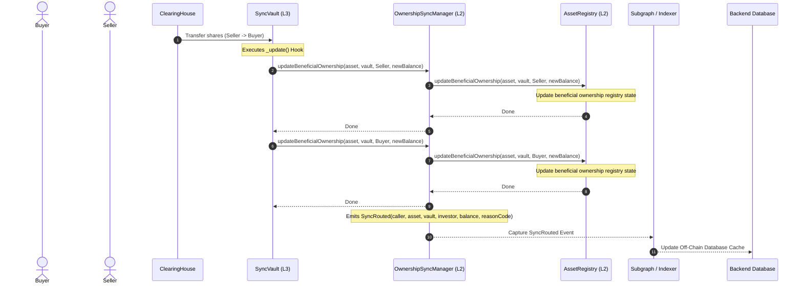

# ARCHITECTURE PROPOSAL: CRATS P2P Ownership Sync & Beneficial Ownership Register (BOR)

**CRATS Protocol v9.0.0**  |  July 2026  
**CopyM Platform**  |  Confidential  

---

## 1. TL;DR
CRATS tokenizes real-world assets (RWA) using fractional vaults (Layer 3) representing ownership of underlying RWA tokens (Layer 2). While primary issuance operates atomically, secondary market P2P trading occurs via off-chain order books settled on-chain through the ClearingHouse. To ensure compliance, regulatory audits, and investor rights, on-chain beneficial ownership must synchronize instantly upon settlement.

This document specifies **CRATS Protocol v9.0.0**, replacing direct registry writes with a secure, authorized **OwnershipSyncManager** middleware. It optimizes transaction storage, secures compliance and reentrancy boundaries, defines asset trading eligibility governance, and outlines Graph Subgraph and backend Node.js integration flows.

---

## 2. The Problem
In previous versions:
1. **Direct Registry Writing:** Individual vaults wrote directly to `AssetRegistry`. This widened the attack surface, requiring vaults to hold high-privilege roles in the asset registry.
2. **Transaction History Bloat:** The registry tracked an unbounded array of historic transfer records. This led to state bloat and progressively higher gas fees for secondary transfers.
3. **UUPS Upgrade Incompatibilities:** Refactoring implementation layouts threatened storage slot alignments on public networks (Sepolia), risking contract corruption.

---

## 3. The Fix

The Layer 2/3 topology introduces `OwnershipSyncManager` as the single gateway for all beneficial ownership sync requests. 

### 3.1 Workflow Diagram

The sequence below details the transaction routing and event capture:



### 3.2 `IOwnershipSync` Interface
```solidity
// SPDX-License-Identifier: MIT
pragma solidity ^0.8.25;

interface IOwnershipSync {
    event BeneficialOwnershipUpdated(
        address indexed asset,
        address indexed vault,
        address indexed investor,
        uint256 balance,
        uint256 timestamp
    );

    function updateBeneficialOwnership(
        address asset,
        address vault,
        address investor,
        uint256 balance
    ) external;

    function updateBeneficialOwnershipBatch(
        address asset,
        address vault,
        address[] calldata investors,
        uint256[] calldata balances
    ) external;
}
```

### 3.3 `OwnershipSyncManager` Implementation
Routes and validates update requests. Only registered vaults or authorized system modules can submit updates.
```solidity
contract OwnershipSyncManager is IOwnershipSync, AccessControl {
    address public immutable assetRegistry;
    mapping(address => bool) public authorizedModules;
    mapping(address => bytes32) public callerReasonCodes;

    event SyncRouted(
        address indexed caller,
        address indexed asset,
        address indexed vault,
        address investor,
        uint256 balance,
        bytes32 reasonCode
    );

    modifier onlyAuthorized(address asset, address vault) {
        require(
            (msg.sender == vault && IAssetRegistry(assetRegistry).isVaultRegistered(asset, vault)) ||
            authorizedModules[msg.sender],
            "OwnershipSyncManager: unauthorized caller"
        );
        _;
    }

    function updateBeneficialOwnership(
        address asset,
        address vault,
        address investor,
        uint256 balance
    ) external override onlyAuthorized(asset, vault) {
        bytes32 reason = callerReasonCodes[msg.sender];
        if (reason == bytes32(0)) {
            reason = keccak256("VAULT_TRANSFER");
        }
        emit BeneficialOwnershipUpdated(asset, vault, investor, balance, block.timestamp);
        emit SyncRouted(msg.sender, asset, vault, investor, balance, reason);
        IAssetRegistry(assetRegistry).updateBeneficialOwnership(asset, vault, investor, balance);
    }
}
```

### 3.4 Updated `BaseVault` Hook
Vaults now trigger updates through `OwnershipSyncManager`:
```solidity
function _update(
    address from,
    address to,
    uint256 value
) internal virtual override(ERC20Upgradeable) {
    super._update(from, to, value);
    if (address(syncManager) != address(0)) {
        if (from != address(0)) {
            syncManager.updateBeneficialOwnership(asset(), address(this), from, balanceOf(from));
        }
        if (to != address(0)) {
            syncManager.updateBeneficialOwnership(asset(), address(this), to, balanceOf(to));
        }
    }
}
```

---

## 4. Before vs. After comparison

| Feature | Before (v8.0) | After (v9.0) |
|---|---|---|
| **Privilege Model** | Vaults held registry writing privileges | Vaults only authorized to update their own sub-records |
| **History Tracking** | Unbounded array stored on-chain | Logged off-chain via `SyncRouted` event indexing |
| **Upgrade Safety** | State variables subject to deletion | Deprecated variables preserved to maintain slots |
| **Exit Execution** | Enumerable list lookup on-chain | Explicit investor array passed off-chain |

---

## 5. Module Routing
Different modules use the `callerReasonCodes` to tag transactions for downstream processing:
- **`PRIMARY_ISSUANCE`:** Tagged by `VaultFactory` during initial funding.
- **`VAULT_TRANSFER`:** Tagged by `SyncVault` or `AsyncVault` during P2P swaps.
- **`REDEMPTION`:** Tagged by `RedemptionManager` during exit queuing.

---

## 6. Trade Validation & Acceptance Criteria

### 6.1 Guardian Pause & Frozen State
The `RedemptionManager` and `LifecycleExitManager` support an emergency freeze:
1. **PAUSED check:** Checks whether the asset category is paused by the system Guardian.
2. **RESTRICTED check:** Checks if the target wallet has compliance restrictions.
3. **FROZEN check:** Validates if the registry has suspended policy execution for the asset.

### 6.2 Shared Compliance Interface
All modules share the same `ICompliance` checking logic:
```solidity
interface ICompliance {
    function isInvestorRestricted(address asset, address investor) external view returns (bool);
}
```

### 6.3 Document Acceptance
RWA vault lifecycle operations require that all required files (e.g., `TITLE_DEED`, `APPRAISAL`) are uploaded and approved in `AssetRegistry` before trading goes live.

### 6.4 Reentrancy Protection
All state modifications in `RedemptionManager` and `LifecycleExitManager` use check-effects-interactions patterns paired with the `nonReentrant` modifier.

### 6.5 Fee Engine Integration
Trades integrate with the `FeeEngine` to calculate and escrow exit fees in USDC dynamically:
```solidity
uint256 fee = IFeeEngine(feeEngine).calculateExitFee(vault, shares, investor);
```

### 6.6 Acceptance Criteria Summary

| Item | Status | Dependency |
|---|---|---|
| **Guardian Pause / Frozen Check** | Deployed & Verified | Live on local node and Sepolia |
| **Shared Compliance Interface** | Deployed & Verified | Identity Registry integration |
| **Document Acceptance** | Deployed & Verified | AssetRegistry document index |
| **Reentrancy Protection** | Deployed & Verified | OpenZeppelin `ReentrancyGuard` |
| **Fee Engine Integration** | Deployed & Verified | `FeeEngine` USDC calculations |
| **BOR Ownership Sync** | Deployed & Verified | `OwnershipSyncManager` routing |
| **Event Listener to Indexer** | Deployed & Verified | Subgraph integration |

---

## 7. Asset Trading Eligibility

Asset trading policies are defined as configurable parameters in compliance plugins to accommodate regulatory shifts across onshore and offshore regimes (e.g., PRYPCO Dubai precedent, Feb 2026).

### 7.1 Design
```solidity
enum TradingEligibility { BLOCKED, TRADABLE, TRADABLE_UNTIL_EVENT }
mapping(bytes32 => TradingEligibility) public assetTradingPolicy;
```

### 7.2 Governance Rules
1. **BLOCKED:** Transfers are blocked (used for regulatory lockups).
2. **TRADABLE:** Allowed under secondary compliance checks.
3. **TRADABLE_UNTIL_EVENT:** Tradable until a maturity date or inspection event triggers a lock.

---

## 8. Risks & Mitigation
- **Risk:** Shifted storage slots on Sepolia proxy upgrade.
- **Mitigation:** Kept deprecated state variables (`_ownerIndex`, `_ownerIndexPos`, `_vaultSummary`) in `AssetRegistry.sol` to preserve EIP-1967 slot spacing.
- **Risk:** Nonce collision during rapid contract deployments.
- **Mitigation:** Integrated 15-second pauses between Sepolia deploy steps to let nodes mine and synchronize transaction nonces.

---

## 9. Subgraph Indexer Configuration

Use the Graph Subgraph config to index the `SyncRouted` events for off-chain query interfaces.

### 9.1 `subgraph.yaml`
```yaml
specVersion: 0.0.5
schema:
  file: ./schema.graphql
dataSources:
  - kind: ethereum
    name: OwnershipSyncManager
    network: sepolia
    source:
      address: "0xAEA3f4E28c9F0122EB8eD2773b79c9743421D007"
      abi: OwnershipSyncManager
      startBlock: 6200000
    mapping:
      kind: ethereum/events
      apiVersion: 0.0.7
      language: wasm/assemblyscript
      entities:
        - BeneficialOwnerRecord
        - OwnershipSyncRoute
      abis:
        - name: OwnershipSyncManager
          file: ./abis/OwnershipSyncManager.json
      eventHandlers:
        - event: BeneficialOwnershipUpdated(indexed address,indexed address,indexed address,uint256,uint256)
          handler: handleBeneficialOwnershipUpdated
        - event: SyncRouted(indexed address,indexed address,indexed address,address,uint256,bytes32)
          handler: handleSyncRouted
      file: ./src/mapping.ts
```

### 9.2 `schema.graphql`
```graphql
type BeneficialOwnerRecord @entity {
  id: ID! # assetAddress-vaultAddress-investorAddress
  asset: Bytes!
  vault: Bytes!
  investor: Bytes!
  shares: BigInt!
  lastUpdated: BigInt!
}

type OwnershipSyncRoute @entity {
  id: ID! # txHash-logIndex
  caller: Bytes!
  asset: Bytes!
  vault: Bytes!
  investor: Bytes!
  balance: BigInt!
  reasonCode: Bytes!
  timestamp: BigInt!
}
```

### 9.3 `mapping.ts`
```typescript
import { BeneficialOwnershipUpdated, SyncRouted } from "../generated/OwnershipSyncManager/OwnershipSyncManager"
import { BeneficialOwnerRecord, OwnershipSyncRoute } from "../generated/schema"

export function handleBeneficialOwnershipUpdated(event: BeneficialOwnershipUpdated): void {
  let id = event.params.asset.toHexString() + "-" + 
           event.params.vault.toHexString() + "-" + 
           event.params.investor.toHexString();
           
  let record = BeneficialOwnerRecord.load(id);
  if (!record) {
    record = new BeneficialOwnerRecord(id);
    record.asset = event.params.asset;
    record.vault = event.params.vault;
    record.investor = event.params.investor;
  }
  record.shares = event.params.balance;
  record.lastUpdated = event.params.timestamp;
  record.save();
}

export function handleSyncRouted(event: SyncRouted): void {
  let routeId = event.transaction.hash.toHexString() + "-" + event.logIndex.toString();
  let route = new OwnershipSyncRoute(routeId);
  route.caller = event.params.caller;
  route.asset = event.params.asset;
  route.vault = event.params.vault;
  route.investor = event.params.investor;
  route.balance = event.params.balance;
  route.reasonCode = event.params.reasonCode;
  route.timestamp = event.block.timestamp;
  route.save();
}
```

---

## 10. Node.js Backend Listener & WS Synchronization

### 10.1 Listener (`listener.js`)
```javascript
const { ethers } = require("ethers");
const WebSocket = require("ws");

const provider = new ethers.JsonRpcProvider(process.env.RPC_URL);
const wss = new WebSocket.Server({ port: 8080 });

const syncAddress = "0xAEA3f4E28c9F0122EB8eD2773b79c9743421D007";
const syncAbi = [
  "event SyncRouted(address indexed caller, address indexed asset, address indexed vault, address investor, uint256 balance, bytes32 reasonCode)"
];

const contract = new ethers.Contract(syncAddress, syncAbi, provider);

function startListener() {
  console.log("Listening for SyncRouted events on Sepolia...");
  contract.on("SyncRouted", async (caller, asset, vault, investor, balance, reasonCode, event) => {
    const reason = ethers.decodeBytes32String(reasonCode);
    console.log(`SyncRouted parsed: Investor ${investor} now has ${ethers.formatEther(balance)} shares.`);

    try {
      // 1. Reconcile SQL database holdings
      await updateDatabaseHoldings(investor, asset, vault, balance.toString(), event.log.transactionHash);

      // 2. Prune orderbook for insufficient balance
      await reconcileOrderbook(investor, asset, balance);

      // 3. WS broadcast
      broadcastWS({
        type: "HOLDINGS_UPDATE",
        investor,
        asset,
        shares: ethers.formatEther(balance),
        reason
      });
    } catch (e) {
      console.error("Database write error:", e);
    }
  });
}

function broadcastWS(data) {
  wss.clients.forEach(client => {
    if (client.readyState === WebSocket.OPEN) {
      client.send(JSON.stringify(data));
    }
  });
}
```

### 10.2 Database Rebalancing
```sql
-- Sync ownership mapping table
INSERT INTO beneficial_ownership_cache (investor, asset, vault, shares, tx_hash)
VALUES ($1, $2, $3, $4, $5)
ON CONFLICT (investor, asset, vault)
DO UPDATE SET shares = EXCLUDED.shares, tx_hash = EXCLUDED.tx_hash, updated_at = NOW();

-- Cancel pending orders exceeding balance
UPDATE orders 
SET status = 'CANCELLED', reason = 'BOR_BALANCE_SYNC_REDUCTION'
WHERE investor = $1 AND asset = $2 AND side = 'SELL' AND status = 'OPEN' AND quantity > $3;
```
