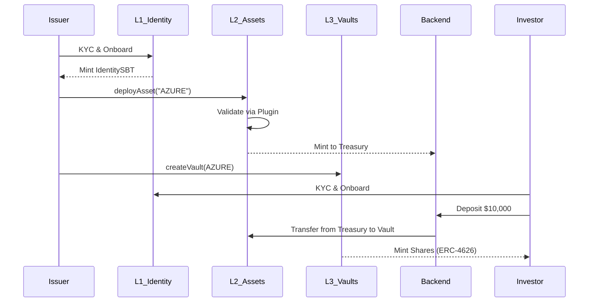

# CRATS Protocol - Deep Architecture & Asset Lifecycle

The CRATS (Compliant Real World Asset Tokenization System) is a **4-Layer Institutional-Grade Protocol** designed for the complete lifecycle of regulated assets on-chain.

---

## 🏗️ The 4-Layer System: Deep Dive

### Layer 1: Identity & Compliance (The Trust Foundation)
This layer ensures every participant and transaction meets global regulatory standards.
- **[IdentitySBT.sol](contracts/identity/IdentitySBT.sol)**: A soulbound ERC-721 token that acts as an "On-Chain Passport." It stores `IdentityData` including DIDs, roles (Issuer, Retail, Institutional), and jurisdictional country codes. It supports **multi-chain wallet linking** for a unified identity.
- **[Compliance.sol](contracts/compliance/Compliance.sol)**: The engine that enforces transfer rules. It checks recipient verification, jurisdiction (blocklist/allowlist), and investor count limits (e.g., Reg D 506(b) limits).
- **[TravelRuleModule.sol](contracts/compliance/TravelRuleModule.sol)**: Implements **FATF Recommendation 16**. It records hashed PII for every transaction above a certain threshold, providing a tamper-proof audit trail for regulators while maintaining GDPR privacy.

### Layer 2: Tokenization (The Digital Security)
Converts physical or legal assets into compliant digital tokens.
- **[AssetToken.sol](contracts/asset/AssetToken.sol)**: An **ERC-20F (Force Transfer)** token. This is critical for RWA because it allows regulators or issuers to recover tokens in cases of lost keys or court orders, complying with **ERC-7518**.
- **[AssetOracle.sol](contracts/asset/AssetOracle.sol)**: A **Multi-sig NAV (Net Asset Value)** oracle. Updates require multiple approvals and can be cross-verified against **Chainlink Proof of Reserve (PoR)** feeds.
- **[AssetRegistry.sol](contracts/asset/AssetRegistry.sol)**: The on-chain "filing cabinet" for legal documents (Title Deeds, Appraisals) and PoR attestations.
- **Plugins**: Sub-logic like **[RealEstatePlugin.sol](contracts/asset/plugins/RealEstatePlugin.sol)** validates that specific documents (e.g., TITLE_DEED) are present before an asset can be deployed.

### Layer 3: Financial Abstraction (The Investment Layer)
Provides standard interfaces for capital movement and yield.
- **[SyncVault.sol](contracts/vault/SyncVault.sol)**: A standard **ERC-4626** vault for atomic (T+0) deposits.
- **[AsyncVault.sol](contracts/vault/AsyncVault.sol)**: An **ERC-7540** vault with a **Request/Claim pattern**. This is essential for RWA where settlement may take 1-7 days (T+N) due to off-chain legal steps.
- **[YieldDistributor.sol](contracts/financial/YieldDistributor.sol)**: Manages automated yield schedules (Rent, Dividends, Interest). It pushes yield into vaults, which naturally increases the share price for all holders.
- **[RedemptionManager.sol](contracts/financial/RedemptionManager.sol)**: Protects the protocol from bank runs using **Redemption Gates** (limit % of AUM redeemed per week) and **FIFO Queues**.

### Layer 4: Marketplace & Liquidity (The Secondary Market)
- **[OrderBookEngine.sol](contracts/market/OrderBookEngine.sol)**: A high-performance Central Limit Order Book (CLOB) for institutional trading. Supports Limit, Market, Stop-Loss, and Iceberg orders.
- **[ClearingHouse.sol](contracts/market/ClearingHouse.sol)**: Acts as a Central Counterparty (CCP). It performs **Obligation Netting**, manages **Margin Balances**, and operates a **Default Fund** to mutualize risk.
- **[SettlementEngine.sol](contracts/market/SettlementEngine.sol)**: Executes atomic **Delivery vs Payment (DvP)** between base assets (RWA tokens) and quote assets (Stablecoins).

---

## 📖 Real-World Story: Tokenizing "The Azure Manor"

### 1. Issuer Onboarding
**Nexus Realty** (the Issuer) wants to tokenize a $10M luxury estate.
- They undergo KYC via an approved Provider.
- `IdentityRegistry` records their DID and jurisdiction (e.g., UK).
- `IdentitySBT` is minted to their wallet with the **ISSUER** role.

### 2. Asset Creation & Validation
- Nexus calls `AssetFactory.deployAsset` for "AZURE".
- The `RealEstatePlugin` checks the `AssetRegistry` for a verified `TITLE_DEED` and `APPRAISAL` hash.
- Once validated, `AssetToken` is deployed.
- 10,000,000 AZURE tokens (representing 100% equity) are minted into a **Smart Treasury Wallet**.

### 3. Marketplace Listing & Vault Setup
- Nexus "lists" the asset to raise $2M.
- The system deploys an **AZURE-Vault (ERC-4626)** via `VaultFactory`.
- The `OrderBookEngine` prepares a market for AZURE-Vault shares.

### 4. Investor Participation
**Sarah** (a Retail Investor) wants to invest $10,000.
- She onboards via KYC and receives her `IdentitySBT`.
- Her country (e.g., France) is checked against the `Compliance` allowlist.
- She deposits $10k USDC.
- **Automated Investment**: The Backend/Oracle detects the deposit, checks the current NAV from `AssetOracle`, and:
    1.  Transfers 10,000 AZURE tokens from the **Smart Treasury** to the **AZURE-Vault**.
    2.  Mints 10,000 vAZURE shares directly to **Sarah’s wallet**.

### 5. Yield & Redemption
- Every month, rental income is received off-chain.
- The `YieldDistributor` pushes these funds into the `AZURE-Vault`.
- Sarah’s shares (vAZURE) become worth more than her initial $1 per share.
- If Sarah wants to exit, she can sell her shares on the `OrderBookEngine` or request a redemption monitored by the `RedemptionManager`.

---

## 🛠️ Summary Technical Flow

